# CI/CD Pipeline Flow

> 운영 형상은 `prod/compose/` 패키지, 배포 단계 스크립트는 `prod/deploy/*.sh`.
> 상세 구조·실행 명령은 [`prod/compose/README.md`](../prod/compose/README.md) 참조. **minikube/k8s 의존성 없음 — docker compose 운영.**

## 트리거

- GitHub `master` 브랜치 push → Jenkins `githubPush` 자동 트리거
- 수동 빌드 가능

## 파이프라인 흐름

```mermaid
flowchart TD
    A[GitHub Push to master] --> B[Jenkins githubPush 트리거]

    subgraph QA ["1. 품질 검사"]
        B --> C[pnpm install --frozen-lockfile]
        C --> D[pnpm lint --fix && lint]
        D --> E[pnpm typecheck]
    end

    subgraph GATE ["2. TDD 게이트"]
        E --> F[pnpm test]
        F -->|실패| FAIL[배포 중단 abort]
    end

    subgraph BUILD ["3. 호스트 빌드"]
        F -->|성공| G["pnpm exec nuxt build --dotenv .env.prod<br/>(.env.prod 값 .output 에 baking)"]
    end

    subgraph INFRA ["4. Docker 확인"]
        G --> H{docker info / compose v2?}
        H -->|실패| FAIL
    end

    subgraph MIGRATE ["5. DB 보장 + 마이그레이션"]
        H -->|OK| I["bash prod/deploy/migrate.sh<br/>db up + drizzle push + seed"]
    end

    subgraph DEPLOY ["6. App 무중단 교체"]
        I --> J["bash prod/deploy/deploy.sh<br/>app 이미지 재빌드 + 컨테이너 교체 + prune"]
    end

    subgraph SMOKE ["7. Smoke"]
        J --> K["bash prod/deploy/smoke.sh<br/>healthcheck + HTTP 200 확인"]
        K -->|실패| FAIL
    end

    K -->|성공| OK[Pipeline SUCCESS]

    style QA fill:#1a1a2e,stroke:#16213e
    style GATE fill:#1a1a2e,stroke:#16213e
    style BUILD fill:#1a1a2e,stroke:#16213e
    style INFRA fill:#1a1a2e,stroke:#16213e
    style MIGRATE fill:#1a1a2e,stroke:#16213e
    style DEPLOY fill:#1a1a2e,stroke:#16213e
    style SMOKE fill:#1a1a2e,stroke:#16213e
```



## 아키텍처 요약

```
┌──────────────────────────────────────────────────────────────┐
│  macOS (Mac mini)                                              │
│                                                                │
│  ┌──────────┐    pnpm build (호스트, .env.prod baking)         │
│  │ Jenkins  │─────────────┐                                    │
│  │ (:8080)  │             ▼                                     │
│  └────┬─────┘        ┌──────────┐                              │
│       │ docker.sock  │ .output/ │                              │
│       ▼              └────┬─────┘                              │
│  ┌──────────────────────────────────────────────────────┐    │
│  │ docker compose (prod/compose/docker-compose.yml)       │    │
│  │                                                        │    │
│  │  ┌──────────────┐   ┌──────────────┐  ┌────────────┐ │    │
│  │  │ app          │──▶│ db (PostGIS) │  │ migrate    │ │    │
│  │  │ :3333→:3000  │   │ 5433→5432    │  │ (profile)  │ │    │
│  │  └──────┬───────┘   └──────────────┘  └────────────┘ │    │
│  └─────────┼──────────────────────────────────────────────┘  │
│            │                                                   │
│  ┌─────────▼──────┐                                            │
│  │ Tailscale      │                                            │
│  │ Funnel (:443)  │──── https://<INTERNAL_HOST> → :3333        │
│  └────────────────┘                                            │
└──────────────────────────────────────────────────────────────┘
```

## 파이프라인 스테이지 (`Jenkinsfile`)

| #   | 스테이지      | 동작                                                        |
| --- | ------------- | ----------------------------------------------------------- |
| 1   | `Install`     | `corepack` + `pnpm install --frozen-lockfile`               |
| 2   | `Lint`        | `pnpm lint --fix` → `pnpm lint`                             |
| 3   | `Typecheck`   | `pnpm typecheck` (비차단)                                   |
| 4   | `Test`        | `pnpm test` — **TDD 게이트, 실패 시 abort**                 |
| 5   | `Build`       | `nuxt build --dotenv .env.prod` → `.output` (값 baking)     |
| 6   | `DockerCheck` | docker 데몬 + compose v2 가용 확인                          |
| 7   | `Migrate`     | `bash prod/deploy/migrate.sh` (db up + drizzle push + seed) |
| 8   | `Deploy`      | `bash prod/deploy/deploy.sh` (app 재빌드 + 무중단 교체)     |
| 9   | `Smoke`       | `bash prod/deploy/smoke.sh` (`runnable_app_prod:3000` 200)  |

배포 로직은 `prod/deploy/*.sh` 에 분리돼 Jenkins 외부에서도 동일하게 수동 실행 가능:

```bash
bash prod/deploy/migrate.sh
bash prod/deploy/deploy.sh
bash prod/deploy/smoke.sh
```

## 주요 설계 결정

| 항목        | 결정                             | 이유                                          |
| ----------- | -------------------------------- | --------------------------------------------- |
| 빌드 위치   | 호스트 (macOS)                   | Docker 내부 Nuxt 빌드 시 Vue 번들 깨짐        |
| 런타임 설정 | 빌드 시 `.env.prod` baking       | 런타임 `NUXT_*` 오버라이드 잉여 제거          |
| 운영 형상   | docker compose (`prod/compose/`) | minikube/k8s 운영 비용 제거, 단일 서버에 적합 |
| 시크릿 관리 | 루트 `.env.prod` (gitignored)    | Jenkins 컨테이너에 read-only 마운트로 주입    |
| 무중단 교체 | `deploy.sh` app 재빌드 후 교체   | 테스트 통과 이미지만 컨테이너 교체            |
| 외부 공개   | Tailscale Funnel                 | 별도 도메인/인증서 불필요                     |
| 운영 포트   | 3333 (localhost) → app :3000     | Funnel 진입점, 기존 dev 포트와 충돌 회피      |
| DB          | compose 내 PostGIS (5433→5432)   | 기존 dev `runnable_db` 와 포트 분리           |
