# CI/CD Pipeline Flow

## 트리거
- GitHub `master` 브랜치 push → Jenkins Webhook 자동 트리거
- 수동 빌드 가능

## 파이프라인 흐름

```mermaid
flowchart TD
    A[GitHub Push to master] --> B[Jenkins Webhook 트리거]

    subgraph QA ["1. 품질 검사"]
        B --> C[pnpm install]
        C --> D[pnpm lint]
        D --> E[nuxt typecheck]
        E --> F[vitest run]
    end

    subgraph BUILD ["2. 호스트 빌드"]
        F --> G[pnpm build → .output/]
    end

    subgraph INFRA ["3. 인프라 확인"]
        G --> H{Docker 데몬?}
        H -->|연결 실패| I[Colima 재시작]
        H -->|OK| J{minikube?}
        I --> J
        J -->|중지됨| K[minikube start]
        J -->|Running| L[PostGIS 이미지 준비]
        K --> L
    end

    subgraph PUSH ["4. Docker Hub Push"]
        L --> M[docker build → runnable:latest + :BUILD_TAG]
        M --> N[docker push to Docker Hub]
    end

    subgraph MIGRATE ["5. K8s + DB 마이그레이션"]
        N --> O[시크릿/설정 파일 복사<br/>~/.jenkins/secrets/runnable/ → workspace]
        O --> P[kubectl apply namespace, secret, configmap, postgres]
        P --> Q[Postgres Ready 대기]
        Q --> R[Migration Job 빌드 + 실행]
        R --> S[DB 마이그레이션 완료 대기]
    end

    subgraph DEPLOY ["6. App 배포"]
        S --> T[docker build runnable-app:latest<br/>minikube Docker 내부]
        T --> U[kubectl apply app.yaml]
        U --> V[rollout restart + 상태 대기]
    end

    subgraph EXPOSE ["7. 외부 공개"]
        V --> W[portforward.sh start<br/>PID 파일 기반, 빌드 종료 후 지속]
        W --> X[헬스체크 HTTP 200 확인<br/>최대 5회 재시도]
        X -->|실패| Y[ERROR 로그 출력 + 빌드 실패]
        X -->|성공| Z[Tailscale Funnel 연결<br/>https://macmini.tail070e2e.ts.net]
    end

    Z --> AA[Pipeline SUCCESS]
    Y --> AB[Pipeline FAILED]

    style QA fill:#1a1a2e,stroke:#16213e
    style BUILD fill:#1a1a2e,stroke:#16213e
    style INFRA fill:#1a1a2e,stroke:#16213e
    style PUSH fill:#1a1a2e,stroke:#16213e
    style MIGRATE fill:#1a1a2e,stroke:#16213e
    style DEPLOY fill:#1a1a2e,stroke:#16213e
    style EXPOSE fill:#1a1a2e,stroke:#16213e
```



## 아키텍처 요약

```
┌─────────────────────────────────────────────────────────┐
│  macOS (Mac mini)                                       │
│                                                         │
│  ┌──────────┐    ┌───────────┐    ┌──────────────────┐ │
│  │ Jenkins  │───▶│ Colima    │───▶│ minikube         │ │
│  │ (:8080)  │    │ (Docker)  │    │                  │ │
│  └──────────┘    └───────────┘    │  ┌────────────┐  │ │
│       │                           │  │ runnable   │  │ │
│       │ pnpm build                │  │ -app:3000  │  │ │
│       │ (호스트에서 빌드)          │  └────────────┘  │ │
│       ▼                           │  ┌────────────┐  │ │
│  ┌──────────┐                     │  │ postgres   │  │ │
│  │ .output/ │──docker build──────▶│  │ :5432      │  │ │
│  └──────────┘                     │  └────────────┘  │ │
│                                   └──────────────────┘ │
│                                          │             │
│  kubectl port-forward (:3333 → :3000)    │             │
│       │                                               │
│       ▼                                               │
│  ┌────────────────┐                                    │
│  │ Tailscale      │                                    │
│  │ Funnel (:443)  │──── https://macmini.tail070e2e.ts.net
│  └────────────────┘                                    │
└─────────────────────────────────────────────────────────┘
```

## 주요 설계 결정

| 항목 | 결정 | 이유 |
|------|------|------|
| 빌드 위치 | 호스트 (macOS) | Docker 내부 Nuxt 빌드 시 Vue 번들 깨짐 |
| 시크릿 관리 | `~/.jenkins/secrets/runnable/` | Git에 민감 정보 포함 방지 |
| 포트포워드 | PID 파일 기반 detach | Jenkins `cleanWs()` 후에도 지속 |
| 외부 공개 | Tailscale Funnel | 별도 도메인/인증서 불필요 |
| DB | minikube 내 PostGIS | 단일 서버 운영에 적합 |
| 운영 포트 | 3333 (localhost) | Colima/minikube 기본 포트와 충돌 방지 |
