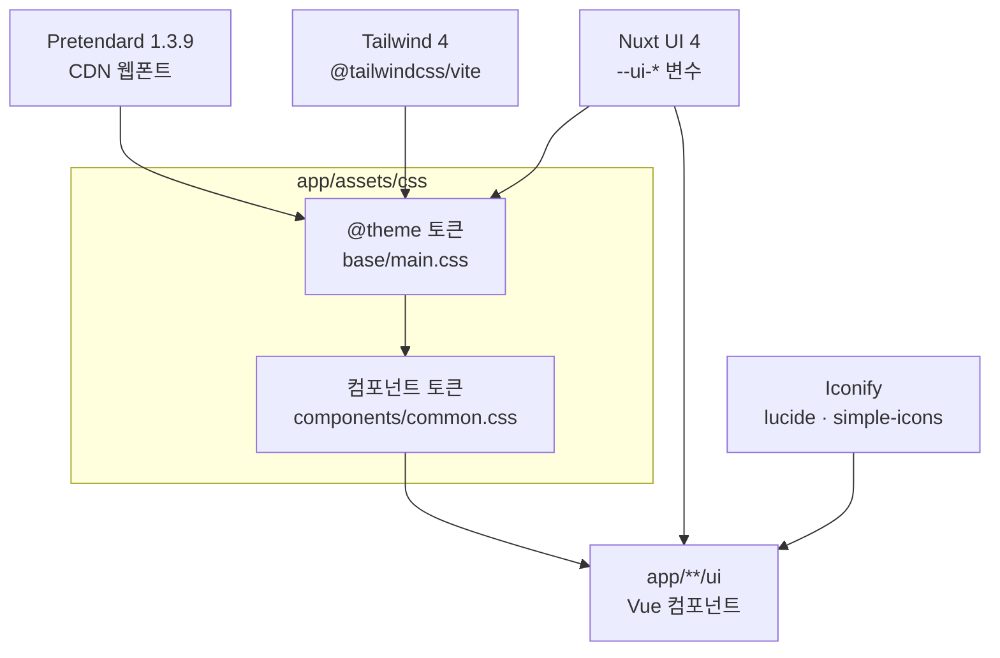

# D1. 디자인 개요

Runnable 의 디자인 톤·원칙·기술 기반을 한 장에 모은 **첫 페이지**입니다. 디자이너가 화면을 만지기 전에 가장 먼저 읽고, 이후 토큰·컴포넌트·아이콘·모션 페이지로 내려가는 출발점입니다.

> 토큰·컴포넌트의 구체 값은 [D2-Design-Tokens](D2-Design-Tokens) 에서 다룹니다. 이 페이지는 "왜 그렇게 생겼는가"를 설명합니다.

## D1.1 제품 톤

Runnable 은 Cesium 기반 **러닝 경로 제작 서비스**입니다. 화면 거의 전체가 3D/2D 지도이고, UI 는 그 지도 위에 떠 있는 얇은 컨트롤 레이어입니다. 이 성격이 디자인 톤을 결정합니다.

| 성격                | 의미                                                                                            |
| ------------------- | ----------------------------------------------------------------------------------------------- |
| **지도가 주인공**   | 본문은 지도다. UI 는 지도를 가리지 않는 플로팅 패널·칩·버튼으로 절제한다                        |
| **도구형**          | 경로를 그리고·자르고·저장·비교하는 도구. 장식보다 조작감과 명료함이 우선                        |
| **부동(浮動) 표면** | 사이드바·카드·오버레이는 떠 있는 표면(elevated surface)으로, 그림자와 라운드로 지도 위에 얹힌다 |
| **모드 적응**       | 라이트/다크 모드가 모두 1급. 색은 직접 값이 아니라 `--ui-*` 변수에 위임해 자동 전환한다         |

## D1.2 디자인 원칙

다섯 가지 원칙이 모든 토큰·컴포넌트 결정을 관통합니다.

### D1.2.1 토큰 우선 (Token-First)

색상·간격·모서리·그림자는 직접 값을 쓰지 않고 CSS 변수로 정의합니다. Nuxt UI 의 `--ui-*` 변수를 의미 단위(`--color-text-muted`, `--color-surface-dark`)로 한 번 더 매핑해, 라이트/다크 모드가 자동으로 따라옵니다. 정의 위치는 `app/assets/css/base/main.css` 의 `@theme` 블록입니다.

```css
--color-surface-dark: var(--ui-bg-elevated); /* 카드 배경 */
--color-text-muted: var(--ui-text-muted); /* 보조 텍스트 */
--color-accent-ring: color-mix(in srgb, var(--ui-primary) 30%, transparent);
```

### D1.2.2 컴포넌트 토큰화 (Component Tokens)

지도 위 UI(버튼·카드·폼)는 각각 자체 토큰 세트를 가집니다(`app/assets/css/components/common.css`). 모서리·패딩·전환을 토큰으로 노출해, 새 변형을 만들 때 값 몇 개만 덮어쓰면 됩니다.

| 표면             | 모서리           | 그림자                        |
| ---------------- | ---------------- | ----------------------------- |
| Map Button       | `0.75rem` (12px) | hover/active 시에만           |
| Map Form Field   | `1rem` (16px)    | 포커스 링                     |
| Map Surface Card | `1.5rem` (24px)  | `0 8px 24px rgba(0,0,0,0.16)` |

### D1.2.3 의미 기반 색상 (Semantic Color)

색상은 장식이 아니라 의미로 씁니다. 텍스트는 `highlighted → muted → dimmed → toned` 위계로 약해지고, 강조는 `--ui-primary` 계열로 일관 적용합니다. 회색 위에 장식 액센트 하나를 얹는 방식이 아니라, 위계 자체가 색으로 표현됩니다.

### D1.2.4 절제된 모션 (Restrained Motion)

전환은 `color`·`background`·`border-color`·`box-shadow` 등 합성 친화 속성 중심으로, 0.3s 내외로 짧게 둡니다. 강조 이징은 아래 하나로 통일합니다.

```css
--ease-emphasized: cubic-bezier(0.22, 1, 0.36, 1);
```

### D1.2.5 접근성 기본값 (Accessibility by Default)

모든 포커스 가능 요소에 `:focus-visible` 아웃라인(2px + 2px offset)을 보장하고, 토글·제거 버튼에는 한글 `aria-label` 을 붙입니다. 선택 가능한 카드는 `tabindex="0"` + Enter 키 동작을 갖습니다.

## D1.3 브랜드 폰트 — Pretendard

본문 폰트는 **Pretendard 1.3.9** 단일 패밀리이며, `main.css` 최상단에서 CDN 으로 로드합니다.

```css
@import url('https://cdn.jsdelivr.net/gh/orioncactus/pretendard@v1.3.9/dist/web/static/pretendard.min.css');
```

- **단일 패밀리** — 한글·영문·숫자를 한 폰트로 처리해 지도 위 좁은 UI 에서도 일관된 자형을 유지합니다.
- **상속 구조** — 전역적으로 `font: inherit` 을 깔고, 컴포넌트는 크기·굵기만 토큰으로 덮어씁니다. 예: Section Label 은 `0.75rem` / `font-weight: 600` / `letter-spacing: 0.06em`.
- **로드 위치** — Tailwind·Nuxt UI import 보다 위에 두어 Preflight 단계부터 폰트가 적용되도록 합니다.

## D1.4 색·모션 철학

| 축         | 철학                                                                                                                                   |
| ---------- | -------------------------------------------------------------------------------------------------------------------------------------- |
| **색**     | 직접 값 금지. `--ui-*` → 시맨틱 토큰 → 컴포넌트 토큰의 3단 위임으로, 한 곳만 바꾸면 라이트/다크가 함께 따라온다                        |
| **포커스** | 액센트 색을 30% 투명 혼합한 링(`--color-accent-ring`)으로 강조하되, 배경을 덮지 않는다                                                 |
| **모션**   | 짧고(≈0.3s) 합성 친화 속성 중심. 패널 진입/퇴장은 `rail-slide-in`(200ms ease-out) / `rail-slide-out`(150ms ease-in) 으로 방향감을 준다 |
| **이징**   | 강조 모션은 `--ease-emphasized` 하나로 통일해, 흔들림 없이 일관된 "튀어오름"을 준다                                                    |

자세한 전환·키프레임은 [D5-Iconography-and-Motion](D5-Iconography-and-Motion) 을 참고하세요.

## D1.5 기술 기반 — Nuxt UI 4

Runnable UI 는 **Nuxt UI 4 + Tailwind 4 + Pretendard** 위에 얇은 커스텀 토큰 레이어를 얹는 구조입니다. 베이스 컴포넌트(`UButton`·`UCard`·`UModal`·`UInput`·`UHeader` 등)와 `--ui-*` 색 변수를 Nuxt UI 가 제공하고, 그 위에 지도 전용 토큰만 더합니다.



### D1.5.1 레이어 구성

| 레이어          | 역할                                                                                                      |
| --------------- | --------------------------------------------------------------------------------------------------------- |
| **Tailwind 4**  | Preflight + 유틸리티. 설정 파일 없이 `main.css` `@theme` 블록으로 통합. `@tailwindcss/vite` 플러그인 사용 |
| **Nuxt UI 4**   | `UButton`·`UCard`·`UModal`·`UInput`·`UHeader` 등 베이스 컴포넌트와 `--ui-*` 색상 변수 제공                |
| **Pretendard**  | 본문 폰트. CDN 로드                                                                                       |
| **커스텀 토큰** | `main.css`(전역·색상·포커스) + `common.css`(맵 버튼·폼·카드)                                              |

### D1.5.2 CSS 임포트 순서

```css
@import 'tailwindcss'; /* 1. Tailwind 기본 */
@import '@nuxt/ui'; /* 2. Nuxt UI 컴포넌트 */
@import '.../components/common.css'; /* 3. 커스텀 컴포넌트 토큰 */
```

Tailwind 4 에서는 CSS 변수를 그대로 유틸리티에 끼워 씁니다 — `bg-(--ui-bg)`, `text-[var(--ui-text-highlighted)]`.

### D1.5.3 버전

| 라이브러리   | 버전                                |
| ------------ | ----------------------------------- |
| Nuxt         | 4.3.0                               |
| Nuxt UI      | 4.7.1                               |
| Tailwind CSS | 4.1.18                              |
| Pretendard   | 1.3.9 (CDN)                         |
| Iconify      | lucide 1.2.87 · simple-icons 1.2.68 |

## D1.6 다음 페이지

| 페이지                                                 | 내용                                                              |
| ------------------------------------------------------ | ----------------------------------------------------------------- |
| [D2-Design-Tokens](D2-Design-Tokens)                   | 색상·타이포·포커스 토큰(`main.css`) + 컴포넌트 토큰(`common.css`) |
| [D3-Components](D3-Components)                         | Vue 컴포넌트 카탈로그 (FSD 계층별)                                |
| [D4-Screens-and-Flows](D4-Screens-and-Flows)           | map-shell 레이아웃·slide-over 탭 흐름                             |
| [D5-Iconography-and-Motion](D5-Iconography-and-Motion) | Iconify·Custom SVG 아이콘 + 이징·전환 모션                        |
| [D6-Accessibility](D6-Accessibility)                   | 포커스 표시·ARIA 라벨·키보드·시맨틱 HTML                          |

> 컴포넌트는 FSD(Feature-Sliced Design) 계층(`widgets / features / entities / shared / plugins-ext`)에 배치됩니다. 코드 베이스(아키텍처·도메인·서버) 위키는 [개발자 위키 Home](../wiki/Home) 을 참고하세요.
