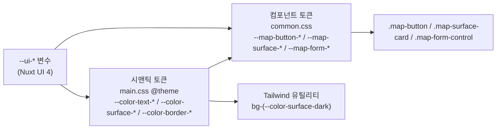
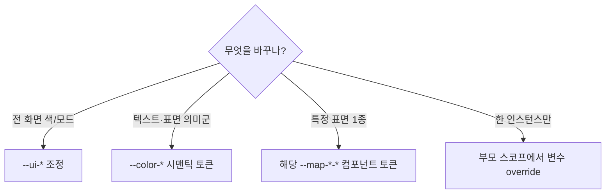

# D2. 디자인 토큰

Runnable UI 의 모든 색상·간격·모서리·전환 값은 CSS 변수로 정의됩니다. 이 페이지는 두 출처의 토큰을 전부 정리합니다.

- **시맨틱 토큰** — `app/assets/css/base/main.css` 의 `@theme` 블록. Nuxt UI 의 `--ui-*` 변수를 의미 단위로 한 번 더 매핑합니다.
- **컴포넌트 토큰** — `app/assets/css/components/common.css`. 지도 위 UI(버튼·카드·폼)의 모양을 노출하는 변수입니다.

> 모든 값은 실제 소스에서 추출했습니다. 코드가 곧 출처이며, 이 페이지는 그 요약입니다.

## 1. 토큰 계층 한눈에 보기

토큰은 3단으로 흐릅니다. Nuxt UI 의 `--ui-*` 원시 변수를 시맨틱 토큰이 한 번 감싸고, 컴포넌트 토큰이 그 위에서 표면별 모양을 정의합니다.



핵심 규칙: **라이트/다크 모드 전환은 `--ui-*` 가 담당**합니다. 시맨틱·컴포넌트 토큰은 색상 값을 직접 쓰지 않고 `--ui-*` 를 참조하므로, 모드를 바꾸면 모든 토큰이 자동으로 따라옵니다.

## 2. 시맨틱 컬러 토큰 (`@theme`)

`main.css` 의 `@theme` 블록에 정의됩니다. Tailwind 4 의 `@theme` 안에 선언된 `--color-*` 토큰은 유틸리티(`text-(--color-text-muted)`, `bg-(--color-surface-dark)`)로도 바로 끼워 쓸 수 있습니다.

### 2.1 텍스트 위계

텍스트는 `base → muted → dimmed → faint` 순으로 약해지는 4단 위계입니다.

| 토큰                  | 매핑(`--ui-*`)          | 의미                              |
| --------------------- | ----------------------- | --------------------------------- |
| `--color-text-base`   | `--ui-text-highlighted` | 주 텍스트(제목·강조 본문)         |
| `--color-text-muted`  | `--ui-text-muted`       | 보조 텍스트(레이블·설명)          |
| `--color-text-dimmed` | `--ui-text-dimmed`      | 약화된 텍스트(placeholder·비활성) |
| `--color-text-faint`  | `--ui-text-toned`       | 최약 텍스트                       |
| `--color-meta`        | `--ui-text-dimmed`      | 메타 정보(시각·카운트 등)         |

> `--color-meta` 와 `--color-text-dimmed` 는 같은 `--ui-text-dimmed` 를 가리키지만, **의도가 다릅니다.** 메타 정보 색을 따로 조정하고 싶을 때 `--color-meta` 만 덮어쓰면 placeholder 류는 건드리지 않을 수 있습니다.

### 2.2 표면(Surface)

| 토큰                     | 매핑(`--ui-*`)     | 의미                      |
| ------------------------ | ------------------ | ------------------------- |
| `--color-surface-dark`   | `--ui-bg-elevated` | 상승된 배경(카드·패널)    |
| `--color-surface-darker` | `--ui-bg`          | 기본 배경(가장 안쪽 바닥) |

### 2.3 테두리 · 강조(Accent)

| 토큰                          | 매핑 / 값                                                | 의미                             |
| ----------------------------- | -------------------------------------------------------- | -------------------------------- |
| `--color-border-accent`       | `--ui-border`                                            | 중성 테두리(기본)                |
| `--color-border-accent-focus` | `--ui-border-accented`                                   | 활성·포커스 테두리               |
| `--color-accent-ring`         | `color-mix(in srgb, var(--ui-primary) 30%, transparent)` | 포커스 링(primary 30% 투명 혼합) |
| `--color-accent-tint`         | `--ui-bg-accented`                                       | 강조 배경(선택·활성 영역)        |
| `--color-accent-hover`        | `--ui-bg-accented`                                       | 호버 배경                        |

> `--color-accent-tint` 와 `--color-accent-hover` 는 현재 같은 `--ui-bg-accented` 를 가리킵니다. 호버와 선택 상태를 시각적으로 분리하고 싶다면 둘 중 하나만 바꾸면 됩니다.

### 2.4 기타 토큰

| 토큰                | 값                               | 의미                                                                                  |
| ------------------- | -------------------------------- | ------------------------------------------------------------------------------------- |
| `--ease-emphasized` | `cubic-bezier(0.22, 1, 0.36, 1)` | 강조 애니메이션 이징(자세히는 [D5-Iconography-and-Motion](D5-Iconography-and-Motion)) |

### 2.5 포커스 토큰 (`@layer base`)

`@theme` 토큰은 아니지만, 같은 `main.css` 에서 전역 포커스 표시를 정의합니다. 모든 `tabindex="0"` 요소와 `button` 에 적용됩니다.

```css
[tabindex='0']:focus-visible,
button:focus-visible {
    outline: 2px solid var(--color-primary);
    outline-offset: 2px;
}
```

| 속성             | 값                               |
| ---------------- | -------------------------------- |
| `outline`        | `2px solid var(--color-primary)` |
| `outline-offset` | `2px`                            |

자세한 접근성 규칙은 [D6-Accessibility](D6-Accessibility) 를 참고하세요.

## 3. 컴포넌트 토큰 (`common.css`)

`common.css` 는 지도 위 UI 4종(`.map-button`, `.map-surface-card`, `.map-form-*`, `.map-section-label`)의 토큰을 정의합니다. 각 CSS 변수는 `var(--token, 기본값)` 형태라, **변수를 선언하지 않으면 표의 "기본값"이 그대로 적용**됩니다. 변형을 만들 때는 부모 스코프에서 필요한 변수만 덮어쓰면 됩니다.

### 3.1 Map Button — `.map-button`

| 토큰                      | 기본값                  | 역할               |
| ------------------------- | ----------------------- | ------------------ |
| `--map-button-gap`        | `0.375rem`              | 아이콘–텍스트 간격 |
| `--map-button-width`      | `auto`                  | 너비               |
| `--map-button-height`     | `auto`                  | 높이               |
| `--map-button-padding`    | `0`                     | 안쪽 여백          |
| `--map-button-border`     | `1px solid transparent` | 기본 테두리        |
| `--map-button-radius`     | `0.75rem` (12px)        | 모서리             |
| `--map-button-bg`         | `transparent`           | 배경               |
| `--map-button-color`      | `inherit`               | 글자색             |
| `--map-button-text-align` | `center`                | 텍스트 정렬        |

상태별 토큰은 **하위 상태가 상위 상태를 기본값으로 상속**합니다(`active → hover → 기본`). 즉 hover 값만 정해도 active 가 같은 값을 물려받습니다.

| 토큰                         | 기본값(상속 체인)                            |
| ---------------------------- | -------------------------------------------- |
| `--map-button-hover-color`   | `--map-button-color` → `inherit`             |
| `--map-button-hover-bg`      | `--map-button-bg` → `transparent`            |
| `--map-button-hover-border`  | `currentColor`                               |
| `--map-button-hover-shadow`  | `none`                                       |
| `--map-button-active-color`  | `--map-button-hover-color` → … → `inherit`   |
| `--map-button-active-bg`     | `--map-button-hover-bg` → … → `transparent`  |
| `--map-button-active-border` | `--map-button-hover-border` → `currentColor` |
| `--map-button-active-shadow` | `--map-button-hover-shadow` → `none`         |

> active 상태는 `.map-button.is-active` 클래스로 켭니다(예: 베이스맵 토글의 선택 상태).

전환: `color · background · border-color · box-shadow` 모두 `0.3s ease`.

### 3.2 Map Surface Card — `.map-surface-card`

| 토큰                    | 기본값                           | 역할                                 |
| ----------------------- | -------------------------------- | ------------------------------------ |
| `--map-surface-gap`     | `0.625rem`                       | 자식 요소 세로 간격                  |
| `--map-surface-padding` | `0.75rem`                        | 카드 안쪽 여백                       |
| `--map-surface-border`  | `--ui-border`                    | 테두리 색(테두리는 항상 `1px solid`) |
| `--map-surface-radius`  | `1.5rem` (24px)                  | 모서리                               |
| `--map-surface-bg`      | `--ui-bg-elevated`               | 배경                                 |
| `--map-surface-shadow`  | `0 8px 24px rgba(0, 0, 0, 0.16)` | 그림자                               |

### 3.3 Map Form Field — `.map-form-field` · `.map-form-label` · `.map-form-control`

폼 필드는 레이블 + 입력 컨트롤 묶음입니다.

#### 레이아웃 · 레이블

| 토큰                     | 기본값             | 역할                       |
| ------------------------ | ------------------ | -------------------------- |
| `--map-form-field-gap`   | `0.375rem`         | 레이블–입력 세로 간격      |
| `--map-form-label-size`  | `0.8125rem` (13px) | 레이블 글자 크기           |
| `--map-form-label-color` | `--ui-text-muted`  | 레이블 색(굵기 `600` 고정) |

#### 입력 컨트롤 (기본 상태)

| 토큰                     | 기본값                  | 역할                                    |
| ------------------------ | ----------------------- | --------------------------------------- |
| `--map-form-padding`     | `0.625rem 0.75rem`      | 컨트롤 안쪽 여백(상하 10px · 좌우 12px) |
| `--map-form-border`      | `--ui-border`           | 테두리 색(`1px solid`)                  |
| `--map-form-radius`      | `1rem` (16px)           | 모서리                                  |
| `--map-form-bg`          | `--ui-bg-elevated`      | 배경                                    |
| `--map-form-color`       | `--ui-text-highlighted` | 글자색                                  |
| `--map-form-font-size`   | `0.875rem` (14px)       | 글자 크기                               |
| `--map-form-line-height` | `1.4`                   | 줄 높이                                 |
| `--map-form-placeholder` | `--ui-text-dimmed`      | placeholder 색                          |
| `--map-form-resize`      | `none`                  | textarea 리사이즈                       |

#### 포커스 · 비활성 상태

| 토큰                        | 기본값                                                   | 역할                               |
| --------------------------- | -------------------------------------------------------- | ---------------------------------- |
| `--map-form-focus-border`   | `--ui-border-accented`                                   | 포커스 시 테두리 색                |
| `--map-form-focus-ring`     | `color-mix(in srgb, var(--ui-primary) 30%, transparent)` | 포커스 링(`0 0 0 3px` 으로 그려짐) |
| `--map-form-focus-bg`       | `--ui-bg-elevated`                                       | 포커스 시 배경                     |
| `--map-form-disabled-color` | `--ui-text-dimmed`                                       | 비활성 글자색                      |
| `--map-form-disabled-bg`    | `--ui-bg-accented`                                       | 비활성 배경                        |

전환: `border-color · box-shadow · background` 모두 `0.3s ease`.

> 포커스 링 값(`--map-form-focus-ring`)은 시맨틱 토큰 `--color-accent-ring` 과 **같은 `color-mix` 식**입니다. 둘 다 primary 30% 투명 혼합으로, 포커스 강조를 전역에서 일관되게 맞춥니다.

### 3.4 Section Label — `.map-section-label`

토큰 없이 고정값으로 정의되는 캡션용 레이블입니다.

| 속성             | 값                |
| ---------------- | ----------------- |
| `padding`        | `0 0.25rem`       |
| `font-size`      | `0.75rem` (12px)  |
| `font-weight`    | `600`             |
| `line-height`    | `1.3`             |
| `letter-spacing` | `0.06em`          |
| `color`          | `--ui-text-muted` |

## 4. 토큰을 바꾸면 어디가 바뀌나

토큰은 위로 갈수록 영향 범위가 넓습니다. 변경 전 이 표로 파급 범위를 확인하세요.

| 바꾸는 토큰                  | 즉시 영향                               | 연쇄 영향                                                                                            |
| ---------------------------- | --------------------------------------- | ---------------------------------------------------------------------------------------------------- |
| `--ui-*` (Nuxt UI 원시 변수) | 거의 모든 시맨틱·컴포넌트 토큰          | 라이트/다크 양쪽, 전 화면                                                                            |
| `--color-text-muted`         | 시맨틱 텍스트를 쓰는 모든 곳            | 레이블·설명 텍스트 일괄                                                                              |
| `--color-surface-dark`       | `--ui-bg-elevated` 를 참조하는 유틸리티 | 카드·패널 배경(단, 컴포넌트 토큰은 `--ui-bg-elevated` 를 직접 참조하므로 영향 없음 — 아래 주의 참고) |
| `--color-accent-ring`        | 시맨틱 링을 쓰는 곳                     | 포커스 강조 톤                                                                                       |
| `--map-button-radius`        | 모든 `.map-button`                      | 베이스맵·드로우·탐색 버튼 모서리                                                                     |
| `--map-surface-shadow`       | 모든 `.map-surface-card`                | 경로 목록·탐색 카드 등 패널 그림자                                                                   |
| `--map-form-radius`          | 모든 `.map-form-control`                | 경로명·설명·사용자명 입력칸 모서리                                                                   |
| `--map-form-focus-ring`      | 모든 폼 컨트롤 포커스                   | 입력 포커스 링만(버튼 포커스는 §2.5 별도)                                                            |

### 4.1 주의: 시맨틱 토큰 vs 컴포넌트 토큰의 참조 경로

컴포넌트 토큰의 기본값은 시맨틱 토큰이 아니라 **`--ui-*` 를 직접 참조**합니다. 예를 들어 `--map-surface-bg` 의 기본값은 `var(--color-surface-dark)` 가 아니라 `var(--ui-bg-elevated)` 입니다. 따라서:

- `--ui-bg-elevated` 를 바꾸면 → 카드 배경이 바뀝니다.
- `--color-surface-dark`(시맨틱) 만 바꾸면 → `--color-surface-dark` 유틸리티를 쓴 곳만 바뀌고, `.map-surface-card` 배경은 **그대로**입니다.

특정 표면만 바꾸고 싶다면 해당 컴포넌트 토큰(`--map-surface-bg` 등)을 부모 스코프에서 덮어쓰는 것이 가장 안전합니다.

### 4.2 변경 범위 결정 가이드



---

관련 페이지: [D3-Components](D3-Components) · [D5-Iconography-and-Motion](D5-Iconography-and-Motion) · [D6-Accessibility](D6-Accessibility)
