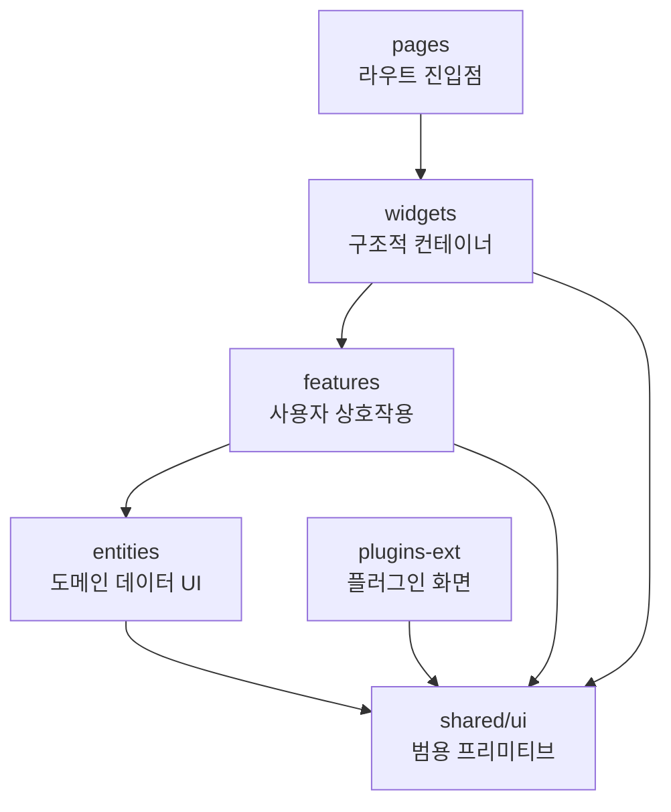
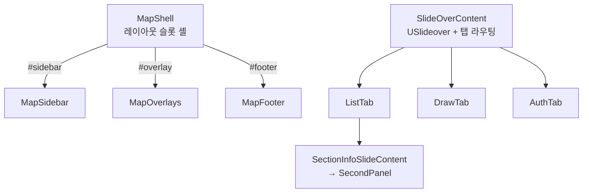

# D3. 컴포넌트 카탈로그

Runnable UI 의 `.vue` 컴포넌트를 **FSD(Feature-Sliced Design) 레이어**별로 분류하고, 각 컴포넌트의 용도와 주요 시각 요소를 정리합니다. 모든 항목은 실제 소스(`app/**/ui/`)에서 추출했으며, 코드가 곧 출처입니다.

> 토큰 정의는 [D2-Design-Tokens](D2-Design-Tokens), 아이콘은 [D5-Iconography-and-Motion](D5-Iconography-and-Motion) 을 참고하세요.

## 1. FSD 레이어 개요

컴포넌트는 의존 방향이 한 방향으로만 흐르도록 레이어에 배치됩니다 — 상위 레이어가 하위 레이어를 조합하며, 그 반대는 없습니다.



| 레이어          | 책임                                    | 대표 컴포넌트                            |
| --------------- | --------------------------------------- | ---------------------------------------- |
| **pages**       | 라우트 진입점, 레이아웃·네비 상태 관리  | `pages/index.vue`                        |
| **widgets**     | 슬롯·탭을 조합하는 대규모 구조 컨테이너 | `MapShell`, `SlideOverContent`           |
| **features**    | 사용자 상호작용 기능 단위               | `DrawRoutePanel`, `BaseMapButton`        |
| **entities**    | 도메인 데이터의 표현 UI                 | `GradientLegend`, `RouteInfoMarkerPopup` |
| **shared/ui**   | 도메인 비의존 범용 프리미티브           | `AppEmptyState`, `TextfieldCard`         |
| **plugins-ext** | 동적 주입형 플러그인 화면               | `PluginLauncher`, `DemoDashboard`        |

이 페이지는 **shared/ui 프리미티브**와 **map-shell 위젯군**을 중심으로 다룹니다. 나머지 레이어 전체 목록은 [D3-Components](D3-Components)(TODO: 미작성) 또는 개발자 위키 [5-Frontend](../wiki/5-Frontend) 를 참고하세요.

## 2. shared/ui — 범용 프리미티브

도메인 지식 없이 어디서나 재사용되는 최하위 UI 조각입니다. 모두 Nuxt UI 컴포넌트(`UCard`·`UButton`·`UInput`·`UPopover`) 위에 얇게 얹혀 있습니다.

| 컴포넌트           | 파일                                    | 용도                                      |
| ------------------ | --------------------------------------- | ----------------------------------------- |
| AppEmptyState      | `app/shared/ui/AppEmptyState.vue`       | 목록·검색 결과가 비었을 때의 공통 빈 상태 |
| FloatingActionMenu | `app/shared/ui/FloatingActionMenu.vue`  | 모바일 전용 FAB + 팝오버 메뉴             |
| TextfieldCard      | `app/shared/ui/cards/TextfieldCard.vue` | 제목·다중 입력 필드를 담는 카드           |

### 2.1 AppEmptyState

빈 상태(empty state)를 한 줄로 표현하는 프리미티브입니다. `icon`·`title`·`description` 3개의 props 만 받고, `#action` 슬롯으로 후속 행동 버튼을 덧붙입니다.

**주요 시각 요소**

- 중앙 정렬(`text-center py-12`), 보조 텍스트 톤(`text-(--ui-text-muted)`)
- 상단 `UIcon` — `w-12 h-12`, `opacity-40` 으로 흐리게 처리
- 타이틀 `text-sm`, 설명 `text-xs` + 한 단계 더 약한 `text-(--ui-text-dimmed)`
- `$slots.action` 존재 시에만 하단에 `mt-4` 행동 영역 노출

```html
<AppEmptyState icon="i-lucide-lock" title="내 경로 목록을 보려면 로그인이 필요합니다.">
    <template #action>
        <UButton label="로그인" color="primary" @click="..." />
    </template>
</AppEmptyState>
```

> 사용처: `ListTab` 비로그인 안내. 텍스트 톤 위계(`muted → dimmed`)는 [D2-Design-Tokens](D2-Design-Tokens) 의 의미 기반 색상 규칙을 그대로 따릅니다.

### 2.2 FloatingActionMenu

지도 위에 흩어진 칩 버튼들을 **모바일에서 하나의 플로팅 버튼 + 팝오버**로 통합합니다. `Teleport to="body"` 로 body 에 직접 렌더링하고, `max-lg:block hidden` 으로 데스크톱에서는 숨깁니다.

**입력 모델**

```ts
interface FloatingMenuGroup {
    key: string
    label: string
    icon: string
    visible?: boolean
    items: FloatingMenuItem[]
}
interface FloatingMenuItem {
    key: string
    label: string
    icon: string
    active?: boolean
    visible?: boolean
    dotColor?: string
    onClick: () => void
}
```

**주요 시각 요소**

- 우하단 고정 FAB — `fixed bottom-10 right-6 z-20`, `rounded-full shadow-lg`, `i-lucide-ellipsis`
- `UPopover` 콘텐츠는 `side: 'top'`, `align: 'end'` 로 버튼 위에 펼침
- 그룹 헤더: 대문자(`uppercase`) + 자간(`tracking-[0.025em]`) + 약화 톤 레이블
- `active` 아이템은 `text-(--ui-primary) bg-(--ui-primary)/10` 으로 강조
- `dotColor` 지정 시 좌측에 `w-2 h-2 rounded-full` 컬러 도트(예: 구간 색상)
- 그룹 간 `USeparator` 구분선 (마지막 그룹 제외)
- `visibleGroups` computed 로 `visible !== false` 인 그룹·아이템만 필터링

### 2.3 TextfieldCard

제목 입력·본문 다중 필드·메타 푸터를 한 카드 안에 조합하는 폼 프리미티브입니다. `UCard variant="subtle"` 기반이며, 각 필드는 `TextfieldCardField` 타입으로 선언적으로 구성합니다.

**필드 구성 (`TextfieldCardField` 주요 속성)**

| 속성                           | 의미                                                    |
| ------------------------------ | ------------------------------------------------------- |
| `id`                           | 필드 식별자 (이벤트 페이로드에 포함)                    |
| `label` / `placeholder`        | 레이블·플레이스홀더                                     |
| `type`                         | `text`·`email`·`password`·`search`·`tel`·`url`·`number` |
| `multiline` / `rows`           | `UTextarea` 다중행 모드 전환                            |
| `leadingIcon` / `trailingIcon` | 앞·뒤 아이콘                                            |
| `autocomplete` / `inputmode`   | 자동완성·가상 키보드 힌트                               |
| `invalid`                      | true 시 `color="error"` 적용                            |

**주요 시각 요소**

- `selected` props → `ring-2 ring-[var(--ui-primary)]` 선택 링
- `disabled` props → `opacity-50 pointer-events-none`
- 헤더 영역: `titleField` 가 있으면 좌측 `sectionColor` 컬러 마커 + 제목 `UInput` + 우측 휴지통 버튼(`i-lucide-trash-2`, `deletable` 제어)
- 헤더 대체: `titleField` 가 없으면 `eyebrow`(대문자 캡션) + `title`(`text-lg font-bold`)
- 본문: `fields` 배열을 순회하며 `multiline` 여부에 따라 `UTextarea`/`UInput` 렌더링. 기본 `<slot>` 으로 커스텀 본문 대체 가능
- 푸터: `#footer`/`#meta` 슬롯 또는 `meta` 텍스트(`text-xs ... text-dimmed`)

**이벤트**

- `click` — 카드 클릭
- `update:field` — `{ id, value, index }` 페이로드 (제목 필드는 `index: -1`)
- `delete` — 휴지통 클릭

> 카드 모서리·패딩·그림자 토큰은 [D2-Design-Tokens](D2-Design-Tokens) 의 Map Surface Card / Map Form Field 토큰을 따릅니다.

## 3. widgets/map-shell — 지도 셸 위젯군

지도 페이지의 골격을 이루는 위젯 묶음입니다. 셸(`MapShell`)이 슬롯을 노출하고, 사이드바·오버레이·푸터·슬라이드오버가 그 슬롯을 채웁니다.



| 컴포넌트         | 파일                                            | 용도                                      |
| ---------------- | ----------------------------------------------- | ----------------------------------------- |
| MapShell         | `app/widgets/map-shell/ui/MapShell.vue`         | 사이드바·오버레이·푸터 슬롯 조합 레이아웃 |
| MapSidebar       | `app/widgets/map-shell/ui/MapSidebar.vue`       | 로고 + 우측 컨트롤·드롭다운 헤더          |
| MapOverlays      | `app/widgets/map-shell/ui/MapOverlays.vue`      | 지도 위 모든 오버레이 UI 조합             |
| MapFooter        | `app/widgets/map-shell/ui/MapFooter.vue`        | 하단 카메라·위치 정보 표시                |
| SlideOverContent | `app/widgets/map-shell/ui/SlideOverContent.vue` | 좌측 슬라이드오버 셸 + 탭 라우팅          |

### 3.1 MapShell — 레이아웃 셸

`#sidebar` · `#footer` · `#overlay` 3개 슬롯과 기본 슬롯(지도 본체)을 조합하는 순수 레이아웃 컨테이너입니다. 로직 없이 배치만 담당합니다.

**주요 시각 요소**

- 최상위 `flex flex-col h-screen` — 전체 화면 높이 점유
- `hideSidebar` props 로 사이드바 슬롯 표시 제어 (공유 페이지 등에서 숨김)
- 지도 본체: `relative flex-auto ... overflow-hidden`
- 푸터 슬롯: `absolute bottom-0 ... z-10 pointer-events-none` (지도 조작 방해 안 함)
- 오버레이 슬롯: `absolute inset-0 pointer-events-none z-10` + `[&>*]:pointer-events-auto` — 컨테이너는 클릭 통과, 자식 요소만 클릭 수신

### 3.2 MapSidebar — 헤더

이름은 사이드바지만 실제로는 `UHeader` 기반 상단 헤더입니다. 좌측 로고와 우측 컨트롤·드롭다운 메뉴를 배치합니다.

**주요 시각 요소**

- `#title` 슬롯에 `runnable_logo_main.svg` 로고(`h-6 w-auto`)
- `#right` 슬롯: `BaseMapButton` · `ViewModeButton` · `GraphicQualityButton` · `UColorModeButton` · `UDropdownMenu`
- 드롭다운 항목은 `userRole` 기반으로 동적 구성 — 목록(`i-lucide-list`)·그리기(`i-lucide-pencil`)·관리자(`i-lucide-shield`, ADMIN 이상)·로그인/내 계정(`i-lucide-user`)
- `:ui="{ root: 'isolate' }"` — 헤더가 자체 stacking context 를 형성해, 외부 `USlideover`(z-30)가 헤더(z-50) 위로 겹치는 문제를 차단(#239)
- 네비 선택은 `select` 이벤트로 부모에 위임 (`NavKey` enum)

### 3.3 MapOverlays — 오버레이 조합기

지도 위에 떠 있는 모든 오버레이 UI를 한곳에서 조합합니다. 부모로부터 facade 객체들을 직접 받아 내부에서 바인딩합니다.

**주요 시각 요소 / 앵커 배치**

`MapOverlayAnchors` 의 모서리 슬롯에 요소를 배치하며, 같은 앵커의 요소는 flex 로 순차 정렬되어 겹치지 않습니다.

| 앵커 슬롯        | 배치 컴포넌트           | 비고                                  |
| ---------------- | ----------------------- | ------------------------------------- |
| `#top-right`     | `FacilityOverlay`       | 시설물 토글·주변검색                  |
| `#bottom-center` | `RouteOverlayBottomBar` | 고도 프로필·구간 나누기·그래디언트 칩 |
| `#bottom-left`   | `GradientLegend`        | 그래디언트 가시화 시에만              |
| `#bottom-right`  | `PluginLauncher`        | 플러그인 런처                         |

추가로 셸 외부에 배치되는 요소:

- `PluginSurfaceHost` — 플러그인 화면 호스트
- `RouteElevationModal` — 고도 프로필 차트 모달
- `RouteInfoInputForm` / `RouteInfoMarkerPopup` / `FacilityMarkerPopup` — 클릭 위치·마커 팝업
- 경로정보 안내 `UModal` (`footer: 'justify-center'`)
- 모바일 전용 "경로 완성" 플로팅 버튼 — `Teleport to="body"`, `fixed bottom-16 left-1/2 z-30`, `rounded-full shadow-lg`, `i-lucide-check`
- `#drawing-help-modal` 슬롯

### 3.4 MapFooter — 하단 정보 바

`useCameraStore` 의 `footerLabel` 을 그대로 출력하는 최소 컴포넌트입니다.

**주요 시각 요소**

- `footer` 시맨틱 요소, 우측 정렬(`justify-end`), `pointer-events-none`
- 라벨 칩: `text-xs text-(--ui-text-muted)`, 숫자 정렬용 `[font-variant-numeric:tabular-nums]`
- 반투명 배경 + 블러: `bg-(--ui-bg-elevated)/75 backdrop-blur-[12px]`
- 좌상단만 둥근 모서리: `rounded-[1rem_0_0_0]` (지도 우하단 코너에 붙는 형태)

### 3.5 SlideOverContent — 슬라이드오버 셸

좌측 `USlideover` 패널 셸로, `currentNav` 값에 따라 3개 탭 콘텐츠를 라우팅합니다. 탭 본문은 `slide-over/*` 컴포넌트에 위임합니다.

**주요 시각 요소**

- `USlideover side="left"`, `:overlay="false"`, `:modal="false"`, `:dismissible="false"` — 지도 위에 비모달로 상주
- `:ui` 로 헤더 높이만큼 띄우고(`top-(--ui-header-height)!`) 폭 제한(`max-w-[75vw] lg:max-w-sm`)
- `#body` 에서 `NavKey` 값으로 `ListTab`·`DrawTab`·`AuthTab` 분기
- `currentNav` 가 `AUTH` 로 바뀌면 `authTabRef.reset()` 호출 (watch)

## 4. slide-over 탭 컴포넌트

`SlideOverContent` 의 본문을 채우는 탭들입니다. 대부분 features/entities 패널을 얇게 래핑해 facade 와 연결하는 어댑터 역할을 합니다.

| 컴포넌트                | 파일                                         | 용도                                 |
| ----------------------- | -------------------------------------------- | ------------------------------------ |
| ListTab                 | `.../slide-over/ListTab.vue`                 | 비로그인 안내·구간정보·경로목록 전환 |
| DrawTab                 | `.../slide-over/DrawTab.vue`                 | `DrawRoutePanel` 래핑                |
| AuthTab                 | `.../slide-over/AuthTab.vue`                 | `AuthSlideOverContent` 래핑          |
| SectionInfoSlideContent | `.../slide-over/SectionInfoSlideContent.vue` | 브레드크럼 + `SecondPanel` 래핑      |
| SecondPanel             | `.../slide-over/SecondPanel.vue`             | 구간별 페이스·짐 무게·전략 상세      |

### 4.1 ListTab

3가지 상태를 조건부로 전환합니다.

1. **비로그인** → `AppEmptyState`(`i-lucide-lock`) + 로그인 버튼
2. **구간정보 열림** (`sectionInfo.isOpen`) → `SectionInfoSlideContent`
3. **기본** → 검색 `UInput`(`i-lucide-search`) + `RouteListPanel`

### 4.2 DrawTab

`DrawRoutePanel` 을 래핑해 `drawing` facade 와 구간 거리 배열을 연결하는 어댑터입니다. 구간 속성·POI·활성 구간 인덱스를 props 로 내려보내고, reset·save·구간 추가/제거·GPX 임포트 등을 이벤트로 facade 에 위임합니다. 자체 마크업은 없습니다.

### 4.3 AuthTab

`AuthSlideOverContent` 를 래핑하고, `defineExpose` 로 `reset()` 메서드를 외부에 노출합니다. `success`·`logout` 이벤트만 그대로 전달하는 패스스루 컴포넌트입니다.

### 4.4 SectionInfoSlideContent

상단 뒤로가기 브레드크럼 + `SecondPanel` 을 묶는 컨테이너입니다.

**주요 시각 요소**

- 브레드크럼: `i-lucide-chevron-left` 뒤로가기 버튼 + `i-lucide-chevron-right` 구분 + "구간정보" 라벨
- 페이스·짐 무게·전략 갱신 이벤트를 모두 `SecondPanel` ↔ 부모 사이에서 중계

### 4.5 SecondPanel

구간별 상세를 조회·편집하는 실질 콘텐츠 패널입니다. `readOnly` 모드는 탐색 탭에서 사용합니다.

**주요 시각 요소**

- 헤더: 패널 제목(`text-lg font-bold`) + 수정/저장 토글 버튼(`isEditMode` 에 따라 `solid`/`outline`·`primary`/`neutral`) + 닫기 버튼(`i-lucide-x`)
- 요약 카드(`UCard variant="subtle"`): 총 거리·예상 소요시간 2열
- 구간 카드 목록: 구간명·거리, 보기 모드 코멘트/설명, 페이스·짐 무게 표시
- 편집 모드(`isEditMode && !readOnly`): 페이스 `USlider`(180~600, step 5), 짐 무게 `USlider`(0~30kg, step 0.5), 전략 `UTextarea`(autoresize)
- 수치는 `[font-variant-numeric:tabular-nums]` 로 정렬

## 5. 패턴 메모

- **셸/슬롯 분리** — `MapShell` 은 배치만, 내용은 슬롯으로 주입. 로직과 레이아웃이 분리됩니다.
- **얇은 어댑터 탭** — `DrawTab`·`AuthTab` 처럼 슬라이드오버 탭은 features/entities 패널을 래핑해 facade 와만 연결합니다.
- **facade 주입** — `MapOverlays` 는 다수의 composable facade 를 props 로 직접 받아 바인딩합니다. (TODO: facade 패턴 상세는 개발자 위키 참조)
- **모바일 분기** — `FloatingActionMenu`, MapOverlays 의 완료 버튼은 `Teleport` + `max-lg` 분기로 모바일 전용 표면을 구성합니다.

> 컴포넌트 토큰(모서리·패딩·그림자·전환)은 [D2-Design-Tokens](D2-Design-Tokens), 접근성 규칙(`aria-label`·포커스·키보드)은 [D6-Accessibility](D6-Accessibility) 를 참고하세요.
