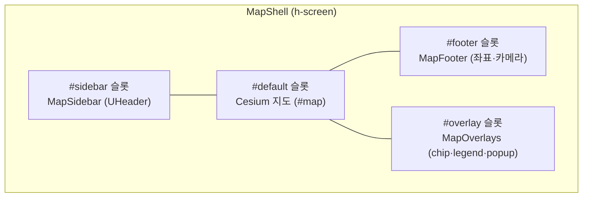
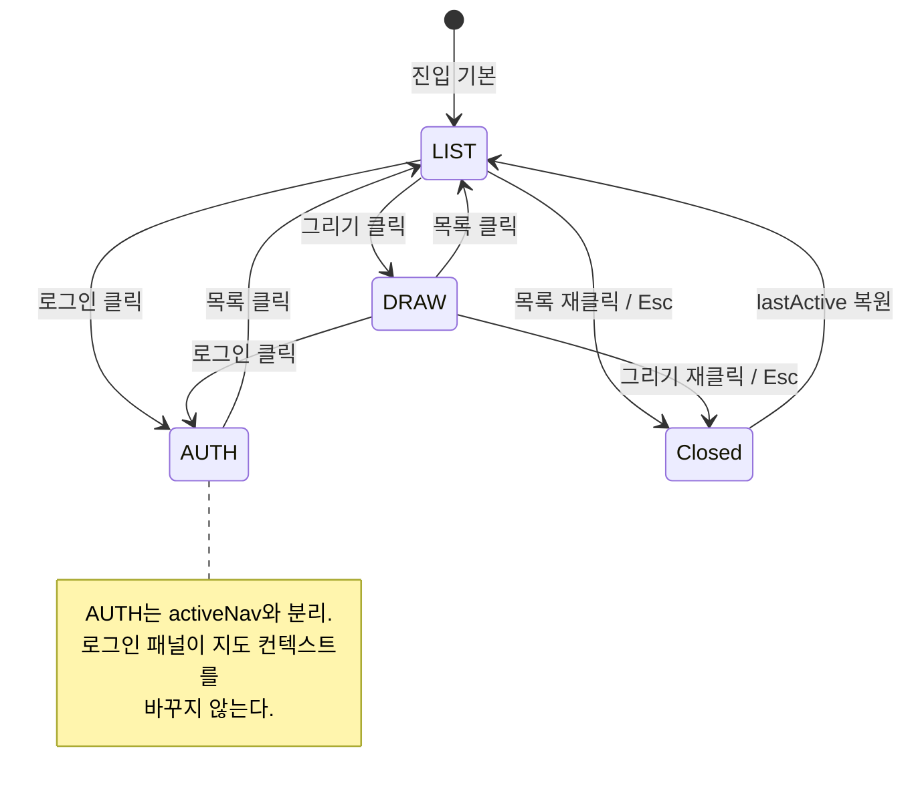
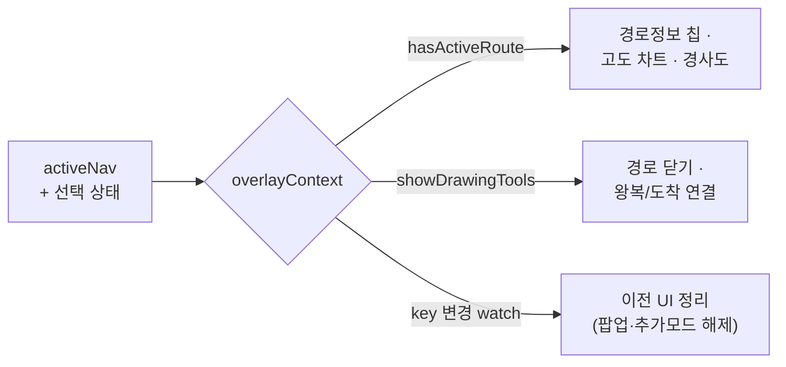

# D4. 화면·흐름

Runnable 의 **화면 구조와 화면 간 이동**을 디자이너 관점에서 정리합니다. 거의 모든 화면이 하나의 `map-shell` 위에서 슬라이드오버·오버레이·푸터가 켜졌다 꺼지는 방식으로 동작하므로, "라우트가 바뀐다"기보다 "같은 지도 위 레이어가 바뀐다"로 이해하는 편이 정확합니다.

> 토큰·컴포넌트의 구체 값은 [D2-Design-Tokens](D2-Design-Tokens), [D3-Components](D3-Components) 를, 모션은 [D5-Iconography-and-Motion](D5-Iconography-and-Motion) 을 참고하세요. 이 페이지는 "어떤 화면이 언제 뜨고, 무엇과 동기화되는가"를 다룹니다.

📷 TODO: 스크린샷 — map-shell 전체 레이아웃 (지도 + 사이드바 + 슬라이드오버 + 오버레이 + 푸터)

## D4.1 화면 지도 (Surface Map)

Runnable 의 "화면"은 라우트 4개로 나뉘지만, 디자인상 의미 있는 표면은 **메인 지도 페이지** 하나와 **공유 뷰** 하나로 압축됩니다.

| 라우트             | 파일                            | 성격                                                           |
| ------------------ | ------------------------------- | -------------------------------------------------------------- |
| `/`                | `app/pages/index.vue`           | 메인 제작 화면. map-shell + 슬라이드오버 4탭 + 오버레이 + 푸터 |
| `/share/[routeId]` | `app/pages/share/[routeId].vue` | 인증 없는 공유 뷰. 지도 + 경로 메타 카드만                     |
| `/admin`           | `app/pages/admin/index.vue`     | 관리자 대시보드 (본 페이지 범위 외)                            |
| `/settings`        | `app/pages/settings.vue`        | 설정 (본 페이지 범위 외)                                       |

메인 화면의 거의 모든 상태 변화는 **라우트 이동 없이** 같은 페이지 안에서 일어납니다. 디자이너가 다뤄야 할 "흐름"은 곧 이 한 페이지 위에서 어떤 패널·오버레이가 켜지고 꺼지는가입니다.

## D4.2 map-shell 레이아웃

`MapShell.vue`(`app/widgets/map-shell/ui/MapShell.vue`)는 화면 전체(`h-screen`)를 차지하는 단일 셸이며, **4개의 슬롯**으로 구성됩니다. 지도가 본문(`default`)이고 나머지는 그 위에 떠 있는 레이어입니다.

### D4.2.1 슬롯 책임

| 슬롯       | 컴포넌트                 | 위치·z-index                                        | 포인터 정책                 |
| ---------- | ------------------------ | --------------------------------------------------- | --------------------------- |
| `#sidebar` | `MapSidebar` (`UHeader`) | 상단 헤더, 자체 stacking context(`isolate`)         | 항상 클릭 가능              |
| `#default` | Cesium `#map`            | 본문 전체                                           | 지도 인터랙션               |
| `#footer`  | `MapFooter`              | 하단 절대 배치, `z-10`, `pointer-events-none`       | 정보 표시만 (클릭 통과)     |
| `#overlay` | `MapOverlays`            | `absolute inset-0`, `z-10`, 부모는 통과·자식만 받음 | `[&>*]:pointer-events-auto` |

> **포인터 통과 규칙** — 오버레이 컨테이너 자체는 `pointer-events-none` 으로 지도 조작을 가리지 않고, 그 안의 실제 UI 요소(`[&>*]`)만 `pointer-events-auto` 로 클릭을 받습니다. 디자인상 "오버레이는 지도를 덮지 않는다"는 원칙이 레이아웃 레벨에서 강제됩니다.

### D4.2.2 푸터

`MapFooter.vue` 는 우측 하단에 카메라·좌표 라벨(`footerLabel`) 하나만 띄우는 얇은 표면입니다. 반투명 `--ui-bg-elevated/75` + `backdrop-blur` + 좌상단만 둥근 모서리(`rounded-[1rem_0_0_0]`)로, 지도 가장자리에 붙은 정보 띠처럼 보입니다.

📷 TODO: 스크린샷 — 우측 하단 좌표 푸터

## D4.3 슬라이드오버 — 4탭 흐름

좌측 슬라이드오버(`SlideOverContent.vue`)는 `USlideover` 하나에 **탭별 콘텐츠를 라우팅**하는 셸입니다. 헤더 높이 아래(`top-(--ui-header-height)`)에서 열리고, 폭은 모바일 `75vw` / 데스크톱 `lg:max-w-sm` 입니다.

| `:modal` | `:overlay` | `:dismissible` |
| -------- | ---------- | -------------- |
| `false`  | `false`    | `false`        |

세 값이 모두 `false` 라는 점이 흐름을 결정합니다 — 슬라이드오버는 **지도를 가리는 모달이 아니라 곁에 붙는 패널**입니다. 열린 채로 지도를 계속 조작할 수 있고, 바깥 클릭으로 닫히지 않습니다. 닫기는 명시적 행위(같은 탭 재클릭, Esc, 모바일 핸들 버튼)로만 일어납니다.

### D4.3.1 탭 구성

| 탭 (`NavKey`)     | 콘텐츠 컴포넌트 | 역할                                               |
| ----------------- | --------------- | -------------------------------------------------- |
| `LIST` ("목록")   | `ListTab.vue`   | 저장 경로 목록 + 검색 + 구간정보(SectionInfo) 분기 |
| `DRAW` ("그리기") | `DrawTab.vue`   | 구간 편집·GPX 임포트·구간 나누기                   |
| `AUTH` ("로그인") | `AuthTab.vue`   | 로그인 / 내 계정                                   |

`NavKey`(`app/widgets/map-shell/model/nav-key.ts`)는 라벨 자체를 키로 쓰는 한글 상수(`'목록' · '그리기' · '로그인'`)이며, Nav Rail 과 슬라이드오버가 같은 키를 공유합니다.

### D4.3.2 탭 전환 규칙 — `useSlideOverNav`

탭 전환의 핵심 로직은 `useSlideOverNav.ts` 가 소유합니다. 디자이너가 알아야 할 동작 규칙:

| 행위                 | 결과                                                                 |
| -------------------- | -------------------------------------------------------------------- |
| 진입 기본값          | `LIST` 탭이 열린 상태로 시작                                         |
| 같은 탭 재클릭       | 슬라이드오버 **닫힘** (토글)                                         |
| 다른 탭 클릭         | 해당 탭으로 **전환**                                                 |
| `AUTH` 외 탭 선택 시 | `activeNav` 동기화 (그리기/목록 컨텍스트가 지도·오버레이까지 따라감) |
| 외부에서 로그인 요청 | `authStore` 모달 플래그 → `AUTH` 탭으로 리다이렉트                   |
| 닫혀 있어도          | `lastActive` 가 마지막 탭을 기억해 Nav Rail 활성 표시 유지           |

> `AUTH` 탭만 `activeNav` 와 분리됩니다. 로그인 패널을 여는 것이 지도 위 그리기/목록 컨텍스트를 건드리면 안 되기 때문입니다. 반대로 `LIST`·`DRAW` 는 탭 = 지도 컨텍스트가 일치합니다.

### D4.3.3 LIST 탭 내부 — 3단 분기

`ListTab.vue` 는 한 탭 안에서 상태에 따라 세 가지 화면을 전환합니다.

| 조건                 | 표시                                                       |
| -------------------- | ---------------------------------------------------------- |
| 비로그인             | `AppEmptyState` (잠금 아이콘 + "로그인" 버튼 → `go-login`) |
| `sectionInfo.isOpen` | 구간정보(`SectionInfoSlideContent` → `SecondPanel`)        |
| 그 외                | 검색 입력 + `RouteListPanel` (경로 카드 목록)              |

구간정보(SectionInfo)는 별도 탭이 아니라 **목록 탭 안의 한 단계 더 깊은 화면**입니다. 경로 카드를 선택하면 그 자리에서 구간정보로 들어가고, 상단 브레드크럼(`경로목록 ›  구간정보`)의 뒤로가기로 복귀합니다. 이 "뒤로 가기"가 미저장 상태를 버릴 수 있으면 `구간정보 닫기` 확인 모달(`showStepBackConfirm`)이 끼어듭니다.

📷 TODO: 스크린샷 — LIST 탭 3단(빈상태 / 경로목록 / 구간정보 SecondPanel)

## D4.4 Nav Rail (모바일 헤더)

화면 전환의 **진입점**은 `MapSidebar.vue` 의 헤더 우측 메뉴입니다. 로고(`Runnable`) + 지도 컨트롤 + 드롭다운 메뉴로 구성됩니다.

| 영역     | 구성                                                                                                     |
| -------- | -------------------------------------------------------------------------------------------------------- |
| `#title` | Runnable 로고 SVG                                                                                        |
| `#right` | `BaseMapButton` · `ViewModeButton` · `GraphicQualityButton` · `UColorModeButton` · `UDropdownMenu`(메뉴) |

드롭다운 메뉴 항목은 **권한에 따라 동적**입니다.

| 항목             | 아이콘            | 조건                             | 동작                   |
| ---------------- | ----------------- | -------------------------------- | ---------------------- |
| 목록             | `i-lucide-list`   | 항상                             | `select(LIST)`         |
| 그리기           | `i-lucide-pencil` | 항상                             | `select(DRAW)`         |
| 관리자           | `i-lucide-shield` | `role ≥ ADMIN`                   | `/admin` 이동 (라우트) |
| 내 계정 / 로그인 | `i-lucide-user`   | 항상 (라벨은 로그인 여부로 분기) | `select(AUTH)`         |

> **stacking 주의** — 헤더는 `isolate` 로 자체 stacking context 를 강제합니다. 슬라이드오버(`z-30`)가 헤더(`z-50`) 위로 겹치는 버그(#239)를 차단하기 위한 의도적 장치이므로, 헤더 z-index 를 만질 때 함께 검토해야 합니다.

### D4.4.1 슬라이드오버 닫힘 시 복귀 핸들

모바일에서 슬라이드오버가 닫히면(`!slideOver.isOpen`), 화면 좌측 세로 중앙에 작은 `chevron-right` 핸들(`사이드바 다시 열기`)이 붙습니다. 클릭하면 `lastActive` 탭으로 슬라이드오버를 복원합니다. 데스크톱에서는 숨겨집니다(`max-lg:flex hidden`).

## D4.5 facility-overlay 와 오버레이 가시성 동기화

지도 위 오버레이는 두 종류로 나뉩니다 — **항상 떠 있는 것**과 **활성 경로가 있을 때만 뜨는 것**. 이 구분이 디자인상 가장 중요한 동기화 규칙입니다.

### D4.5.1 facility-overlay (항상 표시)

`FacilityOverlay.vue` 는 우상단 앵커(`#top-right`)에 시설물·레이어 토글 칩을 띄웁니다. 경로 유무와 무관하게 항상 보이며(데스크톱 `md:flex`, 모바일은 FAB 로 대체), 칩들은 3행으로 묶입니다.

| 행  | 칩                                                               |
| --- | ---------------------------------------------------------------- |
| 1행 | 시설물 레이어 토글들 + (검색 가능 타입 활성 시) "현재 위치 검색" |
| 2행 | 지역 고도 · 시군구 · 읍면동 (경계/고도 레이어)                   |
| 3행 | "경로정보" — **`showRouteInfo` 가 참일 때만**                    |

각 칩은 활성 시 `solid/primary`, 비활성 시 `outline/neutral` 로, 색이 곧 켜짐/꺼짐 상태를 표현합니다(의미 기반 색상). 시설물 칩의 `#leading` 에는 레이어 색 점(`layer.color`)이 붙어 범례 역할을 겸합니다.

### D4.5.2 경로 의존 오버레이 (조건부 표시)

경로가 활성일 때만 뜨는 오버레이는 `MapOverlayContextEnum`(`shared/types/map-overlay-context.enum.ts`)으로 일괄 제어됩니다.

| 컨텍스트           | 발동 조건                    | `hasActiveRoute` | `showDrawingTools` |
| ------------------ | ---------------------------- | :--------------: | :----------------: |
| `NONE`             | 활성 경로 없음               |        ✗         |         ✗          |
| `DRAWING`          | 그리기 탭 + 구간 초안 존재   |        ✓         |         ✓          |
| `LIST_SELECTED`    | 목록 탭 + 경로 선택          |        ✓         |         ✗          |
| `EXPLORE_SELECTED` | 탐색(플러그인)에서 경로 선택 |        ✓         |         ✗          |
| `RECOMMEND`        | 탐색 추천 모드               |        ✗         |         ✗          |

`useOverlayContext.ts` 가 현재 탭·선택 상태를 보고 위 컨텍스트를 계산하고, 그 결과로:

- **`hasActiveRoute`** → 경로정보 칩, 고도 차트, 경사도 범례 등 경로 의존 UI 의 표출을 결정 (`showRouteInfoChip`)
- **`showDrawingTools`** → 그리기 전용 도구(경로 닫기 칩 등) 표출을 결정 (`DRAWING` 컨텍스트에서만)

### D4.5.3 컨텍스트 전환 시 정리(cleanup)

오버레이 동기화의 핵심은 **컨텍스트가 바뀔 때 이전 컨텍스트의 UI 를 자동으로 정리**하는 것입니다. `useOverlayContext` 의 watch 가 컨텍스트 키 변화를 감지해, 새 컨텍스트에 활성 경로가 없으면(`!hasActiveRoute`):

- 경로정보 추가 모드 해제 (`cancelAdding`)
- 경로정보 마커 팝업 닫기 (`selectedMarkerRouteInfo = null`)

> 디자이너 관점에서 이는 "경로 카드가 사라지면 그 경로에 딸린 칩·팝업도 함께 사라진다"는 **일관성 보장**입니다. 경로 없이 떠 있는 미아 오버레이가 생기지 않습니다.

### D4.5.4 데스크톱 칩 ↔ 모바일 FAB

같은 오버레이 액션이 화면 폭에 따라 다른 형태로 노출됩니다.

|                | 데스크톱 (`md:` 이상)   | 모바일 (`max-lg:`)                      |
| -------------- | ----------------------- | --------------------------------------- |
| 시설물·레이어  | `FacilityOverlay` 칩 행 | `FloatingActionMenu` 그룹               |
| 경로 도구      | `RouteOverlayBottomBar` | FAB "경로 도구" 그룹 (조건부 `visible`) |
| 경로 완성      | 슬라이드오버 내 버튼    | 하단 중앙 플로팅 "경로 완성" 버튼       |
| 현재 위치 검색 | 칩 행 내 버튼           | 별도 우하단 플로팅 버튼                 |

`useFabGroups.ts` 가 FAB 그룹을 정의하며, 각 그룹·항목의 `visible` 은 데스크톱 칩과 **동일한 `overlayContext` 조건**을 공유합니다. 즉 한 컨텍스트 규칙이 두 폼팩터의 가시성을 동시에 지배합니다.

📷 TODO: 스크린샷 — 데스크톱 우상단 시설물 칩 vs 모바일 FAB 펼침

## D4.6 공유 화면 (`/share/[routeId]`)

공유 뷰(`share/[routeId].vue`)는 메인과 **완전히 다른 표면**입니다 — map-shell·슬라이드오버·Nav Rail 없이, 어두운 배경(`bg-[#111]`) 위 전체 화면 지도에 경로만 렌더링합니다. 인증 없이 접근 가능한 읽기 전용 뷰입니다.

| 상태 | 표시                                                           |
| ---- | -------------------------------------------------------------- |
| 로딩 | 중앙 "경로를 불러오는 중..." 텍스트                            |
| 오류 | 반투명 카드 + 경고 아이콘 + "다시 시도" / "홈으로" 버튼        |
| 성공 | 좌상단 경로 메타 카드 (제목·설명·거리·고도·작성자·경로정보 수) |

메타 카드는 `bg-black/70 + backdrop-blur` 의 어두운 글래스 표면으로, 메인 화면의 밝은 `--ui-bg-elevated` 카드와 대비됩니다. 공유 뷰는 "결과를 감상하는 화면"이므로 도구 칩 없이 지도와 경로 메타만 남깁니다.

> 공유 뷰는 `useShareViewerSideeffect` 로 섹션 폴리라인을 렌더링하고, 언마운트 시 `clear()` 로 정리합니다. 메인 화면의 복잡한 오버레이 동기화 체계가 여기엔 적용되지 않습니다 — 단방향 표시 전용입니다.

📷 TODO: 스크린샷 — 공유 뷰 (어두운 배경 + 좌상단 글래스 메타 카드)

## D4.7 키보드·전역 단축키

메인 화면(`index.vue`)은 두 개의 전역 단축키를 등록합니다(`defineShortcuts`).

| 키           | 동작                                                      |
| ------------ | --------------------------------------------------------- |
| `Esc`        | 그리기 중이면 그리기 완료, 아니면 슬라이드오버 닫기       |
| `⌘/Ctrl + S` | 구간 초안이 있으면 경로 저장 모달 열기 (입력 중에도 동작) |

`Esc` 의 우선순위(그리기 → 슬라이드오버)는 "가장 깊은 활성 상태부터 빠져나온다"는 흐름 설계를 반영합니다.

## D4.8 화면 전환 요약

| 흐름                         | 트리거                      |  라우트 이동?   | 동기화 대상                                        |
| ---------------------------- | --------------------------- | :-------------: | -------------------------------------------------- |
| 탭 전환 (목록↔그리기↔로그인) | Nav Rail 메뉴 / `select`    |        ✗        | `activeNav` (AUTH 제외) → 지도·오버레이 컨텍스트   |
| 슬라이드오버 토글            | 같은 탭 재클릭 / Esc / 핸들 |        ✗        | `lastActive` 기억                                  |
| 경로 선택 → 구간정보         | LIST 탭 내 카드 클릭        |        ✗        | `LIST_SELECTED` 컨텍스트 → 경로 의존 오버레이 표출 |
| 경로 그리기                  | DRAW 탭 + 지도 클릭         |        ✗        | `DRAWING` 컨텍스트 → 그리기 도구 표출              |
| 컨텍스트 종료                | 카드 닫힘 / 탭 이탈         |        ✗        | 이전 컨텍스트 UI 자동 정리                         |
| 관리자 진입                  | 메뉴 "관리자"               |   ✓ `/admin`    | —                                                  |
| 공유 뷰                      | 외부 링크                   | ✓ `/share/[id]` | 독립 표면 (동기화 없음)                            |

핵심은 **거의 모든 흐름이 라우트 이동 없이 같은 map-shell 위에서 컨텍스트로 처리**된다는 점입니다. 디자이너는 "어떤 페이지로 가는가"보다 "어떤 컨텍스트가 켜지고, 그에 따라 어떤 오버레이가 동기화되는가"를 기준으로 화면을 설계해야 합니다.

## D4.9 관련 페이지

| 페이지                                                 | 내용                                             |
| ------------------------------------------------------ | ------------------------------------------------ |
| [D1-Overview](D1-Overview)                             | 디자인 톤·원칙·기술 기반                         |
| [D3-Components](D3-Components)                         | 여기서 등장한 컴포넌트의 FSD 계층별 카탈로그     |
| [D5-Iconography-and-Motion](D5-Iconography-and-Motion) | 슬라이드오버 진입/퇴장(`rail-slide-in/out`) 모션 |
| [D6-Accessibility](D6-Accessibility)                   | 포커스·ARIA·키보드 단축키 상세                   |

> 컴포넌트는 FSD 계층(`widgets / features / entities / shared / plugins-ext`)에 배치됩니다. 컨텍스트 동기화·오버레이 구현 등 코드 베이스 위키는 [개발자 위키 Home](../wiki/Home) 을 참고하세요.
