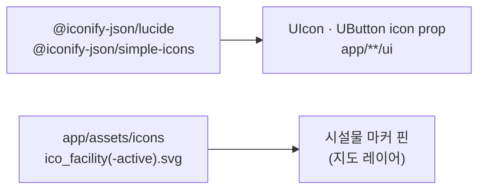

# D5. 아이콘 · 모션

지도 위 UI 의 **아이콘 체계**와 **모션 규칙**을 한 페이지에 모았습니다. 아이콘은 Iconify(lucide·simple-icons)와 시설물 전용 Custom SVG 핀으로 나뉘고, 모션은 `--ease-emphasized` 이징과 짧은 전환을 합성 친화 속성 중심으로 통일합니다.

> 색·토큰의 근거는 [D1-Overview](D1-Overview) 의 "절제된 모션 / 의미 기반 색상" 원칙을 따릅니다. 이 페이지는 그 원칙을 아이콘·모션에서 어떻게 구현하는지 다룹니다.

---

## D5.1 아이콘 체계 개요

아이콘은 두 출처로 나뉩니다.

| 출처                                | 형태                                           | 용도                                  |
| ----------------------------------- | ---------------------------------------------- | ------------------------------------- |
| **Iconify (lucide · simple-icons)** | `i-lucide-*` 이름 문자열 → `UIcon` / 버튼 슬롯 | 일반 UI 아이콘(편집·공유·토글·POI 등) |
| **Custom SVG 핀**                   | `ico_facility.svg` / `ico_facility-active.svg` | 지도 위 시설물 마커 핀(기본/활성)     |



---

## D5.2 Iconify 라이브러리

아이콘은 Iconify 의 lucide·simple-icons 패키지를 사용합니다. 대부분은 lucide 이며, `i-lucide-*` 이름 문자열로 참조합니다.

| 패키지                       | 버전   | 비고                 |
| ---------------------------- | ------ | -------------------- |
| `@iconify-json/lucide`       | 1.2.87 | 기본 UI 아이콘 전반  |
| `@iconify-json/simple-icons` | 1.2.68 | 브랜드/로고형 아이콘 |

### D5.2.1 사용 규칙

- 아이콘은 직접 SVG 를 붙이지 않고 **이름 문자열**(`i-lucide-pencil`)로 참조합니다. `UIcon` 또는 `UButton` 의 `icon` 슬롯/prop 으로 렌더링합니다.
- 같은 의미에는 같은 아이콘을 씁니다(아래 의미 매핑 표). 새 아이콘이 필요하면 먼저 lucide 에 동일 의미의 아이콘이 있는지 확인합니다.
- 색은 아이콘 자체가 아니라 부모 텍스트/버튼 색을 따라가게 둡니다(`currentColor` 위임). 별도 색 지정은 의미가 있을 때만 합니다.

### D5.2.2 의미별 아이콘 매핑

자주 쓰는 아이콘을 의미 단위로 묶었습니다. 같은 행의 아이콘은 같은 의도에서 일관되게 재사용합니다.

| 의미                 | 아이콘                                                       |
| -------------------- | ------------------------------------------------------------ |
| 토글/확장            | `i-lucide-chevron-up` · `i-lucide-chevron-down`              |
| 편집                 | `i-lucide-pencil`                                            |
| 공유                 | `i-lucide-share-2`                                           |
| 좋아요               | `i-lucide-heart`                                             |
| 비교                 | `i-lucide-git-compare`                                       |
| 다운로드 / 업로드    | `i-lucide-download` · `i-lucide-upload`                      |
| 저장 / 삭제 / 초기화 | `i-lucide-save` · `i-lucide-trash-2` · `i-lucide-rotate-ccw` |
| 닫기                 | `i-lucide-x`                                                 |
| 구간 나누기          | `i-lucide-split`                                             |
| 높이 프로필          | `i-lucide-chart-line`                                        |
| GPX 가져오기         | `i-lucide-folder-input`                                      |
| 그래픽 품질          | `i-lucide-gauge`                                             |
| 베이스맵 토글        | `i-lucide-map` · `i-lucide-satellite`                        |
| 위치 찾기            | `i-lucide-locate`                                            |
| 메뉴 / 더보기        | `i-lucide-menu` · `i-lucide-ellipsis`                        |
| 사용자 / 관리자      | `i-lucide-user` · `i-lucide-shield`                          |
| 확인/완료            | `i-lucide-check` · `i-lucide-check-circle`                   |
| 경고                 | `i-lucide-alert-circle`                                      |

### D5.2.3 POI 아이콘

지도 위 POI(관심 지점)는 의미가 분명한 lucide 픽토그램을 씁니다.

| POI 종류  | 아이콘                |
| --------- | --------------------- |
| 물(급수)  | `i-lucide-droplets`   |
| 횡단보도  | `i-lucide-footprints` |
| 병원      | `i-lucide-cross`      |
| 산악 고도 | `i-lucide-mountain`   |
| 일반 마커 | `i-lucide-map-pin`    |

---

## D5.3 Custom SVG — 시설물 핀

시설물 마커는 lucide 가 아니라 전용 SVG 핀 두 개로 렌더링합니다. 기본 상태와 활성 상태가 **색만 다른 동일 형상**이라 시각적 점프 없이 상태가 바뀝니다.

| 파일                                       | 상태      | 핀 채움색             |
| ------------------------------------------ | --------- | --------------------- |
| `app/assets/icons/ico_facility.svg`        | 기본      | `#f5f7fa` (밝은 회색) |
| `app/assets/icons/ico_facility-active.svg` | 활성/선택 | `#facc15` (앰버)      |

### D5.3.1 핀 구조

두 파일 모두 `32x32` 뷰박스의 물방울형 핀 위에 중앙 점을 얹은 구조입니다. 외곽선과 중앙 점은 두 상태가 동일하고, 핀 채움색만 바뀝니다.

| 요소          | 값                                                                        |
| ------------- | ------------------------------------------------------------------------- |
| 뷰박스        | `0 0 32 32`                                                               |
| 핀 외곽선     | `stroke="#111827"` · `stroke-width="1.8"`                                 |
| 핀 채움(기본) | `fill="#f5f7fa"`                                                          |
| 핀 채움(활성) | `fill="#facc15"`                                                          |
| 중앙 점       | `<circle cx="16" cy="12.5" r="3.5" fill="#111827">`                       |
| 접근성        | `role="img"` + `aria-label`("Facility marker" / "Active facility marker") |

### D5.3.2 상태 전환 원칙

- 기본 → 활성 전환은 **형상 변화 없이 색만** 바뀌므로, 핀이 흔들리거나 크기가 튀지 않습니다.
- 핀 색(`#f5f7fa` / `#facc15`)과 외곽선·점 색(`#111827`)은 SVG 에 하드코딩되어 있어 라이트/다크 모드와 무관하게 일정합니다. 지도 위 가독성을 위한 의도된 고정 값입니다.

---

## D5.4 모션 — 이징과 전환

모션은 [D1-Overview](D1-Overview) 의 "절제된 모션" 원칙을 따릅니다. 짧고(≈0.3s), 합성 친화 속성 중심이며, 강조 이징은 하나로 통일합니다.

### D5.4.1 강조 이징 토큰

`main.css` 의 `@theme` 블록에 정의된 단일 강조 이징입니다.

```css
--ease-emphasized: cubic-bezier(0.22, 1, 0.36, 1);
```

- 끝에서 살짝 "튀어오르는" 감속 곡선으로, 강조 모션을 이 하나로 통일해 화면 전체의 모션 톤을 일관되게 유지합니다.
- 정의 위치: `app/assets/css/base/main.css`.

### D5.4.2 컴포넌트 전환 패턴

지도 위 버튼·폼은 상태 변화(hover/focus/active)에서 색·배경·테두리·그림자를 `0.3s ease` 로 짧게 전환합니다. 정의 위치는 `app/assets/css/components/common.css` 입니다.

| 대상             | 전환 속성                                              | 지속·이징   |
| ---------------- | ------------------------------------------------------ | ----------- |
| Map Button       | `color` · `background` · `border-color` · `box-shadow` | `0.3s ease` |
| Map Form Control | `border-color` · `box-shadow` · `background`           | `0.3s ease` |

```css
/* Map Button (common.css) */
transition:
    color 0.3s ease,
    background 0.3s ease,
    border-color 0.3s ease,
    box-shadow 0.3s ease;
```

### D5.4.3 패널 슬라이드 — rail 애니메이션

레일에서 펼쳐지는 슬라이드오버 패널은 진입/퇴장에 방향감을 줍니다. `pages/index.vue` 에 정의되며, `data-state` 속성으로 진입/퇴장 키프레임을 분기합니다.

| 상태                         | 애니메이션       | 지속·이징        |
| ---------------------------- | ---------------- | ---------------- |
| 진입 (`data-state="open"`)   | `rail-slide-in`  | `200ms ease-out` |
| 퇴장 (`data-state="closed"`) | `rail-slide-out` | `150ms ease-in`  |

```css
@keyframes rail-slide-in {
    from {
        opacity: 0;
        transform: translateX(-1rem);
    }
    to {
        opacity: 1;
        transform: translateX(0);
    }
}
@keyframes rail-slide-out {
    from {
        opacity: 1;
        transform: translateX(0);
    }
    to {
        opacity: 0;
        transform: translateX(-1rem);
    }
}
```

- 진입(200ms)이 퇴장(150ms)보다 약간 길어, 들어올 때는 부드럽게·나갈 때는 빠르게 빠집니다.
- 두 키프레임 모두 `opacity` + `transform` 만 움직입니다(아래 D5.5 참고).

---

## D5.5 모션 가이드라인 — Compositor-Friendly

모션은 **레이아웃을 유발하지 않는 합성 친화 속성**만 애니메이션합니다. 레일 슬라이드가 `opacity`·`transform(translateX)` 만 쓰는 것이 그 예입니다.

| 권장 (합성 친화)                                                        | 지양 (레이아웃/페인트 유발)           |
| ----------------------------------------------------------------------- | ------------------------------------- |
| `transform`                                                             | `width` · `height`                    |
| `opacity`                                                               | `top` · `left` · `margin` · `padding` |
| `color` · `background` · `border-color` · `box-shadow` (짧은 상태 전환) | `font-size` · `border` 두께           |

### D5.5.1 원칙

- **이동·등장은 `transform` + `opacity`** — 위치 이동에 `left`/`top` 대신 `translateX` 등 `transform` 을 씁니다.
- **상태 색 전환은 짧게** — hover/focus/active 의 색·그림자 변화는 `0.3s` 내외로 둡니다.
- **강조 이징은 하나로** — 튀는 감속이 필요한 강조 모션은 `--ease-emphasized` 로 통일합니다.
- **장식 모션 금지** — 지도가 주인공이므로, 의미 없는 루프 애니메이션·과한 모션은 넣지 않습니다.

---

## D5.6 관련 페이지

| 페이지                     | 내용                                        |
| -------------------------- | ------------------------------------------- |
| [D1-Overview](D1-Overview) | 디자인 톤·원칙·기술 기반(이징·색 철학 포함) |

> 코드 베이스(아키텍처·도메인·서버) 위키는 [개발자 위키 Home](../wiki/Home) 을 참고하세요.
