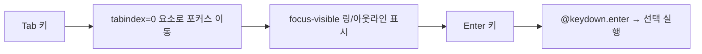

# D6. 접근성 (Accessibility)

지도 위에 떠 있는 얇은 컨트롤 레이어라는 Runnable 의 성격상, 접근성은 "별도 기능"이 아니라 모든 버튼·카드·폼에 기본으로 깔려 있어야 합니다. 이 페이지는 현재 코드에 구현된 **포커스 표시·키보드 내비·색 대비·ARIA** 현황을 정리하고, 디자이너가 새 화면을 만들 때 지킬 **체크리스트**를 제공합니다.

> 토큰·컴포넌트 정의는 [D2-Design-Tokens](D2-Design-Tokens), 모션은 [D5-Iconography-and-Motion](D5-Iconography-and-Motion) 을 참고하세요.

## D6.1 포커스 표시 (focus-visible)

모든 포커스 가능 요소는 키보드로 도달했을 때 아웃라인을 보장합니다. 정의 위치는 `app/assets/css/base/main.css` 의 `@layer base` 안입니다.

```css
/* --- 키보드 포커스 표시 --- */
[tabindex='0']:focus-visible,
button:focus-visible {
    outline: 2px solid var(--color-primary);
    outline-offset: 2px;
}
```

| 항목   | 값                                                     | 의도                                               |
| ------ | ------------------------------------------------------ | -------------------------------------------------- |
| 선택자 | `[tabindex="0"]:focus-visible`, `button:focus-visible` | 커스텀 포커스 카드 + 모든 버튼                     |
| 두께   | `2px solid`                                            | 명확히 보이되 과하지 않게                          |
| 색     | `var(--color-primary)`                                 | 액센트 색                                          |
| 간격   | `outline-offset: 2px`                                  | 요소와 아웃라인 사이 숨                            |
| 트리거 | `:focus-visible`                                       | 마우스 클릭에는 안 뜨고 **키보드 포커스에만** 표시 |

### D6.1.1 카드용 ring 변형

선택 가능한 카드는 아웃라인 대신 Tailwind 의 `ring` 유틸리티로 포커스를 표시합니다(`ExplorePanel.vue`, `RouteListPanel.vue`).

```html
class="cursor-pointer focus-visible:ring-2 focus-visible:ring-[var(--ui-primary)]"
```

즉 포커스 표시는 두 갈래입니다 — 일반 버튼/탭 요소는 **전역 outline**, 카드는 **`focus-visible:ring-2`**. 새 카드를 만들 때는 후자 패턴을 따르세요.

### D6.1.2 폼 컨트롤 포커스

폼 입력은 기본 `outline: none` 으로 브라우저 아웃라인을 끄는 대신, 포커스 링 토큰으로 대체합니다(`common.css`, [D2-Design-Tokens](D2-Design-Tokens) 참고).

```css
--map-form-focus-border: var(--ui-border-accented);
--map-form-focus-ring: color-mix(in srgb, var(--ui-primary) 30%, transparent);
```

> ⚠️ 폼에서 `outline: none` 을 쓸 때는 **반드시** 포커스 링/테두리로 대체해야 합니다. 대체 없이 outline 만 끄면 키보드 포커스가 사라집니다.

## D6.2 키보드 내비게이션

선택 가능한 카드·구간 행은 마우스뿐 아니라 키보드로도 조작됩니다.

| 속성             | 역할                        | 사용처                                                                      |
| ---------------- | --------------------------- | --------------------------------------------------------------------------- |
| `tabindex="0"`   | 포커스 순서에 편입          | `ExplorePanel`, `RouteListPanel`, `DrawRoutePanel` 의 선택 카드/구간        |
| `role="button"`  | div/li 를 버튼으로 인식시킴 | 같은 카드들                                                                 |
| `@keydown.enter` | Enter 키로 선택 실행        | 경로/구간 선택 (`$emit('select', …)`)                                       |
| `autocomplete`   | 브라우저 자동완성 힌트      | `TextfieldCard`, `AuthSlideOverContent` (`name`·`email`·`current-password`) |

```html
<li
    role="button"
    tabindex="0"
    class="cursor-pointer focus-visible:ring-2 focus-visible:ring-[var(--ui-primary)]"
    @keydown.enter="$emit('select', route.routeId)"
></li>
```



> **현황 갭** — `role="button"` 요소에 **Space 키 핸들러(`@keydown.space`)는 없습니다**. 표준 버튼은 Space 로도 눌리므로, 향후 Enter 와 함께 Space 를 지원하는 것이 바람직합니다. (TODO)

## D6.3 색 대비 (Color Contrast)

색은 직접 값이 아니라 Nuxt UI 의 `--ui-*` 변수에 위임되고, 텍스트는 위계로 약해집니다([D2-Design-Tokens](D2-Design-Tokens)).

| 시맨틱 토큰           | 매핑                    | 용도                  |
| --------------------- | ----------------------- | --------------------- |
| `--color-text-base`   | `--ui-text-highlighted` | 주 텍스트 (가장 진함) |
| `--color-text-muted`  | `--ui-text-muted`       | 보조 텍스트           |
| `--color-text-dimmed` | `--ui-text-dimmed`      | 약화 / placeholder    |
| `--color-text-faint`  | `--ui-text-toned`       | 최약 텍스트           |

- **모드 위임** — 라이트/다크가 모두 1급이며 `--ui-*` 가 모드별 값을 가지므로, 디자이너가 직접 색을 박지 않는 한 대비는 Nuxt UI 팔레트를 따라갑니다.
- **위계로 표현** — 대비를 낮춰 정보를 약화시킬 때는 임의 회색이 아니라 `muted → dimmed → toned` 토큰을 사용합니다.

> **검증 TODO** — 각 텍스트 토큰이 실제 배경 위에서 WCAG AA(본문 4.5:1, 큰 글자 3:1)를 만족하는지는 코드만으로 확정할 수 없습니다. 라이트/다크 양쪽에서 대비 측정 검증이 필요합니다.

## D6.4 ARIA 사용 현황

아이콘만 있는 버튼·토글·제거 버튼처럼 **시각 텍스트가 없는 컨트롤**에 한글 `aria-label` 을 붙입니다.

| 요소               | aria-label                     | 위치                                       |
| ------------------ | ------------------------------ | ------------------------------------------ |
| 기본지도/위성 토글 | `"${targetLabel}(으)로 전환"`  | `BaseMapButton.vue`                        |
| 2D/3D 토글         | `"${targetLabel} 모드로 전환"` | `ViewModeButton.vue`                       |
| 그래픽 품질        | `"그래픽 품질 설정"`           | `GraphicQualityButton.vue`                 |
| 메뉴 열기          | `"메뉴 열기"`                  | `MapSidebar.vue`, `FloatingActionMenu.vue` |
| 사이드바 다시 열기 | `"사이드바 다시 열기"`         | `pages/index.vue`                          |
| POI 제거           | `"${poi.name} 제거"`           | `DrawRoutePanel.vue`                       |
| 닫기               | `"닫기"`                       | `SecondPanel.vue`                          |
| 상세 정보 토글     | `"상세 정보 토글"`             | `ExplorePanel.vue`, `RouteListPanel.vue`   |
| 휴지통(삭제)       | `"휴지통"`                     | `TextfieldCard.vue`                        |

### D6.4.1 ARIA 규칙

- **레이블은 동적 의미를 담는다** — 토글 버튼은 현재 상태가 아니라 **눌렀을 때 갈 상태**를 라벨로 둡니다(`…(으)로 전환`).
- **고유 식별** — POI 제거처럼 같은 버튼이 여러 개면 대상 이름을 넣어 구분합니다(`${poi.name} 제거`).

> **현황 갭** — 토글 버튼에 `aria-pressed`, 펼침 패널에 `aria-expanded`, 장식 아이콘에 `aria-hidden` 은 현재 **사용되지 않습니다**. 상태를 라벨 문자열로만 전달하고 있어, 향후 토글류에 `aria-pressed` 를, 접고 펴는 컨트롤에 `aria-expanded` 를 보강하는 것이 바람직합니다. (TODO)

## D6.5 시맨틱 HTML

선택 목록은 시맨틱 리스트로, 선택 행은 버튼 역할로 구성합니다.

```html
<ul role="list">
    <!-- 경로/구간 목록 -->
    <li role="button" tabindex="0">…</li>
    <!-- 선택 가능한 카드 -->
</ul>
```

div/li 를 클릭 가능한 컨트롤로 쓸 때는 항상 `role="button"` + `tabindex="0"` + 키보드 핸들러를 **한 세트**로 붙입니다. 셋 중 하나라도 빠지면 키보드 사용자가 닿지 못합니다.

## D6.6 reduced-motion (감속 모션)

> **현황 갭** — 코드 전역에 `prefers-reduced-motion` 미디어 쿼리가 **없습니다**. 패널 슬라이드(`rail-slide-in/out`)와 0.3s 전환들이 모션 민감 사용자에게도 그대로 재생됩니다. [D5-Iconography-and-Motion](D5-Iconography-and-Motion) 의 전환을 `@media (prefers-reduced-motion: reduce)` 로 감속/제거하는 보강이 권장됩니다. (TODO)

```css
/* 권장 보강 예시 */
@media (prefers-reduced-motion: reduce) {
    *,
    *::before,
    *::after {
        animation-duration: 0.01ms !important;
        transition-duration: 0.01ms !important;
    }
}
```

## D6.7 디자이너 체크리스트

새 화면·컴포넌트를 만들 때 아래를 확인하세요.

### 포커스

- [ ] 모든 인터랙티브 요소가 키보드 포커스로 닿고, `:focus-visible` 표시가 보인다
- [ ] 카드형 컨트롤은 `focus-visible:ring-2 focus-visible:ring-[var(--ui-primary)]` 패턴을 따른다
- [ ] 폼에서 `outline: none` 을 썼다면 포커스 링/테두리로 **반드시** 대체했다

### 키보드

- [ ] 클릭 가능한 div/li 는 `role="button"` + `tabindex="0"` + `@keydown.enter` 세트를 갖는다
- [ ] 텍스트 입력에 적절한 `autocomplete` 힌트를 넣었다
- [ ] (권장) 버튼 역할 요소는 Space 키로도 동작한다 — 현재 미구현, 신규 작업 시 고려

### 색 대비

- [ ] 텍스트 약화는 임의 회색이 아니라 `muted → dimmed → toned` 토큰으로 표현했다
- [ ] 라이트/다크 양쪽에서 본문 4.5:1, 큰 글자 3:1(WCAG AA)을 만족한다

### ARIA / 시맨틱

- [ ] 아이콘 전용 버튼에 한글 `aria-label` 을 붙였다 (현재 상태가 아니라 "갈 상태")
- [ ] 같은 버튼이 여러 개면 대상 이름으로 라벨을 고유화했다
- [ ] 목록은 `role="list"`, 선택 행은 `role="button"` 등 시맨틱을 지켰다
- [ ] (권장) 토글에 `aria-pressed`, 접고 펴는 컨트롤에 `aria-expanded` 를 고려한다

### 모션

- [ ] (권장) 새 애니메이션은 `prefers-reduced-motion: reduce` 에서 감속/제거되도록 한다

## D6.8 요약

| 영역           | 현황                                    | 보강 권장 (TODO)                             |
| -------------- | --------------------------------------- | -------------------------------------------- |
| 포커스 표시    | 전역 outline + 카드 ring 이중 구현      | —                                            |
| 키보드 내비    | `tabindex`/`role`/`@keydown.enter` 세트 | Space 키 지원                                |
| 색 대비        | `--ui-*` 위임 + 텍스트 위계 토큰        | 라이트/다크 AA 측정 검증                     |
| ARIA           | 아이콘 버튼에 한글 `aria-label`         | `aria-pressed`·`aria-expanded`·`aria-hidden` |
| reduced-motion | 미구현                                  | `prefers-reduced-motion` 미디어 쿼리         |

> 이전 페이지: [D5-Iconography-and-Motion](D5-Iconography-and-Motion) · 개요: [D1-Overview](D1-Overview)
