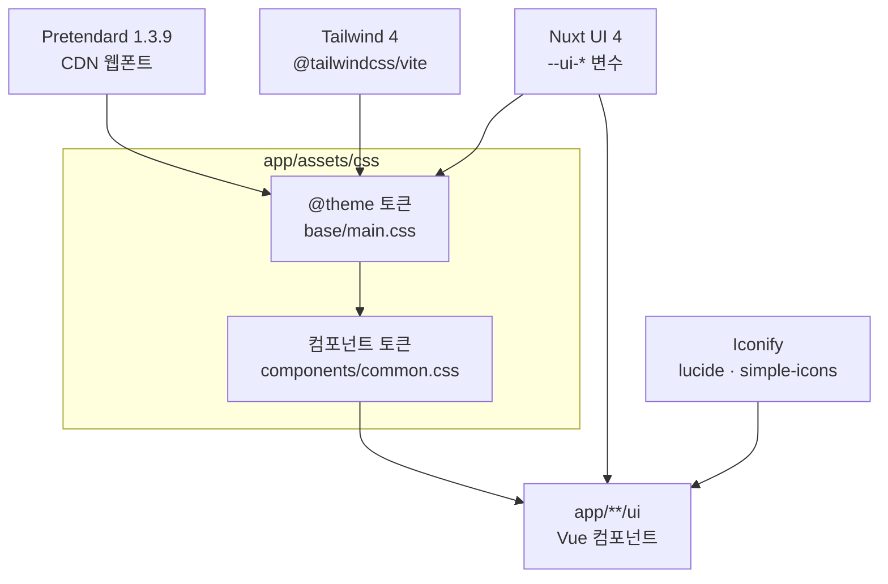

# Runnable 디자인 위키

Runnable UI 의 디자인 시스템을 다루는 위키입니다. 디자이너가 Runnable 의 화면·컴포넌트·토큰을 **이해하고 확장**할 수 있도록, 실제 코드에 정의된 디자인 토큰·컴포넌트·아이콘·모션·접근성 규칙을 정리합니다.

> 코드 베이스(아키텍처·도메인·서버·테스트) 위키는 [개발자 위키 Home](../wiki/Home) 을 참고하세요.

## 1. 이 위키의 목적

- **이해** — Runnable 화면이 어떤 토큰과 컴포넌트로 조립되는지 한곳에서 파악
- **확장** — 새 패널·카드·버튼을 추가할 때 기존 토큰·패턴을 재사용하도록 가이드
- **일관성** — 색상·간격·모서리·모션 값을 임의로 하드코딩하지 않고 정의된 토큰을 따르도록 유도

모든 토큰·컴포넌트 값은 실제 소스(`app/assets/css/`, `app/**/ui/`)에서 추출했습니다. 코드가 곧 출처이며, 이 위키는 그 요약입니다.

## 2. 페이지 인덱스

| 페이지                                                 | 내용                                                                       |
| ------------------------------------------------------ | -------------------------------------------------------------------------- |
| [D1-Overview](D1-Overview)                             | 디자인 개요 — 제품 톤·5가지 원칙·기술 기반                                 |
| [D2-Design-Tokens](D2-Design-Tokens)                   | 색상·타이포·포커스 토큰(`main.css` `@theme`) + 컴포넌트 토큰(`common.css`) |
| [D3-Components](D3-Components)                         | Vue 컴포넌트 카탈로그 (FSD 계층별 46개)                                    |
| [D4-Screens-and-Flows](D4-Screens-and-Flows)           | map-shell 레이아웃·slide-over 탭 흐름·화면 구조                            |
| [D5-Iconography-and-Motion](D5-Iconography-and-Motion) | Iconify(lucide·simple-icons)·Custom SVG·이징 토큰·전환                     |
| [D6-Accessibility](D6-Accessibility)                   | 포커스 표시·ARIA 라벨·키보드·시맨틱 HTML                                   |

## 3. 디자인 원칙 요약

### 3.1 토큰 우선 (Token-First)

색상·간격·모서리·그림자는 직접 값을 쓰지 않고 CSS 변수로 정의합니다. Nuxt UI 의 `--ui-*` 변수를 의미 단위(`--color-text-muted`, `--color-surface-dark`)로 한 번 더 매핑해, 라이트/다크 모드가 자동으로 따라오도록 합니다.

```css
--color-surface-dark: var(--ui-bg-elevated); /* 카드 배경 */
--color-text-muted: var(--ui-text-muted); /* 보조 텍스트 */
--color-accent-ring: color-mix(in srgb, var(--ui-primary) 30%, transparent);
```

### 3.2 컴포넌트 토큰화 (Component Tokens)

지도 위 UI(버튼·카드·폼)는 각각 자체 토큰 세트를 가집니다. 모서리·패딩·전환을 토큰으로 노출해, 새 변형을 만들 때 값 몇 개만 덮어쓰면 됩니다.

| 표면             | 모서리           | 그림자                        |
| ---------------- | ---------------- | ----------------------------- |
| Map Button       | `0.75rem` (12px) | hover/active 시에만           |
| Map Form Field   | `1rem` (16px)    | 포커스 링                     |
| Map Surface Card | `1.5rem` (24px)  | `0 8px 24px rgba(0,0,0,0.16)` |

### 3.3 의미 기반 색상 (Semantic Color)

색상은 장식이 아니라 의미로 씁니다. 텍스트는 `highlighted → muted → dimmed → toned` 위계로, 강조는 `--ui-primary` 계열로 일관 적용합니다.

### 3.4 절제된 모션 (Restrained Motion)

전환은 `transform`·`opacity`·`color`·`box-shadow` 등 합성 친화 속성 중심으로, 0.3s 내외로 짧게 둡니다. 강조 이징은 `--ease-emphasized: cubic-bezier(0.22, 1, 0.36, 1)` 하나로 통일합니다.

### 3.5 접근성 기본값 (Accessibility by Default)

모든 포커스 가능 요소에 `:focus-visible` 아웃라인(2px + 2px offset)을 보장하고, 토글·제거 버튼에는 한글 `aria-label` 을 붙입니다. 선택 가능한 카드는 `tabindex="0"` + Enter 키 동작을 갖습니다.

## 4. 기술 기반 (한 장 요약)

Runnable UI 는 **Nuxt UI 4 + Tailwind 4 + Pretendard** 위에 얇은 커스텀 토큰 레이어를 얹는 구조입니다.



### 4.1 레이어 구성

| 레이어          | 역할                                                                                                      |
| --------------- | --------------------------------------------------------------------------------------------------------- |
| **Tailwind 4**  | Preflight + 유틸리티. 설정 파일 없이 `main.css` `@theme` 블록으로 통합. `@tailwindcss/vite` 플러그인 사용 |
| **Nuxt UI 4**   | `UButton`·`UCard`·`UModal`·`UInput`·`UHeader` 등 베이스 컴포넌트와 `--ui-*` 색상 변수 제공                |
| **Pretendard**  | 본문 폰트. `cdn.jsdelivr.net/gh/orioncactus/pretendard@v1.3.9` 에서 로드                                  |
| **커스텀 토큰** | `main.css`(전역·색상·포커스) + `common.css`(맵 버튼·폼·카드)                                              |

### 4.2 CSS 임포트 순서

```css
@import 'tailwindcss'; /* 1. Tailwind 기본 */
@import '@nuxt/ui'; /* 2. Nuxt UI 컴포넌트 */
@import '.../components/common.css'; /* 3. 커스텀 컴포넌트 토큰 */
```

Tailwind 4 에서는 CSS 변수를 그대로 유틸리티에 끼워 씁니다 — `bg-(--ui-bg)`, `text-[var(--ui-text-highlighted)]`.

### 4.3 버전

| 라이브러리   | 버전                                |
| ------------ | ----------------------------------- |
| Nuxt         | 4.3.0                               |
| Nuxt UI      | 4.7.1                               |
| Tailwind CSS | 4.1.18                              |
| Pretendard   | 1.3.9 (CDN)                         |
| Iconify      | lucide 1.2.87 · simple-icons 1.2.68 |

> 컴포넌트는 FSD(Feature-Sliced Design) 계층(`widgets / features / entities / shared / plugins-ext`)에 배치됩니다. 자세한 구조는 [D3-Components](D3-Components) 또는 개발자 위키 [5-Frontend](../wiki/5-Frontend) 를 참고하세요.
