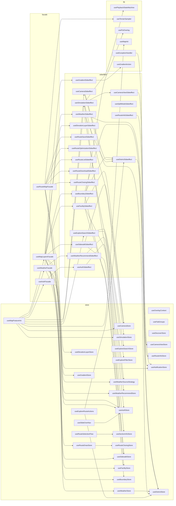

<!-- AUTO-GENERATED — do not edit by hand. Run: pnpm gen:diagrams -->

```mermaid
graph LR
    subgraph facade
        useWeatherFacade
        useRouteMapFacade
        useMapLayersFacade
        useAuthFacade
    end
    subgraph store
        useSlideOverNav
        useRouteSelectionFlow
        useOverlayContext
        useMapFeatureInit
        useFabGroups
        useCameraStore
        useSimulationStore
        useExploreSearchStore
        useExploreRouteActions
        useExploreFilterStore
        useElevationLayerStore
        useDiscoverStore
        useCameraViewStore
        useWeatherStore
        useWeatherSourceStrategy
        useWeatherRecommendStore
        useAuthStore
        useSectionInfoStore
        useRouteInfoStore
        useRouteDrawStore
        useRouteClosingStore
        useNotificationStore
        useGradientStore
        useSidewalkStore
        useFacilityStore
        useDistrictStore
        useBoundaryStore
    end
    subgraph lib
        usePlaybackStateMachine
        useTerrainSampler
        usePoiOverlay
        useMapInit
        useExceptionHandler
        useGradientAction
    end
    subgraph sideeffect
        useWeatherSideeffect
        useWeatherRecommendSideeffect
        useSimulationSideeffect
        useRouteInfoSideeffect
        useExploreSearchSideeffect
        useElevationLayerSideeffect
        useSplitModeSideeffect
        useRouteSaveSideeffect
        useRouteOptimizationSideeffect
        useRouteListSideeffect
        useRouteDownloadSideeffect
        useRouteClosingSideeffect
        useCameraViewSideeffect
        useCameraSideeffect
        useAuthSideeffect
        useGradientSideeffect
        useSidewalkSideeffect
        useFacilitySideeffect
        useDistrictSideeffect
        useBoundarySideeffect
    end
    useWeatherFacade --> useWeatherStore
    useWeatherFacade --> useWeatherSourceStrategy
    useWeatherFacade --> useWeatherSideeffect
    useWeatherFacade --> useWeatherRecommendStore
    useWeatherFacade --> useWeatherRecommendSideeffect
    useSlideOverNav --> useAuthStore
    useRouteSelectionFlow --> useSectionInfoStore
    useRouteMapFacade --> useRouteDrawStore
    useRouteMapFacade --> useNotificationStore
    useRouteMapFacade --> useRouteClosingSideeffect
    useRouteMapFacade --> useRouteSaveSideeffect
    useRouteMapFacade --> useRouteDownloadSideeffect
    useRouteMapFacade --> useTerrainSampler
    useRouteMapFacade --> useRouteListSideeffect
    useRouteMapFacade --> useRouteOptimizationSideeffect
    useRouteMapFacade --> useAuthStore
    useMapLayersFacade --> useFacilityStore
    useMapLayersFacade --> useSidewalkStore
    useMapLayersFacade --> useFacilitySideeffect
    useMapLayersFacade --> useSidewalkSideeffect
    useMapLayersFacade --> useBoundaryStore
    useMapLayersFacade --> useBoundarySideeffect
    useMapLayersFacade --> useElevationLayerStore
    useMapLayersFacade --> useElevationLayerSideeffect
    useMapLayersFacade --> useGradientStore
    useMapLayersFacade --> useGradientSideeffect
    useMapFeatureInit --> useMapInit
    useMapFeatureInit --> useAuthFacade
    useMapFeatureInit --> useWeatherFacade
    useMapFeatureInit --> useMapLayersFacade
    useMapFeatureInit --> useCameraStore
    useMapFeatureInit --> useCameraSideeffect
    useMapFeatureInit --> useExploreSearchSideeffect
    useMapFeatureInit --> useSimulationStore
    useMapFeatureInit --> useSimulationSideeffect
    useAuthFacade --> useAuthStore
    useAuthFacade --> useAuthSideeffect
    useWeatherSideeffect --> useWeatherSourceStrategy
    useWeatherSideeffect --> useDistrictSideeffect
    useWeatherSideeffect --> useNotificationStore
    useWeatherRecommendSideeffect --> useWeatherRecommendStore
    useSimulationSideeffect --> useSimulationStore
    useSimulationSideeffect --> useSectionInfoStore
    useSimulationSideeffect --> useCameraViewSideeffect
    useSimulationSideeffect --> usePlaybackStateMachine
    useRouteInfoSideeffect --> useRouteInfoStore
    useExploreRouteActions --> useDistrictStore
    useExploreRouteActions --> useDistrictSideeffect
    useExploreSearchSideeffect --> useExploreSearchStore
    useExploreSearchSideeffect --> useExploreFilterStore
    useCameraViewSideeffect --> useCameraViewStore
    useCameraSideeffect --> useDistrictStore
    useCameraSideeffect --> useDistrictSideeffect
    useWeatherStore --> useDistrictStore
    useAuthSideeffect --> useAuthStore
    useRouteDrawStore --> useRouteClosingStore
    useExceptionHandler --> useNotificationStore
    useGradientSideeffect --> useGradientAction
    useSidewalkSideeffect --> useSidewalkStore
    useSidewalkSideeffect --> useCameraStore
    useFacilitySideeffect --> useCameraStore
    useFacilitySideeffect --> useFacilityStore
    useFacilitySideeffect --> usePoiOverlay
    useFacilitySideeffect --> useSidewalkStore
    useDistrictSideeffect --> useDistrictStore
    useBoundarySideeffect --> useBoundaryStore
    useBoundarySideeffect --> useDistrictStore
    useBoundarySideeffect --> useDistrictSideeffect
```
