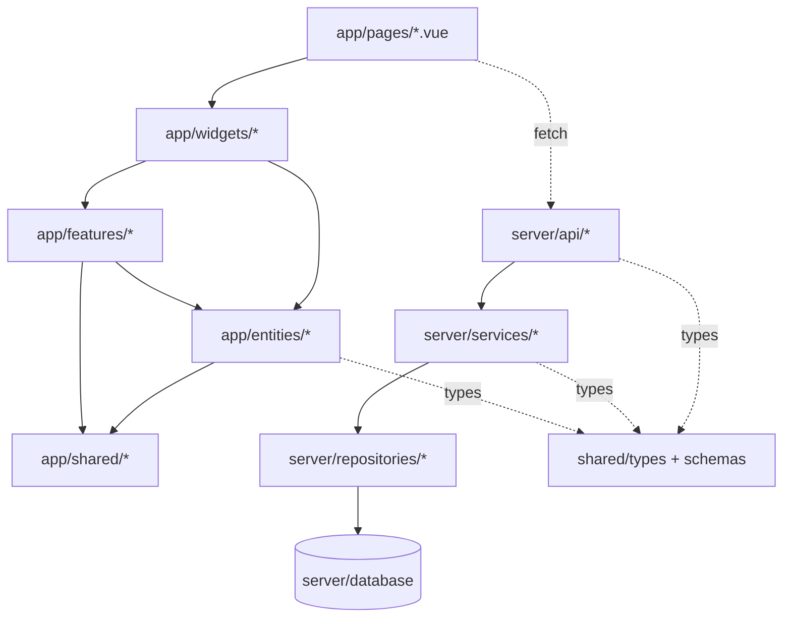

# 2. Architecture

## 2.1 구조 — FSD 변형

Runnable 2.0은 Nuxt 모노리포지토리 안에서 **FSD(Feature-Sliced Design)** 변형을 따릅니다. 프론트엔드(`app/`)는 FSD 레이어로, 백엔드(`server/`)는 Layered Architecture로 구성됩니다.

```
runnable2.0/
├─ app/                  # 프론트엔드 (FSD 적용)
│  ├─ entities/          # 도메인 단위 (route, user, boundary, facility, gradient, notification)
│  ├─ features/          # 기능 단위 (draw-route, explore, camera, ...)
│  ├─ widgets/           # 화면 단위 (map-shell, facility-overlay)
│  ├─ shared/            # 공통 ui / lib / model
│  ├─ plugins-ext/       # 런타임 플러그인 슬롯 시스템 (chip/sidepanel/dashboard/popup)
│  ├─ pages/             # Nuxt 라우팅 (index, settings, admin, share)
│  ├─ middleware/, plugins/
│  ├─ app.config.ts      # Nuxt UI 토큰 + z-index 티어 규약
│  └─ assets/
├─ server/               # 백엔드 (Nitro)
│  ├─ api/               # HTTP 엔드포인트 (50+)
│  ├─ services/          # 도메인 비즈니스 로직 (순수 함수 우선)
│  ├─ repositories/      # 데이터 접근 (interface + drizzle 구현)
│  ├─ database/          # schema, migrations, seed
│  └─ utils/             # 공통 유틸
├─ shared/               # 백엔드·프론트엔드 공유
│  ├─ types/             # 도메인 타입 (30+)
│  ├─ schemas/           # Zod 스키마 (12)
│  └─ constants/         # roles, permissions
├─ tests/                # E2E (Playwright)
├─ docs/                 # 가이드 문서
└─ prod/                 # 운영 docker compose 형상 + 배포 스크립트
```

## 2.2 레이어 책임

| Layer                  | 책임                                               | 의존 방향                              |
| ---------------------- | -------------------------------------------------- | -------------------------------------- |
| `app/pages/`           | 라우팅 진입점 — 최상위 widget facade만 호출        | widgets → features → entities → shared |
| `app/widgets/`         | 화면 단위 레이아웃 + Facade 조합 (map-shell 등)    | features → entities → shared           |
| `app/features/`        | 기능 단위 UI + 로직 (draw-route, explore 등)       | entities → shared                      |
| `app/entities/`        | 도메인 단위 (route, user, boundary 등)             | shared 만                              |
| `app/shared/`          | UI primitives, composable utilities, map utilities | external libs 만 (자체 완결)           |
| `server/api/`          | HTTP 핸들러 — 얇게 유지                            | services, repositories                 |
| `server/services/`     | 비즈니스 로직 (순수 함수 우선)                     | shared 타입                            |
| `server/repositories/` | 데이터 접근 (interface + drizzle)                  | database                               |
| `shared/`              | 양방향 공유 — 타입 / Zod 스키마                    | 자체 완결                              |

### 2.2.1 프론트엔드 슬라이스 구성

각 `entities/{도메인}` 과 `features/{기능}` 슬라이스는 다음 세그먼트로 나뉩니다. 슬라이스마다 필요한 세그먼트만 둡니다.

| 세그먼트 | 책임                                                 | 파일명 규약                     |
| -------- | ---------------------------------------------------- | ------------------------------- |
| `api/`   | Sideeffect composable (외부 API 호출 + store 동기화) | `use*Sideeffect.ts`             |
| `model/` | `useState` 기반 상태 store / 액션                    | `use*Store.ts`, `use*Action.ts` |
| `lib/`   | 순수 비즈니스 로직 (계산, 변환, 파싱, 렌더러)        | (도메인별 함수)                 |
| `ui/`    | 도메인·기능 컴포넌트 (popup, panel, modal, toggle)   | `<Name>.vue`                    |

- 현재 entities(6개): `route`, `user`, `boundary`, `facility`, `gradient`, `notification`
- 현재 features(11개): `base-map`, `camera`, `draw-route`, `elevation-layer`, `explore`, `graphic-quality`, `route-compare`, `route-info`, `route-social`, `share-viewer`, `view-mode`
- 모든 슬라이스가 4개 세그먼트를 다 갖지는 않습니다. 예를 들어 `entities/route` 는 `lib/model/ui` 만, `entities/notification` 은 `lib/model` 만 둡니다.

### 2.2.2 Widget Facade

`widgets/map-shell` 은 화면 단위 레이아웃(`ui/`)과 여러 feature/entity를 단일 인터페이스로 묶는 Facade(`model/`)로 구성됩니다.

- `widgets/map-shell/ui/`: 메인 페이지 레이아웃 (`MapShell.vue`, `MapSidebar.vue`, `MapOverlays.vue`, `MapFooter.vue`, `slide-over/*`)
- `widgets/map-shell/model/`: `use*Facade.ts` 11개 (인증, 지도 레이어, 경로 그리기·저장·다운로드·고도·지형·최적화·목록 등)
- 페이지는 최상위 facade(`useRouteMapFacade`)만 호출하고, 그 안에서 sub-facade들을 조합합니다.
- `widgets/facility-overlay` 는 지도 위 시설 오버레이(`FacilityOverlay.vue`) 단일 화면 단위입니다.

## 2.3 의존 흐름 한 장



의존 규칙(상위 → 하위 단방향):

```
✓ pages → widgets, features, entities, shared
✓ widgets → features, entities, shared
✓ features → entities, shared
✓ entities → shared
✓ shared → external libs only

✗ 역방향(하위 → 상위) import 금지
✗ feature 간 교차 의존 금지 (widget facade에서 조합)
```

> 현재 규칙 준수율은 약 85% 수준이며, 일부 feature 간 교차 의존(`explore ↔ route-social`, `explore ↔ route-compare`, `draw-route ↔ elevation-layer`)이 남아 있습니다. 장기적으로는 widget facade 계층에서 조합하도록 정리하는 것이 목표입니다. (TODO: 교차 의존 제거)

### 2.3.1 Path Alias

| Alias      | 가리키는 곳             | 용도                     |
| ---------- | ----------------------- | ------------------------ |
| `~/`       | `app/`                  | 프론트엔드 절대경로      |
| `#shared/` | `shared/` (타입·스키마) | 양방향 공유 타입 전용    |
| 상대경로   | 같은 슬라이스 내부      | 동일 모듈 내부 import 만 |

> 슬라이스 경계를 넘는 import는 항상 절대경로(`~/...`)를 사용합니다. 상대경로는 같은 슬라이스 내부에서만 허용합니다.

## 2.4 신규 코드 작성 시 결정 트리

1. **백엔드 데이터/규칙인가?**
    - 데이터 접근만 → `server/repositories/`
    - 비즈니스 규칙 (계산, 변환) → `server/services/` (순수 함수 우선)
    - HTTP 엔드포인트 → `server/api/` (얇게)
2. **양쪽에서 쓰는 타입인가?** → `shared/types/`
3. **검증이 필요한 입력 스키마인가?** → `shared/schemas/` (Zod)
4. **프론트 UI인가?**
    - 화면 단위(레이아웃·facade 조합) → `app/widgets/`
    - 기능 단위 → `app/features/`
    - 도메인 단위(데이터·표시 객체) → `app/entities/`
    - 공통 → `app/shared/`
5. **슬라이스 안에서는 어느 세그먼트인가?**
    - 외부 API + store 동기화 → `api/` (`use*Sideeffect`)
    - 상태/액션 → `model/` (`use*Store`, `use*Action`)
    - 순수 로직 → `lib/`
    - 컴포넌트 → `ui/`

## 2.5 핵심 패턴

### 2.5.1 Facade (Widget 계층)

여러 feature·entity를 단일 인터페이스로 제공해 페이지의 결합도를 낮춥니다. 페이지는 facade만 호출하고, feature 간 조합은 facade 안에서 이뤄집니다.

### 2.5.2 Sideeffect (api/ 세그먼트)

비동기 작업과 store 동기화를 선언적으로 표현합니다. 외부 API 호출 결과를 store로 흘려보내는 단방향 흐름을 유지합니다 (`use*Sideeffect`).

### 2.5.3 플러그인 시스템 (`plugins-ext/`)

`PluginManifest` 인터페이스(`plugins-ext/types.ts`)로 런타임 UI를 확장합니다. 빌드 시점에 `registry.ts` 가 매니페스트를 정적으로 등록합니다.

- 슬롯(`PluginSlot`): `chip`, `sidepanel`, `dashboard`, `popup`
- `chip` 슬롯은 8방향 앵커 배치와 정렬 순서를 지원합니다.

### 2.5.4 z-index 티어 시스템 (`app/app.config.ts`)

지도 위 레이어 충돌을 막기 위해 z-index를 티어로 고정합니다.

| 티어   | 용도                              |
| ------ | --------------------------------- |
| `z-0`  | 오버레이 내부 기본 (범례, 바텀바) |
| `z-5`  | POI 마커 레이어 (inline)          |
| `z-10` | 오버레이 컨테이너 / 지도 컨트롤   |
| `z-20` | FAB 플로팅 버튼                   |
| `z-30` | Slideover, 네비게이션 토글        |
| `z-40` | Drawer                            |
| `z-50` | Modal, 팝업, 확인 가이드          |

> Nuxt UI 컴포넌트(slideover/drawer/modal)의 z-index는 `app.config.ts` 에서 위 티어에 맞춰 오버라이드됩니다.

## 2.6 파일명 규약

| 패턴                       | 예시                                      |
| -------------------------- | ----------------------------------------- |
| `use*Store.ts`             | `useRouteDrawStore`, `useCameraStore`     |
| `use*Sideeffect.ts`        | `useGradientSideeffect`                   |
| `use*Facade.ts`            | `useRouteMapFacade`                       |
| `use*Action.ts`            | `useGradientAction`                       |
| `<Name>.vue`               | `MapShell.vue`, `DrawTab.vue`             |
| `__tests__/<name>.test.ts` | `__tests__/useRouteSelectionFlow.test.ts` |

세부 가이드 (준비 중):

- 2.2 app/ 레이어 (Nuxt FSD 디테일)
- 2.3 server/ 레이어 (Nitro 핸들러·서비스·리포)
- 2.4 shared/ 레이어 (타입·스키마·상수 규약)

다음 → [3-Domain-Model](3-Domain-Model)
