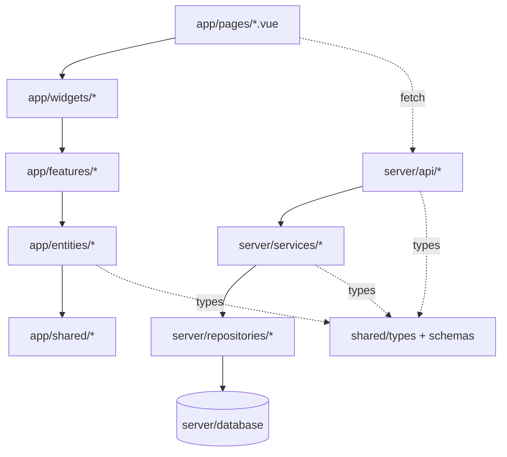

# 2. Architecture

## 2.1 구조 — FSD 변형

Runnable 2.0은 Nuxt 모노리포지토리 안에서 **FSD(Feature-Sliced Design)** 변형을 따릅니다.

```
runnable2.0/
├─ app/                  # 프론트엔드 (FSD 적용)
│  ├─ entities/          # 도메인 단위 (route, weather, facility, ...)
│  ├─ features/          # 기능 단위 (camera, explore, ...)
│  ├─ widgets/           # 화면 단위 (map-shell, ...)
│  ├─ shared/            # 공통 ui / lib / model
│  ├─ pages/             # Nuxt 라우팅
│  ├─ middleware/, plugins/
│  └─ assets/
├─ server/               # 백엔드 (Nitro)
│  ├─ api/               # HTTP 엔드포인트 (50+)
│  ├─ services/          # 도메인 비즈니스 로직 (순수 함수 우선)
│  ├─ repositories/      # 데이터 접근 (interface + drizzle 구현)
│  ├─ database/          # schema, migrations, seed
│  └─ utils/             # 공통 유틸
├─ shared/               # 백엔드·프론트엔드 공유
│  ├─ types/             # 도메인 타입 (30+)
│  ├─ schemas/           # Zod 스키마 (12)
│  └─ constants/         # roles, permissions
├─ tests/                # E2E (Playwright)
├─ docs/                 # 가이드 문서
└─ minikube/             # 로컬 K8s 매니페스트
```

## 2.2 레이어 책임

| Layer                  | 책임                                               | 의존 방향                    |
| ---------------------- | -------------------------------------------------- | ---------------------------- |
| `app/widgets/`         | 화면 단위 컴포저블 (map-shell 등)                  | features → entities → shared |
| `app/features/`        | 기능 단위 UI + 로직 (camera 등)                    | entities → shared            |
| `app/entities/`        | 도메인 단위 (route, weather 등)                    | shared 만                    |
| `app/shared/`          | UI primitives, composable utilities, map utilities | (자체 완결)                  |
| `server/api/`          | HTTP 핸들러 — 얇게 유지                            | services, repositories       |
| `server/services/`     | 비즈니스 로직 (순수 함수 우선)                     | shared 타입                  |
| `server/repositories/` | 데이터 접근 (interface + drizzle)                  | database                     |
| `shared/`              | 양방향 공유 — 타입 / Zod 스키마                    | 자체 완결                    |

## 2.3 의존 흐름 한 장



## 2.4 신규 코드 작성 시 결정 트리

1. **백엔드 데이터/규칙인가?**
    - 데이터 접근만 → `server/repositories/`
    - 비즈니스 규칙 (계산, 변환) → `server/services/` (순수 함수 우선)
    - HTTP 엔드포인트 → `server/api/` (얇게)
2. **양쪽에서 쓰는 타입인가?** → `shared/types/`
3. **검증이 필요한 입력 스키마인가?** → `shared/schemas/` (Zod)
4. **프론트 UI인가?**
    - 화면 단위 → `app/widgets/`
    - 기능 단위 → `app/features/`
    - 도메인 단위(데이터·표시 객체) → `app/entities/`
    - 공통 → `app/shared/`

세부 가이드 (준비 중):

- 2.2 app/ 레이어 (Nuxt FSD 디테일)
- 2.3 server/ 레이어 (Nitro 핸들러·서비스·리포)
- 2.4 shared/ 레이어 (타입·스키마·상수 규약)

다음 → [3-Domain-Model](3-Domain-Model)
