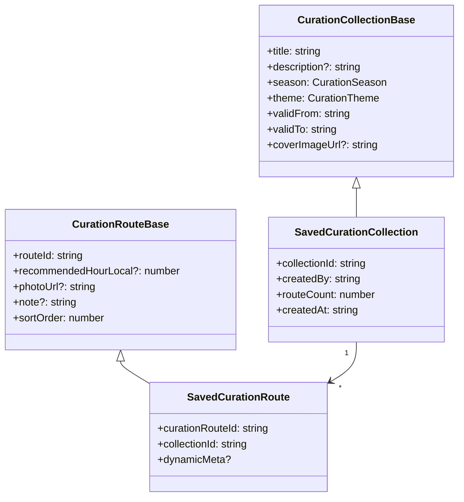

# 3.10 Curation

계절 · 시간대 큐레이션 컬렉션. `shared/types/curation.ts`, 관련 이슈 #150.

## DTO 계층

## 시즌 · 테마

| Season                                    | Theme                                                                                      |
| ----------------------------------------- | ------------------------------------------------------------------------------------------ |
| `spring` / `summer` / `autumn` / `winter` | `cherry-blossom`, `autumn-leaves`, `sunrise`, `sunset`, `night-view`, `shade`, `riverside` |

## 동적 메타

`SavedCurationRoute.dynamicMeta` 는 API 응답 시점에 계산:

- `sunriseLocal`, `sunsetLocal` — 해당 날짜의 해 뜨고 지는 시각
- `recommendedDepartureNote` — 권장 출발 시간 안내

## 관련 API

| Method | Path                                 | 용도                             |
| ------ | ------------------------------------ | -------------------------------- |
| GET    | `/api/curation`                      | 컬렉션 목록                      |
| POST   | `/api/curation`                      | 컬렉션 생성                      |
| GET    | `/api/curation/active`               | 현재 활성 (validFrom~validTo 안) |
| GET    | `/api/curation/:collectionId`        | 단건 조회                        |
| DELETE | `/api/curation/:collectionId`        | 삭제                             |
| GET    | `/api/curation/:collectionId/routes` | 컬렉션에 속한 경로들             |
| POST   | `/api/curation/:collectionId/routes` | 경로 추가                        |

## 관련 코드

- 타입 — `shared/types/curation.ts`
- 스키마 — `shared/schemas/curation.schema.ts`
- 리포지토리 — `server/repositories/curation.repository.{ts,drizzle.ts}`
