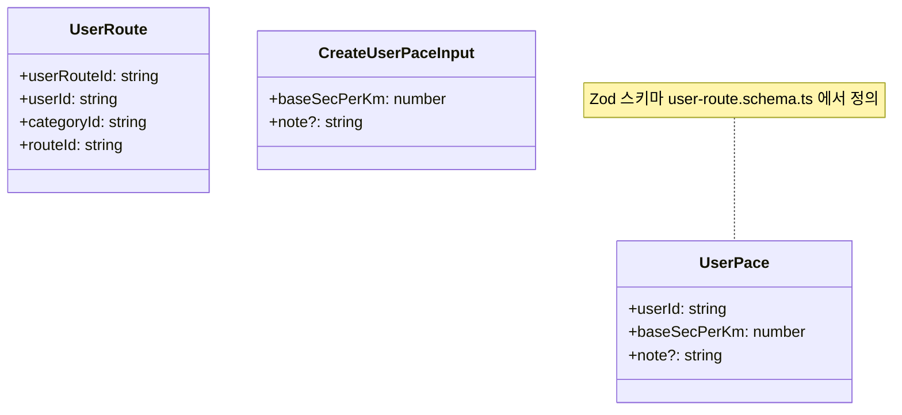

# 3.11 UserRoute

사용자-경로 관계 (좋아요·포크·내 경로 카테고리). `shared/types/user-route.ts`.

## DTO

> `UserPace` / `CreateUserPaceInput` 의 정확한 필드는 `shared/schemas/user-route.schema.ts` 의 Zod 스키마에서 추론됩니다.

## 책임

- **좋아요·포크** — Route 의 메타에 카운트로 반영 (`SavedRoute.likeCount`)
- **카테고리화** — 사용자가 만든 카테고리에 경로를 묶음 (`categoryId`)
- **개인 페이스** — `UserPace` 로 사용자별 기본 페이스 저장 (예상 소요시간 계산용)

## 관련 API

| Method | Path                        | 용도        |
| ------ | --------------------------- | ----------- |
| POST   | `/api/routes/:routeId/like` | 좋아요 추가 |
| DELETE | `/api/routes/:routeId/like` | 좋아요 취소 |
| POST   | `/api/routes/fork/:routeId` | 포크        |

## 관련 코드

- 타입 — `shared/types/user-route.ts`
- 스키마 — `shared/schemas/user-route.schema.ts`
- 프론트 — `app/entities/user/`
