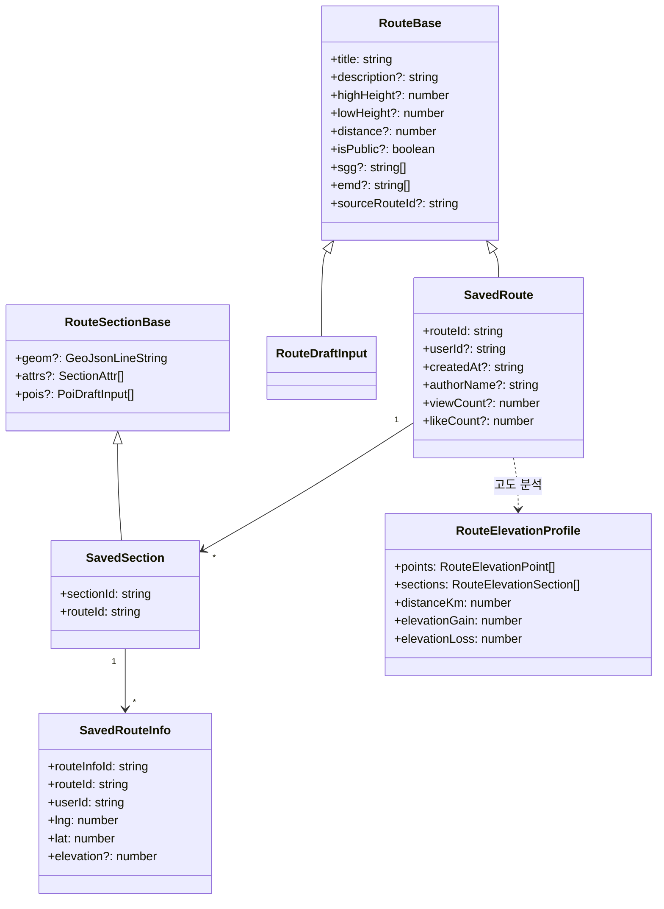

# 3.2 Route

러닝 경로 본체. `shared/types/route.ts` + `shared/schemas/route.schema.ts`.

## DTO 계층

## Base / Draft / Saved 패턴

세 단계로 정의됩니다.

- **Base**: 도메인 필수 필드만
- **DraftInput**: 생성 / 수정용 입력 (서버 요청 본문)
- **Saved\***: DB에 저장된 형태 (id, 메타데이터 포함)

이 패턴은 모든 도메인에 공통.

## 관련 API

| Method | Path                             | 용도            |
| ------ | -------------------------------- | --------------- |
| GET    | `/api/routes`                    | 목록            |
| POST   | `/api/routes`                    | 생성            |
| GET    | `/api/routes/:routeId/sections`  | 섹션 조회       |
| PUT    | `/api/routes/:routeId`           | 수정            |
| DELETE | `/api/routes/:routeId`           | 삭제            |
| POST   | `/api/routes/fork/:routeId`      | 가져오기 (fork) |
| POST   | `/api/routes/:routeId/like`      | 좋아요          |
| DELETE | `/api/routes/:routeId/like`      | 좋아요 취소     |
| GET    | `/api/routes/share/:routeId`     | 공유 링크       |
| GET    | `/api/routes/discover`           | 발견 피드       |
| GET    | `/api/routes/recommend`          | 날씨 기반 추천  |
| GET    | `/api/routes/search`             | 검색            |
| GET    | `/api/routes/stats`              | 통계            |
| POST   | `/api/routes/optimize`           | 경로 최적화     |
| GET    | `/api/routes/:routeId/feedbacks` | 피드백 조회     |
| POST   | `/api/routes/:routeId/feedbacks` | 피드백 작성     |

## 관련 코드

- 타입 — `shared/types/route.ts`, `shared/types/routeInfo.ts`
- 스키마 — `shared/schemas/route.schema.ts`, `shared/schemas/routeInfo.schema.ts`
- 서비스 — `server/services/route.service.ts`
- 리포지토리 — `server/repositories/route.repository.{ts,drizzle.ts}`
- 프론트 — `app/entities/route/`, `app/features/draw-route/`, `app/features/route-info/`
