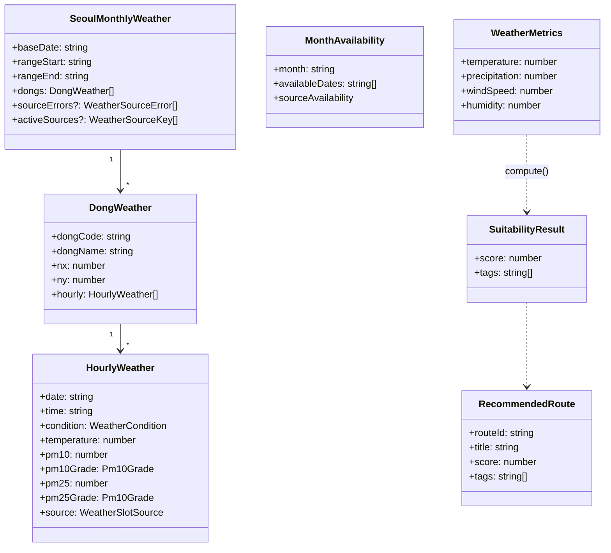
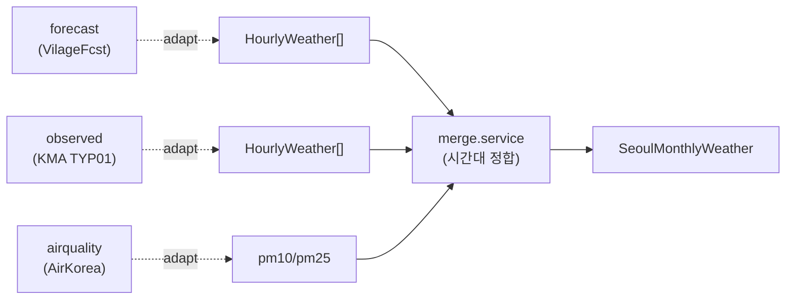

# 3.3 Weather

기상 정보 — 예보 · 관측 · 대기질 통합. `shared/types/weather.ts` + `shared/types/weather-recommend.ts`.

## DTO 계층

## 원본 응답 클래스 (adapter 입력)

외부 API의 원본 응답을 그대로 받는 클래스도 정의되어 있습니다. adapter 가 원본 → 도메인 객체로 변환.

| Class                         | 출처                       | adapter                 |
| ----------------------------- | -------------------------- | ----------------------- |
| `KmaObservedOriginalResponse` | 기상청 TYP01 관측 텍스트   | `observed.adapter.ts`   |
| `VilageFcstOriginalResponse`  | 기상청 동네예보 API        | `forecast.adapter.ts`   |
| `AirKoreaOriginalResponse`    | 에어코리아 실시간 대기오염 | `airquality.adapter.ts` |

## 통합 흐름

## 관련 API

| Method | Path                               | 용도              |
| ------ | ---------------------------------- | ----------------- |
| GET    | `/api/weather/:date`               | 특정 날짜 시간별  |
| GET    | `/api/weather/monthly/:month`      | 월별              |
| GET    | `/api/weather/availability/:month` | 가용일 (캘린더용) |
| GET    | `/api/routes/recommend`            | 날씨 기반 추천    |

## 관련 코드

- 타입 — `shared/types/weather.ts`, `shared/types/weather-recommend.ts`
- 스키마 — `shared/schemas/weather.schema.ts`
- 서비스 — `server/services/weather/*` (forecast, observed, airquality, merge, weather)
- 프론트 — `app/entities/weather/`, `app/features/weather-overlay/`
