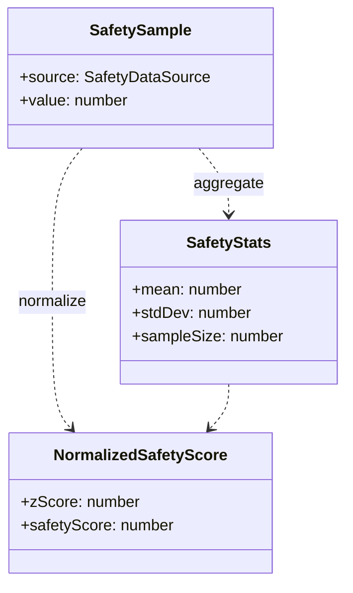
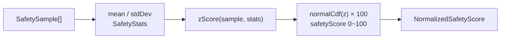

# 3.4 Safety

안전 점수 — Z-score 정규화 엔진. `server/services/safety/`.

## DTO

## 계산 흐름

- `safetyScore` 는 **높을수록 안전** (0~100)
- `sampleSize === 0` → 데이터 부재로 간주, 점수 **50** 반환
- `stdDev === 0` → NaN 방지를 위해 z = 0

## 데이터 소스

| Source     | 의미                          |
| ---------- | ----------------------------- |
| `accident` | 교통사고 통계                 |
| `crime`    | 범죄 통계                     |
| `lighting` | 조명 / 가로등 분포            |
| `ugc`      | 사용자 제보 (피드백 · 리포트) |

## 핵심 함수 (`normalize.ts`)

| Function                      | 책임                                        |
| ----------------------------- | ------------------------------------------- |
| `zScore(value, mean, stdDev)` | 표준 점수                                   |
| `erf(x)`                      | 오차함수 (Abramowitz–Stegun)                |
| `normalCdf(z)`                | 표준정규 누적분포                           |
| `normalize(samples)`          | 위 함수 조합해 `NormalizedSafetyScore` 반환 |

## 관련 코드

- 타입 — `server/services/safety/types.ts`
- 구현 — `server/services/safety/normalize.ts`
- 테스트 — `server/services/safety/__tests__/normalize.test.ts`
- 관련 PR — #195
