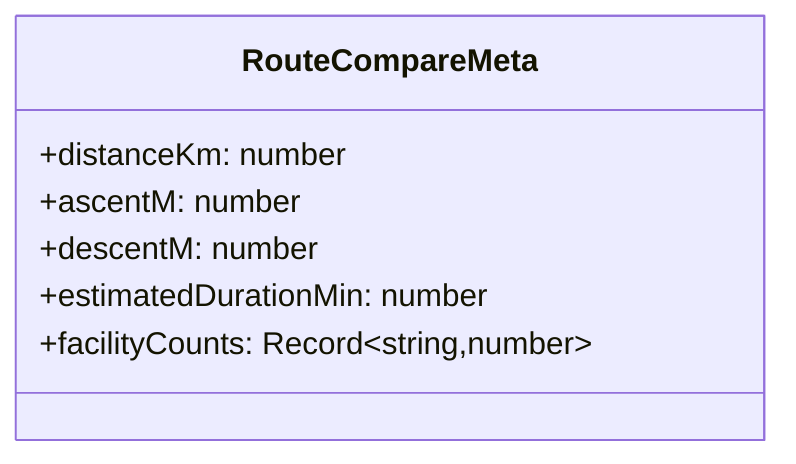
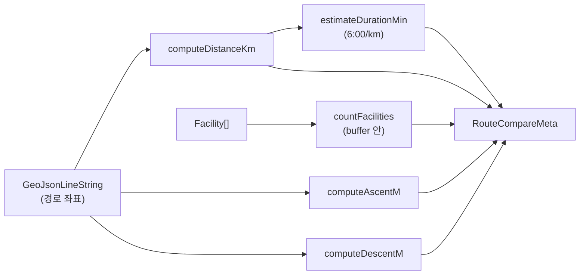

# 3.5 Route-Compare

경로 비교 지표 — 거리 · 고도 · 예상시간 · 시설물 카운트를 한 데로 집계. `shared/types/route-compare.ts`.

## DTO

| Field                  | 단위  | 산출 방법                                      |
| ---------------------- | ----- | ---------------------------------------------- |
| `distanceKm`           | km    | `turf.length` 기반                             |
| `ascentM`              | m     | z 좌표 양수 차이 합                            |
| `descentM`             | m     | z 좌표 음수 차이 합의 절대값                   |
| `estimatedDurationMin` | 분    | 기본 페이스 6:00/km                            |
| `facilityCounts`       | count | 경로 주변 시설물 카운트 (key = `FacilityType`) |

## 계산 흐름

## 사용처

- `/api/route-compare` 응답
- 두 경로의 비교 카드 UI

## 관련 코드

- 타입 — `shared/types/route-compare.ts`
- 서비스 — `server/services/route-compare.service.ts`
- 테스트 — `server/services/__tests__/route-compare.service.test.ts`
- 관련 PR — #189
