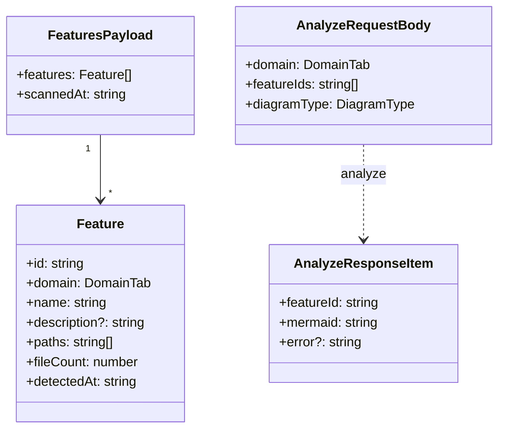
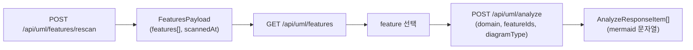

# 3.6 UML

코드 UML 분석 — feature 단위로 코드를 묶어 mermaid 다이어그램으로 시각화. `shared/types/uml.ts`.

## DTO

## 도메인 / 다이어그램 타입

| DomainTab  | 의미       |
| ---------- | ---------- |
| `planning` | 기획       |
| `frontend` | 프론트엔드 |
| `backend`  | 백엔드     |
| `library`  | 라이브러리 |

| DiagramType  | 출력              |
| ------------ | ----------------- |
| `class`      | 클래스 다이어그램 |
| `flowchart`  | 흐름도            |
| `sequence`   | 시퀀스 다이어그램 |
| `dependency` | 의존성 다이어그램 |

## 분석 흐름

## 관련 API

| Method | Path                       | 용도                            |
| ------ | -------------------------- | ------------------------------- |
| GET    | `/api/uml/features`        | feature 목록 조회               |
| POST   | `/api/uml/features/rescan` | feature 재스캔                  |
| POST   | `/api/uml/analyze`         | 선택한 feature들의 mermaid 생성 |

## 관련 코드

- 타입 — `shared/types/uml.ts`
- 스키마 — `shared/schemas/uml.schema.ts`
- 유틸 — `server/utils/uml/` (`detect-features.ts`, `paths.ts` + 테스트)
- 프론트 — `docs/uml-dashboard.md` (UML 대시보드 가이드)
