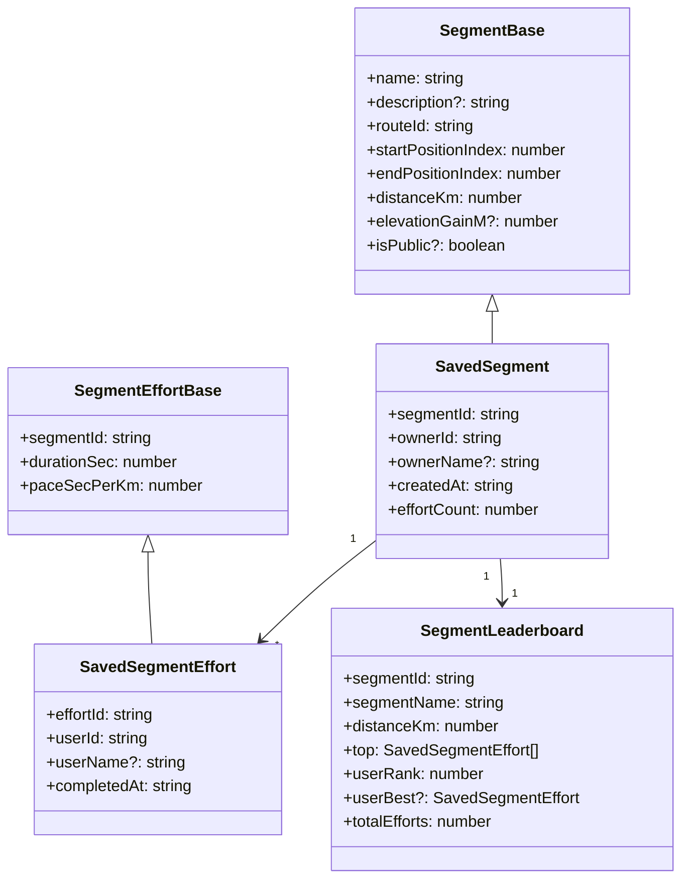

# 3.7 Segment

세그먼트 — 경로의 일부분을 등록해 다른 사용자들과 시간 비교 (Strava 식). `shared/types/segment.ts`, 관련 이슈 #147.

## DTO 계층

## 관련 API

| Method | Path                                   | 용도          |
| ------ | -------------------------------------- | ------------- |
| GET    | `/api/segments`                        | 세그먼트 목록 |
| POST   | `/api/segments`                        | 세그먼트 생성 |
| GET    | `/api/segments/:segmentId`             | 단건 조회     |
| DELETE | `/api/segments/:segmentId`             | 삭제          |
| GET    | `/api/segments/:segmentId/leaderboard` | 리더보드      |
| POST   | `/api/segments/:segmentId/efforts`     | 기록 등록     |

## 관련 코드

- 타입 — `shared/types/segment.ts`
- 스키마 — `shared/schemas/segment.schema.ts`
- 리포지토리 — `server/repositories/segment.repository.{ts,drizzle.ts}`
