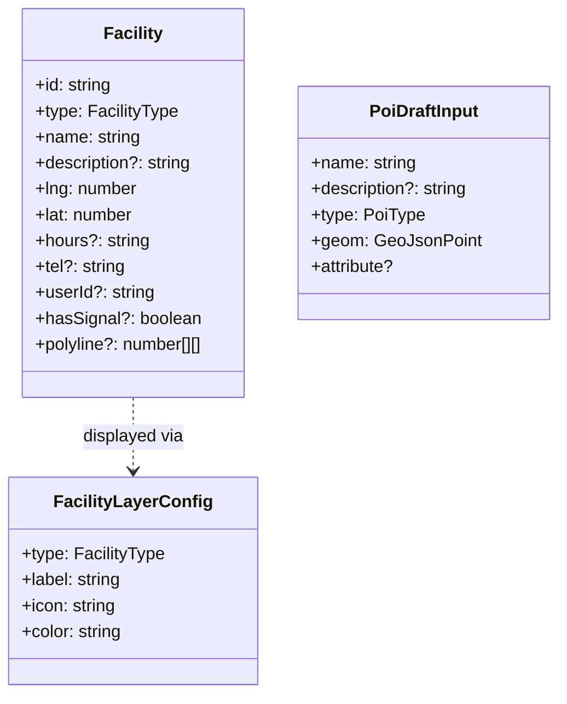

# 3.8 Facility

편의 시설 — 식수대 · 화장실 · 횡단보도 · 병원 등. `shared/types/facility.ts`.

## DTO

## FacilityType / PoiType

| FacilityType | 의미     | 특수 필드               |
| ------------ | -------- | ----------------------- |
| `crosswalk`  | 횡단보도 | `hasSignal`, `polyline` |
| `fountain`   | 식수대   |                         |
| `locker`     | 보관함   |                         |
| `hospital`   | 병원     |                         |
| `sidewalk`   | 보도     |                         |
| `toilet`     | 화장실   |                         |

`PoiType` (`HOSPITAL`, `CROSSWALK`, `WATER`) 는 경로 구간(`RouteSection.pois`) 에 연결되는 POI 의 좁은 카테고리입니다.

## 관련 API

| Method | Path                     | 용도             |
| ------ | ------------------------ | ---------------- |
| GET    | `/api/facilities`        | 목록             |
| GET    | `/api/facilities/nearby` | 좌표 근처 시설물 |

## 관련 코드

- 타입 — `shared/types/facility.ts`
- 스키마 — `shared/schemas/facility.schema.ts`
- 리포지토리 — `server/repositories/facility.repository.{ts,drizzle.ts}`
- 프론트 — `app/entities/facility/`, `app/widgets/facility-overlay/`
