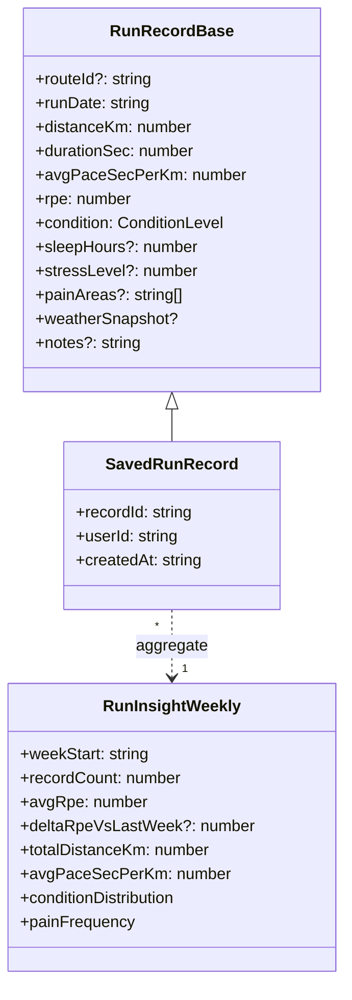

# 3.9 RunRecord

러닝 일지 + 컨디션 트래커. 매 달리기 후 RPE(자각 운동강도) · 컨디션 · 메모를 기록. `shared/types/run-record.ts`, 관련 이슈 #149.

## DTO 계층

## 도메인 값

| Field         | 범위                      | 비고            |
| ------------- | ------------------------- | --------------- |
| `rpe`         | 1~10                      | Borg CR-10 척도 |
| `condition`   | `good` / `normal` / `bad` |                 |
| `stressLevel` | 1~5                       | 선택            |
| `painAreas`   | string[]                  | 통증 부위 라벨  |

## 관련 API

| Method | Path                               | 용도          |
| ------ | ---------------------------------- | ------------- |
| GET    | `/api/run-records`                 | 목록          |
| POST   | `/api/run-records`                 | 기록 추가     |
| GET    | `/api/run-records/:recordId`       | 단건 조회     |
| PUT    | `/api/run-records/:recordId`       | 수정          |
| DELETE | `/api/run-records/:recordId`       | 삭제          |
| GET    | `/api/run-records/insights/weekly` | 주간 인사이트 |

## 관련 코드

- 타입 — `shared/types/run-record.ts`
- 스키마 — `shared/schemas/run-record.schema.ts`
- 리포지토리 — `server/repositories/run-record.repository.{ts,drizzle.ts}`
