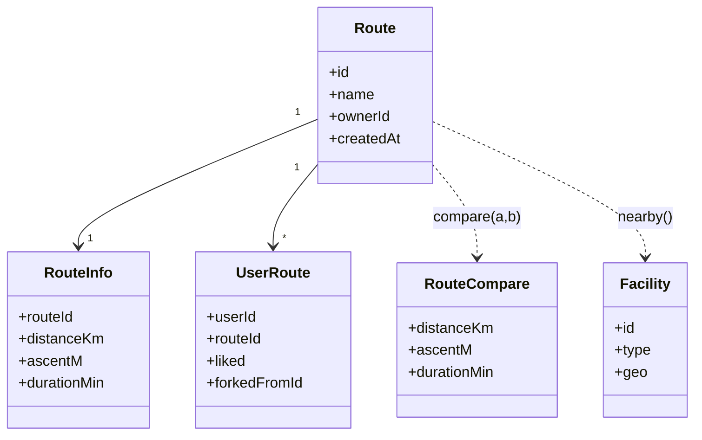

# 3. Domain Model

## 3.1 도메인 카탈로그

`shared/types/` 와 `shared/schemas/` 에 정의된 도메인 객체 목록입니다. 각 도메인의 상세 mermaid 다이어그램은 후속 페이지(3.2 ~)에서 단계적으로 정리됩니다.

### 핵심 도메인

| Domain        | 타입 파일                                           | Zod 스키마                                                               | 책임                                |
| ------------- | --------------------------------------------------- | ------------------------------------------------------------------------ | ----------------------------------- |
| Route         | `route.ts`, `routeInfo.ts`, `route-optimization.ts` | `route.schema.ts`, `routeInfo.schema.ts`, `route-optimization.schema.ts` | 러닝 경로 본체                      |
| Safety        | (server/services/safety)                            | —                                                                        | 안전 점수 정규화 (Z-score)          |
| Route-Compare | `route-compare.ts`                                  | —                                                                        | 경로 비교 지표 (거리·고도·예상시간) |
| Facility      | `facility.ts`                                       | `facility.schema.ts`                                                     | 편의 시설 (식수대·화장실 등)        |
| Discover      | `discover.ts`                                       | `discover.schema.ts`                                                     | 발견 피드                           |
| User-Route    | `user-route.ts`                                     | `user-route.schema.ts`                                                   | 사용자-경로 관계 (좋아요·포크)      |
| GeoJSON       | `geojson.ts`                                        | `geojson.schema.ts`                                                      | 지리 데이터                         |
| Gradient      | `gradient.ts`                                       | —                                                                        | 고도 그래프 색상 매핑               |
| Stats         | `stats.ts`                                          | —                                                                        | 통계                                |
| District      | `district.ts`                                       | —                                                                        | 행정 구역 (서울 동·구)              |

### Enum 카탈로그

| Enum                              | 용도                   |
| --------------------------------- | ---------------------- |
| `camera-view-mode.enum.ts`        | 카메라 시점 모드       |
| `difficulty-level.enum.ts`        | 난이도                 |
| `facility-type.enum.ts`           | 편의 시설 타입         |
| `ground-clamp-mode.enum.ts`       | 지표면 고정 모드       |
| `map-overlay-context.enum.ts`     | 지도 오버레이 컨텍스트 |
| `notification-tone.enum.ts`       | 알림 톤                |
| `playback-state.enum.ts`          | 재생 상태              |
| `pm10-grade.enum.ts`              | 미세먼지 등급          |
| `route-closing-mode.enum.ts`      | 경로 폐쇄 모드         |
| `route-optimization-mode.enum.ts` | 최적화 모드            |

### 보조 타입

| File           | 용도             |
| -------------- | ---------------- |
| `common.ts`    | 공통 헬퍼 타입   |
| `cesium.ts`    | Cesium 관련 헬퍼 |
| `enum-base.ts` | enum 베이스 정의 |
| `theme-map.ts` | 테마 색상 매핑   |

## 도메인 간 관계 (overview)

> 각 도메인의 상세(필드, 관련 API, 사용처) 는 3.2 이후 페이지에서 mermaid 클래스 다이어그램 + API 라우트 + 호출 흐름으로 정리됩니다.

다음 → [6-Testing-and-TDD](6-Testing-and-TDD.md) (TDD 섹션이 먼저 채워졌습니다)
