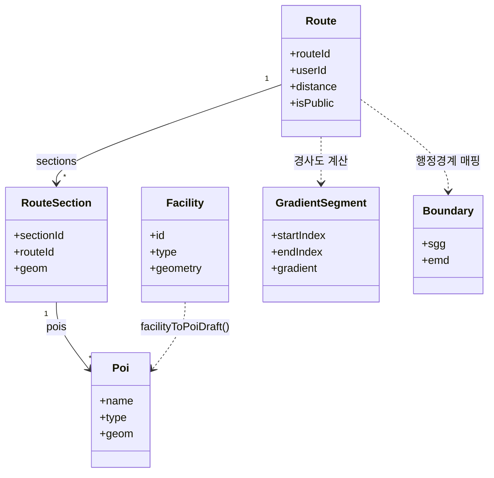

# 3. Domain Model

## 3.1 Entities 카탈로그

`app/entities/` 는 FSD(Feature-Sliced Design) 기준으로 6개의 도메인 엔티티로 나뉩니다. 각 엔티티는 `model/`(상태 store) · `api/`(부수효과 composable) · `lib/`(순수 함수) · `ui/`(Vue 컴포넌트) 계층으로 구성되며, 공유 계약은 `shared/types/` 와 `shared/schemas/` 에 정의됩니다.

| Entity         | 디렉터리                    | 책임                                | 주요 타입/스키마                                                     | 계층 구성              |
| -------------- | --------------------------- | ----------------------------------- | -------------------------------------------------------------------- | ---------------------- |
| `route`        | `app/entities/route`        | 러닝 경로 본체 · 구간 · POI 드로잉  | `route.ts`, `routeInfo.ts`, `route.schema.ts`, `routeInfo.schema.ts` | model · lib · ui       |
| `facility`     | `app/entities/facility`     | 편의 시설 · 인도 · POI 변환         | `facility.ts`, `facility-type.enum.ts`                               | model · api · lib · ui |
| `gradient`     | `app/entities/gradient`     | 경사도 세그먼트 · 난이도 분류       | `gradient.ts`, `difficulty-level.enum.ts`                            | model · api · lib · ui |
| `boundary`     | `app/entities/boundary`     | 행정경계(시군구·읍면동) · 서울 메타 | `district.ts`                                                        | model · api · lib      |
| `notification` | `app/entities/notification` | 토스트 알림 · 비동기 예외 처리      | `notification-tone.enum.ts`                                          | model · lib            |
| `user`         | `app/entities/user`         | 인증 세션 · 로그인/회원가입         | `AuthUser` (store 내부 정의)                                         | model · api · ui       |

> `route` 엔티티는 별도 `api/` 디렉터리 없이 `lib/`(드로잉·고도·GPX 변환) 와 `model/`(store) 로 구성됩니다. `notification` 은 `useToast()` 를 직접 호출하므로 `api/` 가 없습니다.

각 도메인의 상세 필드·API 라우트·호출 흐름은 세부 페이지에서 정리합니다.

- [3-2-Route](3-2-Route)
- [3-4-Safety](3-4-Safety)
- [3-5-Route-Compare](3-5-Route-Compare)
- [3-8-Facility](3-8-Facility)
- [3-11-UserRoute](3-11-UserRoute)

## 3.2 엔티티별 핵심 모델

### 3.2.1 Route

경로 타입은 **Draft(생성 입력) → Schema(Zod 검증) → Saved(DB 조회)** 3계층 패턴을 따릅니다. (`shared/types/route.ts`)

| 타입                     | 계층      | 주요 필드                                                                                                |
| ------------------------ | --------- | -------------------------------------------------------------------------------------------------------- |
| `RouteBase`              | 공통      | `title`, `description`, `highHeight`, `lowHeight`, `distance`, `isPublic`, `sgg`, `emd`, `sourceRouteId` |
| `RouteDraftInput`        | 생성 입력 | `RouteBase` 별칭                                                                                         |
| `SavedRoute`             | DB 조회   | `routeId`, `userId`, `createdAt`, `authorName`, `viewCount`, `likeCount`                                 |
| `RouteSectionBase`       | 구간 공통 | `geom`(GeoJsonLineString), `attrs`(SectionAttr[]), `pois`(PoiDraftInput[])                               |
| `RouteSectionDraftInput` | 구간 입력 | `RouteSectionBase` + `routeId`                                                                           |
| `SavedSection`           | 구간 조회 | `RouteSectionBase` + `sectionId`, `routeId`                                                              |
| `RouteElevationProfile`  | 고도 계산 | `points[]`, `sections[]`, `distanceKm`, `minElevation`, `maxElevation`, `elevationGain`, `elevationLoss` |

- **store** (`model/`): `useRouteDrawStore`(드로잉 상태), `useRouteInfoStore`(정보 핀), `useSectionInfoStore`(구간 패널), `useRouteClosingStore`(마감 모드)
- **lib** (`lib/`): `useRouteDraftBuilder`(초안 변환), `useRouteElevationProfile`(고도 프로파일), `useRouteGpx`/`useGpxParser`(GPX 입출력), `usePoiSnapping`(POI 스냅), `usePaceCalculator`(페이스·시간)
- **schema** (`route.schema.ts`): `createRouteSchema`(title 1~255자, distance ≥0), `createSectionSchema`(routeId 필수), `poiSchema`(type enum, Point geom)

### 3.2.2 Facility

`shared/types/facility.ts` 는 6종 시설물 타입과 EAV 속성 모델을 정의합니다.

| 타입                | 정의                                                                              |
| ------------------- | --------------------------------------------------------------------------------- |
| `FacilityType`      | `'crosswalk' \| 'fountain' \| 'locker' \| 'hospital' \| 'sidewalk' \| 'toilet'`   |
| `PoiType`           | `'HOSPITAL' \| 'CROSSWALK' \| 'WATER'`                                            |
| `PoiDraftInput`     | `name`, `type`(PoiType), `geom`(GeoJsonPoint), `description?`, `attribute?`       |
| `FacilityAttribute` | EAV 가변 속성 — `name`, `type`, `value`                                           |
| `Facility`          | `id`, `type`, `name`, `description?`, `geometry?`, `attributes[]`, `references[]` |

- **store** (`model/`): `useFacilityStore`(시설 데이터 + `activeTypes` 집합), `useSidewalkStore`(구·동 인도 선택)
- **api** (`api/`): `useFacilitySideeffect`(`/api/facilities/nearby` 카메라 기반 검색), `useSidewalkSideeffect`(인도 로드)
- **lib** (`lib/`): `useFacilityConversion`(`facilityToPoiDraft()` 변환), `useFacilityRenderer`(Cesium 마커 렌더)
- **enum** (`facility-type.enum.ts`): `FacilityTypeEnum` 인스턴스마다 `icon`·`color`·`poiType` 부가 속성 보유 (예: FOUNTAIN→`poiType:'WATER'`, LOCKER/TOILET→`poiType:null`)

### 3.2.3 Gradient

경사도 색상 매핑과 난이도 분류를 담당합니다. (`shared/types/gradient.ts`)

| 타입              | 정의                                                     |
| ----------------- | -------------------------------------------------------- |
| `DifficultyLevel` | `'beginner' \| 'intermediate' \| 'advanced' \| 'expert'` |
| `GradientSegment` | `startIndex`, `endIndex`, `gradient`(%), `color`         |

- **store** (`model/useGradientStore`): `isGradientVisible`, `currentDifficulty`, `gradientSegments`
- **lib** (`lib/useGradientAction`): `calculateSegmentGradients(coordinates)`(수평거리 turf.distance + 고도차 → 경사도%, <3% 초록 / 3~7% 노랑 / 7~12% 주황 / 12%+ 빨강), `classifyDifficulty(distanceKm, elevGain, maxGrad)`
- **api** (`api/useGradientSideeffect`): `drawnPositions` 변경 감지 → 경사도 폴리라인 렌더
- **enum** (`difficulty-level.enum.ts`): `DifficultyLevelEnum` — BEGINNER(#4CAF50, order 0) / INTERMEDIATE(#FFC107, 1) / ADVANCED(#FF9800, 2) / EXPERT(#F44336, 3)

### 3.2.4 Boundary

행정경계 메타데이터와 GeoJSON 로딩을 관리합니다. (`shared/types/district.ts`)

| 타입                | 필드                                                                |
| ------------------- | ------------------------------------------------------------------- |
| `SeoulGuMeta`       | `name`, `code`(행정코드), `lng`/`lat`(중심), `nx`/`ny`(기상청 격자) |
| `SeoulDongMap`      | `Record<구이름, 동이름[]>`                                          |
| `SeoulDistrictData` | `gu`(SeoulGuMeta[]), `dongMap`(SeoulDongMap)                        |

- **store** (`model/`): `useBoundaryStore`(`isGuActive`/`isDongActive` 토글), `useDistrictStore`(서울 메타·`guGeojson`·`dongGeojson`·`guByName` Map)
- **api** (`api/`): `useBoundarySideeffect`(GeoJSON → Cesium 폴리곤 렌더), `useDistrictSideeffect`(`/api/district` → store 갱신)
- **lib** (`lib/boundaryGeojson`): `loadBoundaryGeojson('sgg' | 'emd')` — `/admin_area/sgg_4326.geojson` 또는 `emd_4326.geojson` 로드, 모듈 싱글턴 캐시 + in-flight Promise 공유로 중복 fetch 방지

### 3.2.5 Notification

토스트 알림과 비동기 예외 처리를 담당하며 `api/` 없이 `model/` + `lib/` 만으로 구성됩니다.

- **store** (`model/useNotificationStore`): `notify({ title, message, tone? })` → `useToast().add(...)` 위임 (기본 톤 INFO)
- **lib** (`lib/useExceptionHandler`): `handleAsync(fn, options?)` — `$fetch` 의 `statusCode`/`statusMessage`/`data.message` 추출 후 토스트 알림 일관 처리
- **enum** (`notification-tone.enum.ts`): `NotificationToneEnum` — SUCCESS(green) / ERROR(red) / INFO(blue) / WARNING(orange), 각 인스턴스에 `color`·`icon`(lucide) 보유

### 3.2.6 User

인증 세션 상태와 better-auth 연동을 담당합니다. `AuthUser` 타입은 store 내부에 정의됩니다. (`app/entities/user/model/useAuthStore.ts`)

```ts
interface AuthUser {
    id: string
    name: string
    email: string
    image?: string | null
    role?: number | null // 1=USER, 50=ADMIN, 99=DEVELOPER
}
```

- **store** (`model/useAuthStore`): `user`(null이면 미로그인), `isLoggedIn`, `isAuthModalOpen`
- **api** (`api/useAuthSideeffect`): `fetchSession()`, `login(email, pwd)`, `signUp(name, email, pwd)`, `logout()` — better-auth `signIn.email` / `signUp` 호출
- **ui** (`ui/AuthSlideOverContent.vue`): 인증 슬라이드오버 패널

## 3.3 도메인 간 관계 (overview)



> 6개 엔티티 외의 통합/비교/통계 계약(`route-compare.ts`, `discover.ts`, `stats.ts`, `user-route.ts`) 과 enum/공유 인프라(`enum-base.ts`, `geojson.ts`, `cesium.ts`) 는 `shared/` 계층에 별도로 정의됩니다.

다음 → [6-Testing-and-TDD](6-Testing-and-TDD)
