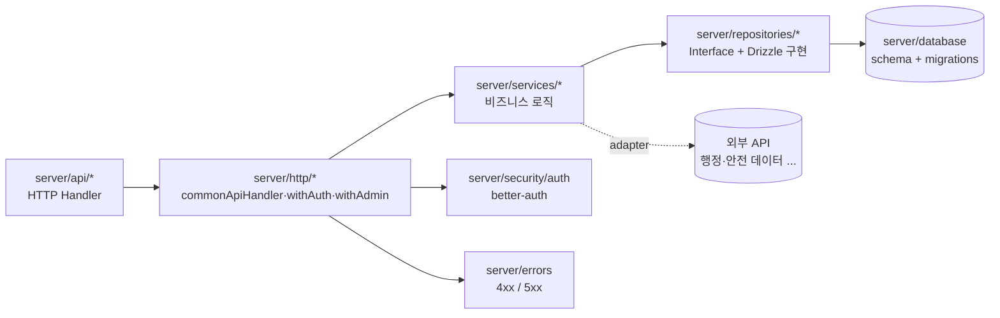

# 4. Server

Nitro(H3) 기반 백엔드. `server/` 디렉터리. 계층 구조는 **API Routes → HTTP 래퍼 → Services → Repositories → Database** 로 이어지며, 입력 검증은 Zod, 인증은 better-auth 로 처리한다.

## 4.1 API Endpoints

Nuxt Server Routes 컨벤션(`*.get.ts`, `*.post.ts` 등)으로 메서드를 파일명에 인코딩한다. 핸들러는 `commonApiHandler` / `withAuth` / `withAdmin` 래퍼로 감싼다 ([4.5 HTTP 래퍼](4-Server) 참고).

### Routes 도메인

| 엔드포인트                        | 파일                                | 메서드 | 인증 | 설명                                          |
| --------------------------------- | ----------------------------------- | ------ | ---- | --------------------------------------------- |
| `/api/routes`                     | `index.get.ts`                      | GET    | 선택 | 로그인 시 내 경로, 비로그인 시 공개 경로 목록 |
| `/api/routes`                     | `index.post.ts`                     | POST   | 필수 | 새 경로 + 구간 생성 (Zod 검증)                |
| `/api/routes/discover`            | `discover.get.ts`                   | GET    | 선택 | 공개 경로 탐색 (구/동 필터·정렬·좋아요 상태)  |
| `/api/routes/search`              | `search.get.ts`                     | GET    | 없음 | 키워드로 공개 경로 검색                       |
| `/api/routes/compare`             | `compare.get.ts`                    | GET    | 필수 | 두 경로 메타·구간·메트릭 비교                 |
| `/api/routes/optimize`            | `optimize.post.ts`                  | POST   | 필수 | 경로 최적화                                   |
| `/api/routes/stats`               | `stats.get.ts`                      | GET    | 없음 | 경로 통계                                     |
| `/api/routes/fork/[routeId]`      | `fork/[routeId].post.ts`            | POST   | 필수 | 공개 경로 포크(복제)                          |
| `/api/routes/[routeId]`           | `[routeId]/index.get.ts`            | GET    | 없음 | 개별 경로 조회                                |
| `/api/routes/[routeId]`           | `[routeId]/index.put.ts`            | PUT    | 필수 | 경로 메타·구간 수정 (소유자만)                |
| `/api/routes/[routeId]`           | `[routeId]/index.delete.ts`         | DELETE | 필수 | 경로 삭제 (소유자만)                          |
| `/api/routes/[routeId]/like`      | `[routeId]/like.post.ts`            | POST   | 필수 | 좋아요 추가                                   |
| `/api/routes/[routeId]/like`      | `[routeId]/like.delete.ts`          | DELETE | 필수 | 좋아요 취소                                   |
| `/api/routes/[routeId]/sections`  | `[routeId]/sections.get.ts`         | GET    | 없음 | 구간 목록 조회                                |
| `/api/routes/[routeId]/feedbacks` | `[routeId]/feedbacks/index.get.ts`  | GET    | 없음 | 경로 피드백/리포트 조회                       |
| `/api/routes/[routeId]/feedbacks` | `[routeId]/feedbacks/index.post.ts` | POST   | TODO | 경로 피드백 작성                              |
| `/api/routes/share/[routeId]`     | `share/[routeId].get.ts`            | GET    | 없음 | 공유 경로 조회                                |

### 기타 도메인

| 도메인     | 엔드포인트                                        | 파일                                         | 설명                        |
| ---------- | ------------------------------------------------- | -------------------------------------------- | --------------------------- |
| Auth       | `/api/auth/[...all]`                              | `auth/[...all].ts`                           | better-auth 라우팅          |
| Me         | `/api/me/feature-prefs` (GET·PUT)                 | `me/feature-prefs.get.ts`, `.put.ts`         | 사용자 플러그인 활성화 설정 |
| Facilities | `/api/facilities`, `/api/facilities/nearby`       | `facilities/index.get.ts`, `nearby.get.ts`   | 전체·반경 시설물 조회       |
| District   | `/api/district`                                   | `district/index.get.ts`                      | 행정 코드 변환              |
| Boundary   | `/api/boundary/seoul`, `/api/boundary/seoul-dong` | `boundary/seoul.get.ts`, `seoul-dong.get.ts` | 행정 구역 경계 데이터       |

**디자인 원칙**:

- 핸들러는 **얇게** — 입력 검증 + service 호출 + 응답 변환만
- 비즈니스 로직은 `server/services/` 로 위임
- Zod 스키마(`shared/schemas/*`)로 입력 검증, 검증 실패는 400 으로 응답

## 4.2 HTTP 래퍼

`server/http/` — 핸들러를 감싸는 합성(composition) 래퍼. 인증·에러 처리·파라미터 추출을 가로지른다.

| 파일                  | 시그니처 요지                                                 | 역할                                                              |
| --------------------- | ------------------------------------------------------------- | ----------------------------------------------------------------- |
| `commonApiHandler.ts` | `commonApiHandler<T>(handler)`                                | `defineEventHandler` + `withErrorHandler` 합성                    |
| `withAuth.ts`         | `withAuth<T>((event, user) => ...)`                           | 세션 필수, 미인증 시 401. `user` 주입 + `event.context.user` 저장 |
| `withAdmin.ts`        | `withAdmin<T>((event, user) => ...)`                          | 세션 필수(401) + `VIEW_ADMIN_PAGE` 권한 확인(403)                 |
| `session.ts`          | `getSessionUser` / `requireSession` / `requireRouteOwnership` | 세션 조회, 세션 강제(401), 소유권 검증(401/404/403)               |
| `params.ts`           | `requireRouteIdParam(event)`                                  | `routeId` 경로 파라미터 추출, 없으면 400                          |

합성 사용 예:

```typescript
commonApiHandler(
    withAuth(async (event, user) => {
        // 인증된 user 가 주입된 상태로 로직 수행
    })
)
```

## 4.3 Services

`server/services/` — 비즈니스 로직. **순수 함수/객체 우선**.

| Service                    | 책임                                                         |
| -------------------------- | ------------------------------------------------------------ |
| `route.service.ts`         | 경로 CRUD·좋아요·조회수·포크 등 경로 도메인 로직             |
| `route-compare.service.ts` | 경로 비교 지표 계산 ([3-5-Route-Compare](3-5-Route-Compare)) |
| `safety/normalize.ts`      | 안전 점수 Z-score 정규화 ([3-4-Safety](3-4-Safety))          |
| `safety/segment.ts`        | 경로 세그먼트 분할 + 세그먼트별 안전 점수 계산               |
| `safety/types.ts`          | 안전 관련 타입 정의                                          |

### routeService 주요 메서드

`routeService` 는 함수 모음 객체(`export const routeService = { ... }`)이며 Repository 와 `lookupDistricts`(행정 조회)에 의존한다.

| 메서드                                             | 설명                                         |
| -------------------------------------------------- | -------------------------------------------- |
| `getRouteById` / `listRoutes` / `listRoutesByUser` | Repository 위임 조회                         |
| `searchPublicRoutes(query?)`                       | 공개 경로 검색 위임                          |
| `createRouteWithSections(input, sections, userId)` | **구/동 행정 자동 조회 후 경로 + 구간 저장** |
| `updateRouteWithSections(...)`                     | 구/동 재조회 후 구간 교체                    |
| `deleteRoute` / `getSectionsByRouteId`             | Repository 위임                              |
| `incrementViewCount`                               | 조회수 증가                                  |
| `likeRoute` / `unlikeRoute` / `isLikedByUser`      | 좋아요 추가·취소·확인 (경로 존재 확인 포함)  |
| `forkRoute(sourceRouteId, userId)`                 | **포크: 원본 확인 → 중복 확인 → 구간 복제**  |

**패턴**:

- 외부 API → adapter (`*.adapter.ts`) 에서 raw → 도메인 변환
- service 본체는 가능한 한 순수 함수
- DB 접근 필요 시 Repository interface 주입

### Safety 핵심 함수

- `splitRouteIntoSegments(coords, segmentLengthM)` — 좌표 배열을 일정 간격 세그먼트로 분할 (`@turf/turf` 활용)
- `computeSegmentSafetyScores(samples, weights)` — accident·crime·lighting·ugc 정규화 후 가중 합산
- `normalize(value, stats)` — Z-score → 0~100 안전 점수 변환
- `normalCdf(z)` — 표준 정규 누적분포(Abramowitz & Stegun 근사)

## 4.4 Repositories

`server/repositories/` — 데이터 접근. **인터페이스 + Drizzle 구현을 한 파일에** 둔다(예: `route.repository.ts` 안에 `IRouteRepository` 와 `DrizzleRouteRepository`).

| Domain          | 파일                            | 인터페이스                   | 구현체                             |
| --------------- | ------------------------------- | ---------------------------- | ---------------------------------- |
| Route           | `route.repository.ts`           | `IRouteRepository`           | `DrizzleRouteRepository`           |
| RouteInfo       | `routeInfo.repository.ts`       | `IRouteInfoRepository`       | `DrizzleRouteInfoRepository`       |
| Facility        | `facility.repository.ts`        | `IFacilityRepository`        | `DrizzleFacilityRepository`        |
| UserFeaturePref | `userFeaturePref.repository.ts` | `IUserFeaturePrefRepository` | `DrizzleUserFeaturePrefRepository` |

`index.ts` 가 Singleton 팩토리를 노출한다: `getRouteRepository()`, `getRouteInfoRepository()`, `getFacilityRepository()`, `getUserFeaturePrefRepository()`. 각 팩토리는 `getDb()` 로 DB 핸들을 받아 구현체를 1회 생성·캐시한다.

### IRouteRepository 주요 메서드

| 메서드                                        | 설명                                          |
| --------------------------------------------- | --------------------------------------------- |
| `createRoute` / `getRoute`                    | 경로 생성·단건 조회                           |
| `listRoutes` / `listRoutesByUser`             | 전체(생성 최신순)·사용자 경로 목록            |
| `searchPublicRoutes(query?)`                  | 공개 경로 제목/설명 LIKE 검색                 |
| `updateRoute` / `deleteRoute`                 | 메타 수정·삭제                                |
| `createSection` / `createSections`            | 구간 1건 / 다중(트랜잭션) 생성, geom·POI 포함 |
| `getSectionsByRouteId`                        | 구간 목록 + POI 조회                          |
| `deleteSectionsByRouteId`                     | 구간 일괄 삭제                                |
| `hasRouteFromSource(userId, sourceId)`        | 복제 여부 확인                                |
| `incrementViewCount`                          | 조회수 증가                                   |
| `likeRoute` / `unlikeRoute` / `isLikedByUser` | 좋아요 추가·취소·확인                         |

**특징**:

- **지공간 처리("facilities 패턴")**: 비공간 컬럼은 Drizzle 로, `geom` 은 raw SQL(PostGIS `ST_Force3D`·`ST_SetSRID`·`ST_GeomFromGeoJSON`·`ST_AsGeoJSON`)로 관리. PGlite 미지원·스키마 복잡화 방지가 이유.
- **트랜잭션**: `createSections` 다중 생성 시 한 트랜잭션으로 처리
- **집계 캐시**: `routes.viewCount`·`routes.likeCount` 를 캐시하고 `route_likes` 정규화 테이블은 별도 유지

### Facility / RouteInfo / FeaturePref

- `IFacilityRepository`: `findNearby(lat, lng, radius, types)`(PostGIS `ST_DWithin` geography 반경 검색), `findAll()`. 기본 행 + EAV 속성 + 참조를 `Promise.all` 병렬 조회 후 단일 `Facility[]` 로 **조립**한다.
- `IRouteInfoRepository`: `findByRouteId`, `create`(`ST_MakePoint` 으로 PointZ 저장). Drizzle insert + raw SQL geom update 분리.
- `IUserFeaturePrefRepository`: `findByUserId`, `upsert(userId, pluginId, enabled)`(유니크 복합키 토글).

**테스트** — `__tests__/*.test.ts` 패턴으로 Testcontainers 기반 실제 PostGIS 컨테이너 사용 ([6-3-Test-Writing-Guide](6-3-Test-Writing-Guide) 2번 참고).

## 4.5 Database

`server/database/` — Drizzle ORM + PostgreSQL/PostGIS.

| 경로          | 역할                                                  |
| ------------- | ----------------------------------------------------- |
| `schema/`     | 도메인별 Drizzle 테이블 정의                          |
| `schema.ts`   | 스키마 배럴(barrel) — 전체 테이블 re-export           |
| `migrations/` | 수기 작성 마이그레이션 SQL(현재 10개) + `meta` 스냅샷 |
| `client.ts`   | DB 클라이언트 (`getDb()` Singleton)                   |
| `seed.ts`     | `pnpm seed` 진입점                                    |

### 스키마 파일과 테이블

| 스키마 파일             | 테이블                                                          | 설명                                          |
| ----------------------- | --------------------------------------------------------------- | --------------------------------------------- |
| `users.ts`              | `users`, `user_sessions`, `user_accounts`, `user_verifications` | 계정·세션·OAuth/자격증명·이메일 인증          |
| `routes.ts`             | `routes`, `route_likes`, `route_sections`                       | 경로 메타, 좋아요(복합 PK), 구간(LineStringZ) |
| `routeSectionPois.ts`   | `route_section_pois`                                            | 구간별 POI (PointZ, JSONB 가변 속성)          |
| `routeInfos.ts`         | `route_infos`                                                   | 경로 마커/정보 (PointZ, 사용자 주석)          |
| `facilities.ts`         | `facilities`                                                    | 시설물 기본 (id·type·name·description·geom)   |
| `facilityAttributes.ts` | `crosswalk_attribute`, `toilet_attribute`, `hospital_attribute` | 시설물 종류별 EAV 속성                        |
| `facilityReference.ts`  | `facility_reference`                                            | 시설물 외부 참조 링크 (1:N)                   |
| `userFeaturePrefs.ts`   | `user_feature_prefs`                                            | 사용자 플러그인 설정 (userId·pluginId 유니크) |

### 지공간 처리 패턴

비공간 컬럼은 Drizzle, 공간(geometry) 컬럼은 raw SQL 로 분리 관리한다.

```sql
-- 비공간 (Drizzle)
INSERT INTO route_sections (section_id, route_id, attrs) VALUES ($1, $2, $3)

-- 공간 (raw SQL)
UPDATE route_sections
SET geom = ST_Force3D(ST_SetSRID(ST_GeomFromGeoJSON($1), 4326))
WHERE section_id = $2
```

### 마이그레이션

마이그레이션은 `drizzle-kit generate` 의 파괴적 DROP 을 피하기 위해 **SQL + 저널을 수기로** 작성한다.

| 파일                                      | 설명                                  |
| ----------------------------------------- | ------------------------------------- |
| `0000_woozy_pretty_boy.sql`               | 초기 스키마(routes·sections·users 등) |
| `0001_next_ken_ellis.sql`                 | `route_likes` 추가                    |
| `0002_dazzling_gertrude_yorkes.sql`       | `facilities` 기본 테이블              |
| `0003_concerned_tiger_shark.sql`          | 소규모 수정                           |
| `0004_abnormal_skaar.sql`                 | 스키마 확장                           |
| `0005_wide_thundra.sql`                   | PostGIS 관련 대규모 변경              |
| `0006_user_feature_prefs.sql`             | `user_feature_prefs` 추가             |
| `0007_facilities_attribute_reference.sql` | 시설물 속성 분리(EAV)                 |
| `0008_facilities_geom_eav.sql`            | 시설물 기하 정규화                    |
| `0009_postgis_geom_normalize.sql`         | PostGIS 기하 정규화                   |

### DB 클라이언트 부팅 흐름

`client.ts` 의 `getDb()` Singleton:

1. `getDatabaseUrl()` — `DATABASE_URL` 우선, 없으면 `POSTGRES_*` 환경변수로 조립
2. `pg.Pool` 생성
3. `assertConnectable()` — 접속 가능 확인
4. `hasCoreTables()` — `users` 테이블 존재 확인
5. 없으면 `migrate()` 실행

테스트용으로 `initTestDb(connectionString)`, `resetDb()` 제공.

## 4.6 인증 (better-auth)

`server/security/auth/` — better-auth 기반 인증.

| 파일          | 역할                                                                            |
| ------------- | ------------------------------------------------------------------------------- |
| `service.ts`  | `IAuthService`(`getSession`/`requireSession`) + `auth` 구현, `SessionUser` 타입 |
| `instance.ts` | `getAuthMode()` Singleton — better-auth 인스턴스 생성                           |
| `env.ts`      | 인증 환경변수 + `assertProductionAuthEnv()` 부팅 검증                           |

`SessionUser` 형태: `{ userId, name, email, role }`.

**better-auth 설정 요지**:

- 어댑터: Drizzle + PostgreSQL
- 사용자 정의 필드: `role`(기본 1), `banned`, `banReason`, `banExpires`
- 이메일+비밀번호: 최소 10자
- 세션 유효기간: 30일
- 쿠키 보안: PRODUCT 환경 `Secure`+HTTPS 강제, `sameSite: 'lax'`(CSRF 완화), `httpOnly: true`(XSS 탈취 방지)

**환경변수**:

| 변수                          | 기본값                    | 설명                                   |
| ----------------------------- | ------------------------- | -------------------------------------- |
| `BETTER_AUTH_SECRET`          | undefined                 | 세션 서명 (PRODUCT: 32자 이상 필수)    |
| `BETTER_AUTH_URL`             | `http://localhost:{PORT}` | 콜백 도메인 (PRODUCT: `https://` 필수) |
| `BETTER_AUTH_TRUSTED_ORIGINS` | undefined                 | CSRF 신뢰 출처 (쉼표 구분)             |

### 권한·역할

- 권한 상수: `#shared/constants/permissions` — 예: `VIEW_ADMIN_PAGE`
- 역할 레벨: `#shared/constants/roles` — 예: `USER = 1`
- `hasPermission(role, permission)` 으로 검사. `withAdmin` 래퍼가 이를 사용한다.

## 4.7 에러 처리

`server/errors/` — 4xx/5xx 분류 헬퍼와 핸들러.

| 파일                  | 내용                                                                                   |
| --------------------- | -------------------------------------------------------------------------------------- |
| `errors/error-400.ts` | `badRequest(400)`·`unauthorized(401)`·`forbidden(403)`·`notFound(404)`·`conflict(409)` |
| `errors/error-500.ts` | `internalError(500)`                                                                   |
| `error-handler.ts`    | `withErrorHandler<T>(handler)`                                                         |

`withErrorHandler` 동작:

1. H3 `createError` → 그대로 전파
2. Zod `ValidationError` → 400 (상세 노출 방지)
3. 예상치 못한 에러 → 500 + 로깅

## 4.8 설정 (config)

`server/config/`:

| 파일         | 함수               | 설명                                               |
| ------------ | ------------------ | -------------------------------------------------- |
| `dbMode.ts`  | `getDatabaseUrl()` | `DATABASE_URL` → `POSTGRES_*` 조립 → 불가 시 throw |
| `envMode.ts` | `getEnvMode()`     | `'DEVELOP'` \| `'PRODUCT'` 환경 모드 판별          |

## 4.9 공유 타입

서버·프론트가 공유하는 타입은 `shared/` 에 둔다(`#shared/*` alias).

- `#shared/types/route` — `SavedRoute`, `SavedSection`, `RouteDraftInput`
- `#shared/types/facility` — `Facility`, `FacilityType`, `FacilityAttribute`
- `#shared/types/routeInfo` — `SavedRouteInfo`
- `#shared/types/discover` — `RouteDiscoverCard`
- `#shared/types/geojson` — `GeoJsonPoint`, `GeoJsonLineString`
- `#shared/schemas/route.schema` — Zod 검증 스키마

> 위 공유 타입 경로 일부는 분석 노트 기준 추정이며, 정확한 export 명은 실제 `shared/` 정의를 따른다(TODO: 세부 확인).

## 의존 흐름


