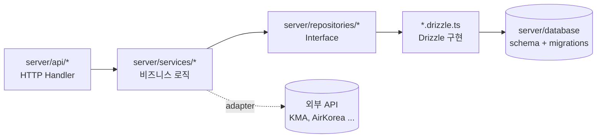

# 4. Server

Nitro 기반 백엔드. `server/` 디렉터리.

## 4.1 API Endpoints

총 50+ 엔드포인트, 도메인별로 분류됩니다.

| 도메인      | 엔드포인트 그룹                                                                                 |
| ----------- | ----------------------------------------------------------------------------------------------- |
| Auth        | `/api/auth/[...all]` (better-auth)                                                              |
| Routes      | `/api/routes/**` (목록·생성·수정·삭제·검색·추천·최적화·통계·fork·like·share·feedbacks·sections) |
| Segments    | `/api/segments/**` (생성·삭제·리더보드·기록 등록)                                               |
| Run Records | `/api/run-records/**` (CRUD + `/insights/weekly`)                                               |
| Weather     | `/api/weather/:date`, `/api/weather/monthly/:month`, `/api/weather/availability/:month`         |
| Facilities  | `/api/facilities`, `/api/facilities/nearby`                                                     |
| Curation    | `/api/curation/**` (collections + routes + active)                                              |
| UML         | `/api/uml/features`, `/api/uml/features/rescan`, `/api/uml/analyze`                             |
| District    | `/api/district`                                                                                 |
| Boundary    | `/api/boundary/seoul`, `/api/boundary/seoul-dong`                                               |
| Admin       | `/api/admin/seed/status`, `/api/admin/seed/run`                                                 |

**디자인 원칙**:

- 핸들러는 **얇게** — 입력 검증 + service 호출 + 응답 변환만
- 비즈니스 로직은 `server/services/` 로 위임
- Zod 스키마(`shared/schemas/*`)로 입력 검증

## 4.2 Services

`server/services/` — 비즈니스 로직. **순수 함수 우선**.

| Service                         | 책임                                                            |
| ------------------------------- | --------------------------------------------------------------- |
| `route.service.ts`              | 경로 관련 비즈니스 로직                                         |
| `route-compare.service.ts`      | 경로 비교 지표 계산 ([3-5-Route-Compare](3-5-Route-Compare.md)) |
| `safety/normalize.ts`           | 안전 점수 정규화 ([3-4-Safety](3-4-Safety.md))                  |
| `weather/forecast.service.ts`   | 동네예보                                                        |
| `weather/observed.service.ts`   | 관측 데이터                                                     |
| `weather/airquality.service.ts` | 대기질                                                          |
| `weather/merge.service.ts`      | 예보·관측·대기질 통합                                           |
| `weather/weather.service.ts`    | 외부 응답 통합 진입점                                           |

**패턴**:

- 외부 API → adapter (`*.adapter.ts`) 에서 raw → 도메인 변환
- service 본체는 가능한 한 순수 함수
- DB 접근 필요 시 Repository interface 주입

## 4.3 Repositories

`server/repositories/` — 데이터 접근. **인터페이스 + Drizzle 구현 분리**.

| Domain    | Interface                  | Drizzle 구현                       |
| --------- | -------------------------- | ---------------------------------- |
| Route     | `route.repository.ts`      | `route.repository.drizzle.ts`      |
| RouteInfo | `routeInfo.repository.ts`  | `routeInfo.repository.drizzle.ts`  |
| Segment   | `segment.repository.ts`    | `segment.repository.drizzle.ts`    |
| Facility  | `facility.repository.ts`   | `facility.repository.drizzle.ts`   |
| Curation  | `curation.repository.ts`   | `curation.repository.drizzle.ts`   |
| RunRecord | `run-record.repository.ts` | `run-record.repository.drizzle.ts` |

`index.ts` 가 환경에 따라 구현체를 선택 (팩토리 패턴).

**테스트** — `__tests__/*.pglite.test.ts` 패턴으로 PGlite 인메모리 PostgreSQL 사용 ([6-3-Test-Writing-Guide](6-3-Test-Writing-Guide.md) 2번 참고).

## 4.4 Database

`server/database/` — Drizzle ORM + PostgreSQL / PGlite.

| 디렉터리      | 역할                                                                                                                                     |
| ------------- | ---------------------------------------------------------------------------------------------------------------------------------------- |
| `schema/`     | 도메인별 Drizzle 테이블 정의 (`routes.ts`, `curations.ts`, `routeInfos.ts`, `facilities.ts`, `runRecords.ts`, `segments.ts`, `users.ts`) |
| `migrations/` | 생성된 마이그레이션 SQL (현재 6개) + 메타 스냅샷                                                                                         |
| `client.ts`   | DB 클라이언트 (PG / PGlite 분기)                                                                                                         |
| `seed.ts`     | `pnpm seed` 진입점                                                                                                                       |

## 의존 흐름

