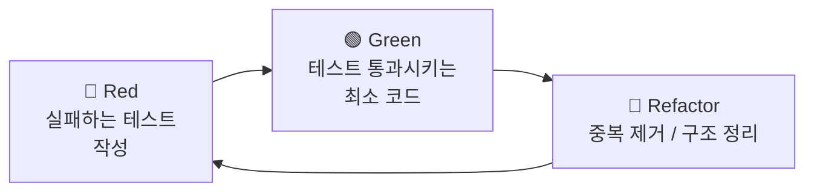

# 6.1 TDD 개념과 기본 규칙

## TDD란?

**TDD(Test-Driven Development)** 는 테스트를 구현 코드보다 **먼저** 작성하는 개발 방식입니다. 구현 전에 "이 코드가 어떻게 동작해야 하는가" 를 테스트로 명세하고, 그 테스트를 통과시키는 최소한의 코드를 작성합니다.

## Red-Green-Refactor 사이클

TDD의 기본 사이클은 짧고 반복적입니다.



| 단계     | 목적                           | 흔한 실수                                        |
| -------- | ------------------------------ | ------------------------------------------------ |
| Red      | 동작 명세를 코드로 표현        | 컴파일 에러로 실패 — assertion 실패여야 진짜 Red |
| Green    | 최소한의 코드로 빠르게 통과    | 한 사이클에 여러 기능을 한 번에 구현             |
| Refactor | 코드 / 테스트의 중복·표현 개선 | 동작 변경을 같이 함 — 기능 변경은 별도 사이클    |

## 기본 규칙 (Runnable 2.0 컨벤션)

### 1. 테스트는 구현 옆에 둔다

```
server/services/route-compare.service.ts
server/services/__tests__/route-compare.service.test.ts
```

`__tests__/` 디렉터리는 대상 코드와 같은 폴더에 둡니다. 이 패턴은 이미 `shared/`, `server/`, `app/` 모든 레이어에서 일관되게 사용됩니다.

### 2. 순수 함수 우선

비즈니스 로직은 **순수 함수** 로 작성합니다 (예: `server/services/safety/normalize.ts`).

- 입력 → 출력만 의존
- I/O · 시간 · 난수 등 비결정 요소는 인자로 주입
- 결과: TDD 사이클이 짧고 가벼움

### 3. 한 테스트는 한 가지를 검증한다

- `describe` 는 대상 단위(함수·클래스·컴포넌트), `it` / `test` 는 하나의 행동
- assertion 이 여러 개라도 **한 가지 행동** 의 일부여야 함

### 4. FIRST 원칙

| 원칙                | 의미                                                        |
| ------------------- | ----------------------------------------------------------- |
| **F**ast            | 빠르게 — 한 번 돌리는데 수 초 이내, 회귀 안전망 역할        |
| **I**solated        | 격리 — 다른 테스트의 상태에 의존 X (전역 상태·DB 공유 금지) |
| **R**epeatable      | 반복 가능 — 같은 입력이면 항상 같은 결과                    |
| **S**elf-validating | 자가 검증 — assertion 으로 pass/fail 자동                   |
| **T**imely          | 적시에 — 구현 전이나 직후에 작성, 한 달 뒤 X                |

### 5. 테스트 이름은 행동을 서술한다

```ts
// ❌
test('test1', ...)
test('compute', ...)

// ✅
test('총 거리 = 좌표 쌍의 Haversine 합', ...)
test('빈 배열은 0km 를 반환한다', ...)
```

### 6. 의존성은 명시적으로 주입

- 데이터 접근은 Repository interface (`server/repositories/*.repository.ts`) 로
- 외부 API 호출은 adapter (`server/services/weather/*.adapter.ts`) 로 격리
- 테스트에서는 InMemory 구현 / mock adapter 로 대체

### 7. 통합 테스트는 별도 표시

| 종류      | 패턴               | 예시                                                            |
| --------- | ------------------ | --------------------------------------------------------------- |
| 유닛      | `*.test.ts`        | `server/services/__tests__/route-compare.service.test.ts`       |
| 통합 (DB) | `*.pglite.test.ts` | `server/repositories/__tests__/route.repository.pglite.test.ts` |
| E2E       | `*.spec.ts`        | `tests/e2e/*.spec.ts`                                           |

## TDD가 잘 작동하는 시그널

- 한 사이클이 **5분 이내** 에 끝난다
- 테스트 파일이 구현 파일과 **비슷한 크기** 다 (지나치게 길면 단위가 너무 크다)
- 리팩토링 시 테스트가 거의 그대로 통과한다 (테스트가 구현 디테일에 의존 X)
- 새 요구가 들어왔을 때 먼저 떠오르는 것이 "어떤 테스트를 추가할까"

## TDD가 어색해질 때

- I/O가 많은 코드 → **adapter / repository 패턴** 으로 격리
- UI 인터랙션 → 가능한 한 model · composable로 추출해 단위 테스트, 시각 회귀는 E2E로
- 시간 · 난수 의존 → fake clock · seed 주입

다음 → [6-2-Test-Infrastructure](6-2-Test-Infrastructure)
