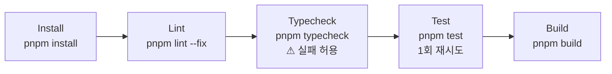

# 6.4 CI 게이트

Jenkins 파이프라인의 테스트 게이트 순서입니다.



| 단계      | 명령                       | 실패 시                 |
| --------- | -------------------------- | ----------------------- |
| Install   | `pnpm install`             | 파이프라인 중단         |
| Lint      | `pnpm lint --fix`          | 파이프라인 중단         |
| Typecheck | `pnpm typecheck \|\| true` | 경고 (실패 허용)        |
| Test      | `pnpm test \|\| pnpm test` | 두 번째도 실패하면 중단 |
| Build     | `pnpm build`               | 파이프라인 중단         |

## 게이트 정책

- **Lint 실패 즉시 중단** — 코드 스타일 일관성 보호
- **Typecheck 는 현재 경고** — 점진적으로 strict 화. 새 코드는 typecheck 통과시키되, 기존 경고가 모두 잡힐 때까지 게이트 미적용
- **Test 재시도 허용** — 일시적 외부 API 흔들림에 한해. 두 번째도 실패하면 진짜 회귀로 간주
- **Build 는 항상 마지막** — production 번들이 만들어지는지 확인

## TDD 와의 관계

- TDD 사이클에서 작성한 테스트는 모두 `pnpm test` 단계에서 자동 실행
- 새 기능을 추가할 때 테스트가 없으면 CI 는 통과하지만 **회귀 안전망에서 빠짐** — 코드 리뷰에서 보완
- E2E 는 별도 (`pnpm test:e2e`) — 현재 CI 게이트 X, 추후 단계적 추가 예정

## 로컬에서 게이트 흉내내기

```bash
pnpm lint --fix && pnpm typecheck && pnpm test && pnpm build
```

PR 올리기 전에 한 번 돌리면 CI 실패를 거의 다 잡습니다.

## 향후 개선 후보

- Typecheck 를 strict 게이트로 승격
- E2E (`pnpm test:e2e`) 를 nightly 잡으로 분리 실행
- Coverage 측정 (`vitest --coverage`) 후 일정 임계 이하 알림

상세 CI/CD 흐름은 7. Operations _준비 중_ 페이지 참고.
