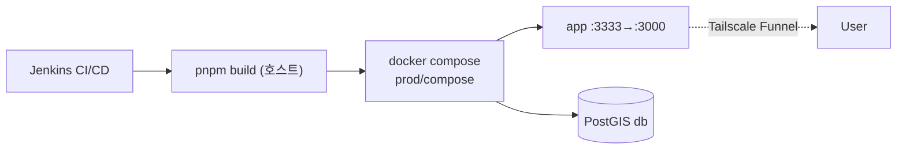

# 7. Operations

배포 · 운영 환경.

## 7.1 환경 / 포트

| 환경                             | 포트 | 용도                   |
| -------------------------------- | ---- | ---------------------- |
| 개발 (`pnpm dev`)                | 3001 | 핫 리로딩, 빠른 피드백 |
| 프로덕션 프리뷰 (`pnpm preview`) | 3000 | 빌드 후 산출물 확인    |

## 7.2 인프라 구성

| 컴포넌트           | 역할                                                                          |
| ------------------ | ----------------------------------------------------------------------------- |
| **Jenkins**        | CI/CD — `Jenkinsfile` (Install → Lint → Typecheck → Test → Build → Deploy)    |
| **docker compose** | 운영 형상 — `prod/compose/docker-compose.yml` (db / app / migrate / jenkins)  |
| **Tailscale**      | 외부 노출 — `localhost:3333` 을 HTTPS 로 공개 (관련 스킬: `tailscale-funnel`) |
| **PostgreSQL**     | 운영 DB — compose 내 PostGIS (개발·테스트 모두 Postgres 단일 모드)            |

## 7.3 Docker / 빌드 정책

**중요** — 빌드는 반드시 **호스트(macOS)** 에서 실행하세요.

> Docker Linux 컨테이너 안에서 `pnpm build` 를 돌리면 Vue 번들이 깨지는 케이스가 확인됨. 호스트에서 빌드한 산출물만 Docker 에 복사하는 방식으로 운용합니다.

## 7.4 환경 변수 / 시드

| 명령                         | 용도            |
| ---------------------------- | --------------- |
| `pnpm install`               | 의존성 설치     |
| `pnpm seed`                  | DB 시드 (개발)  |
| `pnpm dev`                   | 개발 서버       |
| `pnpm build && pnpm preview` | 프로덕션 프리뷰 |

환경 변수 상세는 `nuxt.config.ts` + 로컬 `.env` 참고.

## 7.5 관련 문서

- `docs/ci-cd-flow.md` — CI/CD 상세 흐름
- `docs/local-setup.md` — 로컬 셋업
- `prod/compose/README.md` — 운영 compose 형상·배포 스크립트
- 스킬 `tailscale-funnel` — 외부 노출 설정
