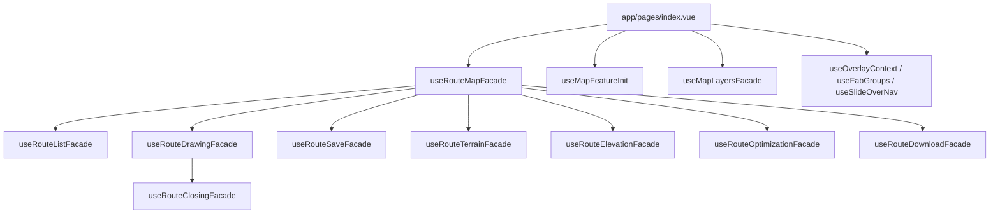

# 9. 기능 명세 (Feature Matrix)

현재 master 에 살아있는 기능과, 과거에 구현됐다가 정리·분리된 기능을 한눈에 보기 위한 표.

분리 경위는 두 epic 으로 추적된다:

- **epic #330 (v2.1 인터페이스 단위 정리)** — 한 PR 에 누적된 기능량이 검수 한계를 넘겨, 사용자가 인벤토리 체크박스로 직접 선택해 보존/제거를 결정한 epic. 8 개 PR (#339~#346) 로 머지 완료, `v2.0.0` (정리 직전) / `v2.1.0` (정리 후) 태그 보존.
- **epic #350 (플러그인 확장 시스템)** — 코어(경로 그리기/비교/공유 + 지도)는 그대로 두고, 추가 기능은 빌드 시점 정적 등록 플러그인으로 붙였다 뗐다 하는 시스템. `/settings` 에서 per-user 토글.

---

## 9.1 현재 살아있는 코어 기능

코어 = 경로 그리기 / 비교 / 공유 + 지도 셸 + 지도 표시·제어. 모든 사용자에게 항상 노출되며, 플러그인 토글 대상이 아니다.

각 feature 는 공통적으로 **store(상태) / sideeffect(부수효과) / lib(유틸) / ui(컴포넌트)** 계층으로 나뉜다. UI 액션 → store 변경 → sideeffect 가 `watch` 로 감지해 Cesium 층을 조작하는 단방향 흐름을 따른다. 자세한 합성 규칙은 [Composables](2-Architecture) 참조.

### 9.1.1 경로 도메인

| 영역      | 기능                                    | 위치                                                                                                   | 진입점                             | 비고                                                  |
| --------- | --------------------------------------- | ------------------------------------------------------------------------------------------------------ | ---------------------------------- | ----------------------------------------------------- |
| 경로 제작 | Cesium 3D 지도 위 폴리라인 직접 그리기  | `app/features/draw-route`                                                                              | 지도 페이지 FAB → "경로 그리기"    | 구간(section) 단위로 이름·설명 입력, 분할(split) 지원 |
| 경로 제작 | 폐곡선(loop)·왕복(round-trip) 자동 연결 | `app/features/draw-route/api/useRouteClosingSideeffect`                                                | 그리기 중 토글                     | 코스 형태 자동 보정                                   |
| 경로 제작 | 경로 최적화                             | `app/features/draw-route/api/useRouteOptimizationSideeffect`                                           | 그리기 중 최적화 액션              | `POST /api/routes/optimize`                           |
| 경로 제작 | 고도 프로파일 시각화                    | `app/features/elevation-layer/lib/useElevationChartAction`, `app/widgets/map-shell` (elevation facade) | 경로 선택 / 작성 시 하단 SVG 차트  | 최고/최저 + 누적 상승/하강                            |
| 경로 제작 | GPX 다운로드                            | `app/features/draw-route` 저장 모달                                                                    | 저장 모달 내 GPX 버튼              | —                                                     |
| 경로 제작 | 경로 저장 모달                          | `app/features/draw-route/ui/RouteSaveModal.vue`                                                        | FAB → "저장"                       | 비로그인이면 로그인 유도 모달 자동 표시 (#5)          |
| 경로 비교 | 두 경로 통계 비교                       | `app/features/route-compare`                                                                           | FAB → "비교" → `RouteCompareModal` | 첫 경로 선택 → 대기 → 두 번째 선택 시 비교 API 호출   |
| 경로 정보 | 경로별 위치 메모(이름·설명) 등록·조회   | `app/features/route-info`, `app/entities/route/model/useRouteInfoStore`                                | FAB → "경로정보" 칩 → 지도 클릭    | 최대 500자, 핀 마커 + 클릭 팝업                       |
| 경로 공유 | 공유 링크 생성 / 인증 없이 열람         | `app/features/share-viewer`, `app/pages/share/[routeId].vue`                                           | 공유 버튼 → URL 복사 → 누구나 접근 | route + sections + routeInfos 로드, 읽기 전용 렌더링  |
| 경로 공유 | 경로 소셜(좋아요/공유 액션)             | `app/features/route-social`                                                                            | 경로 카드 / 상세                   | 좋아요는 낙관적 업데이트(실패 시 롤백)                |

### 9.1.2 지도 표시·제어

| 영역      | 기능                                        | 위치                                           | 진입점                              | 비고                                                         |
| --------- | ------------------------------------------- | ---------------------------------------------- | ----------------------------------- | ------------------------------------------------------------ |
| 베이스맵  | V-World 위성/지도 베이스맵 전환             | `app/features/base-map`                        | 사이드바 헤더 베이스맵 버튼         | `imageryLayers` 교체, V-World WMTS                           |
| 화면 모드 | 2D / 3D 전환                                | `app/features/view-mode`                       | 사이드바 헤더 2D/3D 버튼            | 카메라 pitch 전환(−90°↔−45°) + 3D 타일 show/hide ("유사 2D") |
| 렌더 품질 | 렌더링 품질 자동/수동(AUTO·HIGH·MEDIUM·LOW) | `app/features/graphic-quality`                 | 사이드바 헤더 품질 버튼 → 선택 모달 | FPS 측정(5초 주기) 기반 자동 상·하향 + 온디맨드 렌더링       |
| 카메라    | 카메라 이동·역지오코딩                      | `app/features/camera`                          | 구역 선택, 경로 선택 등             | 동/구까지 reverse-geocode → `서울특별시 {구} {동}`           |
| 카메라    | 경로 플라이스루(진행률 기반 카메라 보간)    | `app/features/camera/lib/useFlythroughAction`  | 시뮬레이션/미리보기                 | haversine·heading·고도 보간 + 지형 샘플링                    |
| 카메라    | 건물(3D 타일) 클릭 지면 보정                | `app/features/camera/lib/useBuildingDetection` | 지도 클릭                           | 타일 위 클릭 좌표를 지면으로 보정                            |

### 9.1.3 지도 레이어

| 영역        | 기능                                                   | 위치                                                                                     | 진입점                         | 비고                                                                                         |
| ----------- | ------------------------------------------------------ | ---------------------------------------------------------------------------------------- | ------------------------------ | -------------------------------------------------------------------------------------------- |
| 지도 레이어 | 행정구역 (시군구·법정동) 경계                          | `app/entities/boundary`, 서버 `GET /api/boundary/seoul`, `seoul-dong`                    | 코어 자동 활성                 | 신규 GeoJSON 기반 런타임 fetch + 캐싱                                                        |
| 지도 레이어 | 편의시설 오버레이 (화장실/병원/분수대/보관함/횡단보도) | `app/widgets/facility-overlay`, `app/entities/facility`, `server/data/facilities/*.json` | 사이드바 facility 토글 칩      | sidewalk(인도) 는 분리 — 플러그인 (§9.2)                                                     |
| 지도 레이어 | 고도(elevation) 색상 라인 + SVG 차트                   | `app/features/elevation-layer`                                                           | 코어 기본 활성 / 차트 인터랙션 | `globe.material` 교체. epic #350 에서 gradient legend 결합으로 **플러그인 제외** (코어 유지) |
| 지도 레이어 | 경사도 색상 라인 + 난이도 뱃지                         | `app/entities/gradient`                                                                  | 하단 오버레이 바 "경사도" 칩   | 초급/중급/고급/전문가 자동 분류                                                              |

### 9.1.4 인증·셸

| 영역    | 기능                                                               | 위치                                        | 진입점               | 비고                                                         |
| ------- | ------------------------------------------------------------------ | ------------------------------------------- | -------------------- | ------------------------------------------------------------ |
| 인증    | better-auth 이메일/비번 + 30일 세션                                | `app/entities/user`, `server/security/auth` | AuthModal            | 미로그인 저장 시 모달 자동 표시 (#5)                         |
| 인증    | 본인 경로 수정/삭제 권한                                           | `server/api/routes/{id}.put/delete`         | 경로 카드 액션       | 소유자 검증 (#6)                                             |
| 지도 셸 | MapShell / MapSidebar / MapFooter / MapOverlays / SlideOverContent | `app/widgets/map-shell`                     | 메인 페이지 레이아웃 | 좌측 사이드바 + 우측 SlideOver + 하단 footer + chip 오버레이 |

> 탐색(explore) 은 검색·필터 store(`app/features/explore`)만 코어에 남아 오버레이 컨텍스트 판단에 쓰이고, UI(서울 25개 구 칩·공개 경로 목록)는 sidepanel 플러그인으로 분리되어 있다 (§9.2).

---

## 9.1.5 map-shell 오케스트레이션 (facade)

페이지는 `useRouteMapFacade` 하나만 import 하고, 내부적으로 sub-facade 들을 조합한다 (Facade 합성 패턴).

| Facade                       | 책임                                    |
| ---------------------------- | --------------------------------------- |
| `useRouteMapFacade`          | 진입점 — sub-facade 조합                |
| `useRouteListFacade`         | 경로 목록 조회·선택·필터링              |
| `useRouteDrawingFacade`      | 드로잉 시작·저장 조율                   |
| `useRouteClosingFacade`      | 폐곡선/왕복 모드                        |
| `useRouteSaveFacade`         | 저장 모달 상태                          |
| `useRouteTerrainFacade`      | 지형 샘플링                             |
| `useRouteElevationFacade`    | 고도 차트                               |
| `useRouteOptimizationFacade` | 경로 최적화                             |
| `useRouteDownloadFacade`     | GPX 다운로드                            |
| `useMapFeatureInit`          | 마운트 시 인증·지형·경계 병렬 초기화    |
| `useMapLayersFacade`         | 편의시설·경계·고도·경사도 레이어 조합   |
| `useOverlayContext`          | 오버레이 표시 컨텍스트 결정(DRAWING 등) |
| `useFabGroups`               | 플로팅 액션 메뉴(FAB) 항목 정의         |
| `useSlideOverNav`            | 슬라이드 오버 탭(LIST/DRAW/AUTH) 전환   |

---

## 9.2 플러그인 (epic #350)

빌드 시점 정적 등록. `app/plugins-ext/{name}/plugin.manifest.ts` 에 manifest 선언 → `app/plugins-ext/registry.ts` 정적 배열에 등록.

manifest schema: `{ id, label, description, slot: 'chip' | 'sidepanel' | 'dashboard' | 'popup', component, defaultEnabled, position? }`

활성 판정 = `usePluginPrefs().isEnabled()` — user pref 우선, 없으면 `defaultEnabled`.
영속: `user_feature_prefs` 테이블 + `GET/PUT /api/me/feature-prefs`.

| 플러그인 ID | Slot      | 출처                          | 동작                                                                                                              | 도입 PR |
| ----------- | --------- | ----------------------------- | ----------------------------------------------------------------------------------------------------------------- | ------- |
| (데모 chip) | chip      | 신규 (PR1)                    | 토대 검증용                                                                                                       | #352    |
| sidewalk    | chip      | 기존 facility 에서 분리       | 인도(보행로) GeoJSON 오버레이. `useMapViewer` DI 토대 동반 도입                                                   | #365    |
| explore     | sidepanel | 기존 widget/feature 에서 분리 | 서울 25개 구 칩 → 구 선택 → 카메라 이동 + 공개 경로 목록 (거리/고도/최신/인기). `useMapActions` DI 토대 동반 도입 | #367    |

**플러그인 DI 토대**:

- `app/shared/lib/map/useMapViewer.ts` — 전역 viewer ref. 코어가 `set`, 플러그인이 consume.
- `app/shared/lib/map/useMapActions.ts` — 코어가 액션을 `register`, 플러그인이 호출.

**chip 8방향 배치** (PR #361): manifest 의 `position` 으로 코너/엣지(상/하/좌/우 + 4 corner) 지정.

**남은 후속 (선택, 코어 가동에는 영향 없음)**:

- shared `FacilityTypeEnum` 의 sidewalk 멤버 정리
- `useExploreRouteActions` 내 dead `activeNav==='탐색'` 분기 정리
- 데모 sidepanel 제거
- `/settings` 진입 nav 엔트리
- drizzle migration snapshot debt (#350 PR2 발견)

---

## 9.3 분리·제거된 기능 (epic #330)

> 모두 squash 머지 완료. 코드는 master 에 없으나 `v2.0.0` 태그에서 조회 가능.

| 도메인              | 무엇이었나                                                                     | 제거 PR (Closes 이슈) | 비고                                                                                                               |
| ------------------- | ------------------------------------------------------------------------------ | --------------------- | ------------------------------------------------------------------------------------------------------------------ |
| run-records         | 러닝 기록 (실주행 trace 저장/조회)                                             | #340 (Closes #332)    | —                                                                                                                  |
| segments            | 경로 구간 분할 도메인 (그리기와 별도)                                          | #343 (Closes #335)    | 그리기 내부의 section 개념은 코어에 남음 — 별도                                                                    |
| simulation          | 3D 경로 플라이스루(재생/일시정지/정지/탐색, 1x/2x/5x, 실시간 거리·고도·경사도) | #341 (Closes #333)    | SimulationDrawer + xstate 기반 머신 제거                                                                           |
| curation            | 큐레이션(추천 셋트, 관리자 큐레이션 카드)                                      | #344 (Closes #336)    | map-shell ExploreTab/SlideOverContent/MapSidebar 결합도 함께 정리                                                  |
| weather + recommend | 서울 25개 구 시간대별 날씨/기온/PM10 오버레이 + 날씨 적합도 기반 경로 추천     | #345 (Closes #337)    | 가장 광범위 — 274 개 테스트 제거. `useWeatherFacade`, 오버레이, 사이드바 weather 결합, explore 추천 로직 모두 제거 |
| right-panel         | 우측 패널 widget                                                               | #342 (Closes #334)    | SectionInfoSlideContent 는 map-shell/slide-over 로 이동 (보존)                                                     |
| admin/seed          | 관리자 시드 카드 / 페이지                                                      | #346 (Closes #338)    | AdminSeedCard 제거 + `/admin` 빈 카드 분기점 스켈레톤으로 재구성                                                   |
| admin/uml           | UML 다이어그램 페이지 도메인                                                   | #339 (Closes #331)    | `/api/uml`, `vue-mermaid-string` UI 등                                                                             |
| admin/curation      | 큐레이션 운영 도구                                                             | curation 와 함께 #344 | —                                                                                                                  |

**테스트 흐름:** PR-A 이전 1333 → PR-H 후 897 (총 436 테스트 제거, cascade 정확히 매칭).

**롤백 안전망:** `v2.0.0` 태그(`37fee10`, 정리 직전) 와 `v2.1.0` 태그(`2a2cc4c`, 정리 후) 모두 원격 보존.

---

## 9.4 라우트 ↔ 기능 매핑

| 라우트             | 페이지 파일                     | 노출되는 코어 기능                                                                                                  | 노출 가능한 플러그인                               |
| ------------------ | ------------------------------- | ------------------------------------------------------------------------------------------------------------------- | -------------------------------------------------- |
| `/`                | `app/pages/index.vue`           | 지도 셸 / 그리기 / 비교 / 경로정보 / 경사도·고도 / 편의시설 / 행정구역 / 카메라 / 베이스맵·화면모드·렌더품질 / 인증 | sidewalk (chip), explore (sidepanel), (그 외 추후) |
| `/settings`        | `app/pages/settings.vue`        | 인증(로그인 필수)                                                                                                   | — (모든 플러그인 토글 대상)                        |
| `/admin`           | `app/pages/admin/index.vue`     | 인증(권한 분기)                                                                                                     | — (관리자용 카드 분기점 스켈레톤, 현재 비어있음)   |
| `/share/[routeId]` | `app/pages/share/[routeId].vue` | 공유 뷰어 (인증 없이 접근)                                                                                          | —                                                  |

각 라우트의 화면설계서는 챕터 10 (Screens) 참조.
