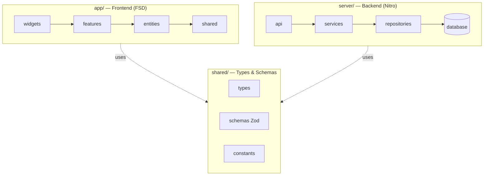

# Runnable 2.0 Wiki

러닝 경로 추천·시뮬레이션·기록 관리 풀스택 Nuxt 4 애플리케이션의 코드 베이스 위키입니다.

## 빠른 안내

- 처음 보는 분 → [1-Overview](1-Overview) → [2-Architecture](2-Architecture)
- 도메인 객체 한눈에 보기 → [3-Domain-Model](3-Domain-Model)
- 백엔드 만들기 → [4-Server](4-Server)
- 프론트엔드 만들기 → [5-Frontend](5-Frontend)
- TDD·테스트 → [6-Testing-and-TDD](6-Testing-and-TDD)
- 배포 → [7-Operations](7-Operations)
- 컨트리뷰션 → [8-Contribution](8-Contribution)
- Claude Code 가이드 → [11-Claude-Code-Guide](11-Claude-Code-Guide)
- 🎨 디자이너용 위키 → `../design-wiki/Home`

## 기술 스택 요약

| Layer    | Stack                                                |
| -------- | ---------------------------------------------------- |
| Frontend | Nuxt 4 + Vue 3 + TailwindCSS 4 + Cesium 1.140        |
| Backend  | Nitro (Nuxt 4) + Drizzle ORM + PostgreSQL            |
| Auth     | better-auth                                          |
| State    | useState composables + xstate 5 (재생 상태머신)      |
| Test     | Vitest 4 + Playwright 1.60 + @nuxt/test-utils        |
| Build/CI | pnpm + Jenkinsfile (docker compose / Tailscale 배포) |

## 구조 한 장 요약

## Wiki 페이지 인덱스 (총 21페이지)

전체 목차는 사이드바를 참조하세요.

- **Overview / Architecture** — 1-Overview, 2-Architecture
- **Domain Model** — 3-Domain-Model (카탈로그) + 도메인별 페이지 (Route, Safety, Route-Compare, Facility, UserRoute)
- **Layers** — 4-Server, 5-Frontend
- **Testing & TDD** — 6-Testing-and-TDD + 4 세부 페이지 (Concepts, Infrastructure, Writing Guide, CI Gate)
- **Operations / Contribution** — 7-Operations, 8-Contribution
- **Feature Matrix / Screens** — 9-Feature-Matrix, 10-Screens (+ Map/Settings/Admin/Share)
- **Claude-Code Guide** — 11-Claude-Code-Guide

> 🎨 디자이너용 위키는 별도 저장소(`docs/design-wiki/`)에서 관리됩니다 → `../design-wiki/Home`

## 진행 상황

- ✅ **완료** — 8개 섹션 모두, 총 21개 페이지, mermaid 다이어그램 20+개
- 🚧 **확장 가능 영역** — 도메인 추가(geojson, gradient, stats, district 등), 2.x 레이어별 디테일 페이지, API 별 sequence 다이어그램
